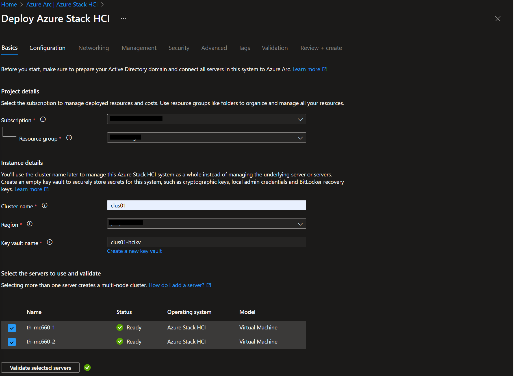

## 2. Deploy Azure Stack HCI Cluster 23H2 using Cloud Based Deployment (Azure Portal)

Now, after MSLAB is hydrated we are ready to build 2 node of Azure Stack HCI clusters 23H2 (in nested VM) using cloud based deployment (Azure Portal). Read the microsoft document [here](https://learn.microsoft.com/en-us/azure-stack/hci/deploy/deploy-via-portal) for more detail.
> Note: Cloud Deployment is not yet supported from any OEM. Here we can get away to work nested VM with disabling bitlocker for OS and disabling WDAC (WDAC policy is distributed as part of Solution Builder Extensions)

### Task 1 - Customize deployment LabConfig and Deploy

1. Save current LabConfig.ps1 as [LabConfig.hydrate.ps1](LabConfig.hydrate.ps1) for documentation as we are going to use another version of LabConfig.ps1 in this step.
2. Below LabConfig will deploy a large 2 virtual nodes (with 24 vCPU and 96GB RAM each) and also DC VM, Windows Admin Center Gateway (WAC GW) VM and Management VM. We will use range of VLAN for different subnets later on (for Storage traffic, Network ATC will use 711-712, for VM and AKS logical networks we can use Vlan 1-10),these VLANs are all internal, if require connection to Azure it will be routed and NATed from DC VM as the gateway.
```powershell
$LabConfig=@{
    AllowedVLANs="1-10,711-719"; 
    DomainAdminName=''; 
    AdminPassword=''; 
    Prefix = 'dcoffee-' ; 
    DCEdition='4'; 
    Internet=$true ;
    UseHostDnsAsForwarder=$true; 
    AdditionalNetworksInDC=$true; 
    AdditionalNetworksConfig=@(); 
    VMs=@(); 
    DomainNetbiosName="th";
    DomainName="th.dcoffee.com";
    TelemetryLevel='Full' ; 
    TelemetryNickname='dcoffee'
}

#pre-domain joined
1..2 | ForEach-Object {
    $VMNames="th-mc660-" ; 
    $LABConfig.VMs += @{ 
        VMName = "$VMNames$_" ; 
        Configuration = 'S2D' ; 
        ParentVHD = 'azshci23h2_g2.vhdx' ; 
        HDDNumber = 4; 
        HDDSize= 2TB ; 
        MemoryStartupBytes= 96GB; 
        VMProcessorCount="24"; 
        NestedVirt=$true; 
        vTPM=$true;
        Unattend="NoDjoin"
    }
}

#add subnet 1-4 in DC (for arc VM/AKS logical networks)

$LABConfig.AdditionalNetworksConfig += @{ NetName = 'subnet1'; NetAddress='10.0.1.'; NetVLAN='1'; Subnet='255.255.255.0'}
$LABConfig.AdditionalNetworksConfig += @{ NetName = 'subnet2'; NetAddress='10.0.2.'; NetVLAN='2'; Subnet='255.255.255.0'}
$LABConfig.AdditionalNetworksConfig += @{ NetName = 'subnet3'; NetAddress='10.0.3.'; NetVLAN='3'; Subnet='255.255.255.0'}
$LABConfig.AdditionalNetworksConfig += @{ NetName = 'subnet4'; NetAddress='10.0.4.'; NetVLAN='4'; Subnet='255.255.255.0'}

#Windows Admin Center gateway
$LabConfig.VMs += @{ VMName = 'WACGW' ; ParentVHD = 'Win2022Core_G2.vhdx' ; MGMTNICs=1 }

#Management machine
$LabConfig.VMs += @{ VMName = 'Management' ; ParentVHD = 'Win2022_G2.vhdx'; MGMTNICs=1 ; AddToolsVHD=$True }
```
2. Right-click on Deploy.ps1 and select **Run with PowerShell**

### Expected Result

Here are screenshot of successfull powershell script and view on Hyper-V Manager


> Make sure to start all VMs before going to the next task.

### Task 2 - Prepare Active Directory

These steps are inspired from Microsoft Documentation [here](https://learn.microsoft.com/en-us/azure-stack/hci/deploy/deployment-prep-active-directory). Please run the following PowerShell Script [PrepareAd.ps1](PrepareAD.ps1) from Management VM's PowerShell in elevated mode (Run As Administrator).
Adjust the script if necessary:
```powershell
$AsHCIOUName="OU=clus01,DC=th,DC=dcoffee,DC=com"
$LCMUserName=""
$LCMPassword=""
$SecuredPassword = ConvertTo-SecureString $LCMpassword -AsPlainText -Force
$LCMCredentials= New-Object System.Management.Automation.PSCredential ($LCMUserName,$SecuredPassword)

#install posh module for prestaging Active Directory
Install-PackageProvider -Name NuGet -Force
Install-Module AsHciADArtifactsPreCreationTool -Repository PSGallery -Force

#make sure active directory module and GPMC is installed
Install-WindowsFeature -Name RSAT-AD-PowerShell,GPMC

#populate objects
New-HciAdObjectsPreCreation -AzureStackLCMUserCredential  $LCMCredentials -AsHciOUName $AsHCIOUName

#install management features to explore cluster,settings...
Install-WindowsFeature -Name "RSAT-ADDS","RSAT-Clustering"
```
### Expected Result


### Task 3 - Prepare Azure

At this step make sure you have Azure Subscription and you have user that are a user access administrator and a contributor role, since we are going to create some resources like resource group.
Here I'm using ServicePrincipal because it's convinient to code and from security perspective you can use time limited secrets or certificates. If you use regular user, you need to interactively login with browser and finish the MFA (MultiFactorAuthentication) step.
Basically we are going to create a Resource Group to hold all the resources. Please run the following PowerShell Script [PrepareAzure.ps1](PrepareAzure.ps1) from Management VM's PowerShell in elevated mode (Run As Administrator).
Adjust the script if necessary:
```powershell
# Setup some variables
$ResourceGroupName="dcoffee-rg"
$Location="eastus" #make sure location is lowercase

# Make sure User or SPN is contributor and user access administrator in Azure Subscriptions
# We are using SPN here:
# fill out the following variable to your environment
$tenantID = ""
$AdminSPNAppID=""
$AdminPlainSecret=""
$AdminSecuredSecret = ConvertTo-SecureString $AdminPlainSecret -AsPlainText -Force
$AdminSPNCred = New-Object -TypeName System.Management.Automation.PSCredential -ArgumentList $AdminSPNAppID, $AdminSecuredSecret

#login to azure
#download and install Azure module

#Set PSGallery as a trusted repo
Set-PSRepository -Name "PSGallery" -InstallationPolicy Trusted

if (!(Get-InstalledModule -Name az.accounts -ErrorAction Ignore)){
	Install-Module -Name Az.Accounts -Force
}
if (-not (Get-AzContext)){
	Connect-AzAccount -ServicePrincipal -TenantId $tenantID -Credential $AdminSPNCred
}

#install az resources module
if (!(Get-InstalledModule -Name "az.resources" -ErrorAction Ignore)){
	Install-Module -Name "az.resources" -Force
}

#create resource group
if (-not(Get-AzResourceGroup -Name $ResourceGroupName -ErrorAction Ignore)){
	New-AzResourceGroup -Name $ResourceGroupName -Location $location
}
```
> Note: if installing module failed, you may need to re-try again.
### Expected Result


### Task 4 - Prepare Azure Stack HCI Nodes for Cloud Deployment

Now, we are going to prepare the nodes for Cloud Deployment.

#### Step 1 - Test Connectivity

* Test name Resolution using simple ping from Management machine to the azure stack HCI nodes
> Time out is OK since Windows Firewall does not allow ping by default, most important is the name resolution works. Please also ignore the IPv6 we will fix this later.
* Test WINRM works from Management machine to the azure stack HCI nodes
```powershell
Test-NetConnection -ComputerName th-mc660-1 -CommonTCPPort WINRM
Test-NetConnection -ComputerName th-mc660-2 -CommonTCPPort WINRM
```

#### Expected Result


#### Step 2 - Deploy Arc Agent

* In this step we will install Arc agent, Arc extensions and will set RBAC roles to Arc objects. It will also install Environmental Checker, so cloud deployment will be able to kick validations
* Please run the following PowerShell Script [PrepareNodes.ps1](PrepareNodes.ps1) from Management VM's PowerShell in elevated mode (Run As Administrator). Adjust the script to your environment.

**The script will do the following:**
* Since all the nodes are not domain joined yet, we will need to enable trusted hosts
* Install required features and cumulative updates
* Restart the servers to finalize features/updates
* Install required PowerShell modules on all nodes
* Deploy arc agent and extensions

#### Expected Result


> Check if all arc extensions were installed. If one failed (sometimes LCM fails), it needs to be uninstalled (in azure portal) and rerun code above to attempt to redeploy extension.
Wait for extensions to be installed before continuing with lab! If you will connect to remote session, it might interrupt installing LCM extension and it will fail.

The following are the script for installing individual extensions:
```powershell
# Check if Extension is installed
Get-AzConnectedMachineExtension -Name "AzureEdgeTelemetryAndDiagnostics" -ResourceGroupName $ResourceGroupName -MachineName $Server
Get-AzConnectedMachineExtension -Name "AzureEdgeDeviceManagement" -ResourceGroupName $ResourceGroupName -MachineName $Server
Get-AzConnectedMachineExtension -Name "AzureEdgeLifecycleManager" -ResourceGroupName $ResourceGroupName -MachineName $Server
Get-AzConnectedMachineExtension -Name "AzureEdgeRemoteSupport" -ResourceGroupName $ResourceGroupName -MachineName $Server

# install the extensions manually here:
New-AzConnectedMachineExtension -Name "AzureEdgeTelemetryAndDiagnostics" -ResourceGroupName $ResourceGroupName -MachineName $Server -Location $Location -Publisher "Microsoft.AzureStack.Observability" -Settings $Settings -ExtensionType "TelemetryAndDiagnostics" -NoWait
New-AzConnectedMachineExtension -Name "AzureEdgeDeviceManagement" -ResourceGroupName $ResourceGroupName -MachineName $Server -Location $Location -Publisher "Microsoft.Edge" -ExtensionType "DeviceManagementExtension" -NoWait
New-AzConnectedMachineExtension -Name "AzureEdgeLifecycleManager" -ResourceGroupName $ResourceGroupName -MachineName $Server -Location $Location -Publisher "Microsoft.AzureStack.Orchestration" -ExtensionType "LcmController" -NoWait
New-AzConnectedMachineExtension -Name "AzureEdgeRemoteSupport" -ResourceGroupName $ResourceGroupName -MachineName $Server -Location $Location -Publisher "Microsoft.AzureStack.Observability" -ExtensionType "EdgeRemoteSupport" -NoWait
```

#### Step 3 - Add final touches

* Make sure there is only one NIC with gateway configured, and disabled all unused adapters (in this deployment we only use 2 adapters (Ethernet and Ethernet 2))
```powershell
#make sure there is only one management NIC with IP address (setup is complaining about multiple gateways)
    Invoke-Command -ComputerName $servers -ScriptBlock {
        Get-NetIPConfiguration | Where-Object IPV4defaultGateway | Get-NetAdapter | Sort-Object Name | Select-Object -Skip 1 | Set-NetIPInterface -Dhcp Disabled
    } -Credential $Credentials
```
> Make sure also management NIC has the same consistent name accross the whole cluster nodes
* Configure NTP Servers and Set the time zone to UTC.
First you need to disable Timesync from Hyper-V. Run following command on Hyper-V Host! (applies to nested environment only)
```powershell
Get-VM *dcoffee-th-mc660* | Disable-VMIntegrationService -Name "Time Synchronization"
```
And after that you can run following command from management machine to configure NTP Server
> Set timezone back to UTC. This is [known issue](https://learn.microsoft.com/en-us/azure-stack/hci/known-issues-2310) using preview baseline builds 10.2310.0.30 (25398.469)
```powershell
$NTPServer="th.dcoffee.com"
Invoke-Command -ComputerName $servers -ScriptBlock {
    w32tm /config /manualpeerlist:$using:NTPServer /syncfromflags:manual /update
    Restart-Service w32time
} -Credential $Credentials

Start-Sleep 20

#check if source is NTP Server
Invoke-Command -ComputerName $servers -ScriptBlock {
    w32tm /query /source
} -Credential $Credentials

# workaround on baseline release - deployment will fail if not setup to UTC
Invoke-Command -ComputerName $servers -ScriptBlock {
    Set-TimeZone -Id "UTC"
    Get-TimeZone
} -Credential $Credentials
```
* Configure current user to be Key Vault Administrator on dcoffee-rg resource group
> No need if you deploying second cluster in the same resource group
```powershell
#add key vault admin of current user to Resource Group (It can be also done in Deploy Azure Stack HCI wizard)
#$objectId = (Get-AzADUser -SignedIn).Id
# Since we are using SPN
$adminSPNName=""
$objectId =(Get-AzADServicePrincipal -DisplayName $adminSPNName).id
New-AzRoleAssignment -ObjectId $ObjectId -ResourceGroupName $ResourceGroupName -RoleDefinitionName "Key Vault Administrator"
```
* Configure new admin password on nodes (as Cloud Deployment requires at least 12chars)
> if failed, you might need to set trusted host again
```powershell
#change password of local admin to be at least 12 chars
$plainAdminPassword=""
Invoke-Command -ComputerName $servers -ScriptBlock {
    Set-LocalUser -Name Administrator -AccountNeverExpires -Password (ConvertTo-SecureString $plainAdminPassword -AsPlainText -Force)
} -Credential $Credentials
```

### Task 5 - Perform Azure Stack HCI deployment from Azure Portal

#### Step 1 - Navigate to Azure Portal and in Azure Stack HCI clusters, click on Create button


#### Step 2 - Continue with setup with following values:
> In Security settings I removed Bitlocker for data volumes as it would expand VHDs when encrypting volumes.
```
Basics:
    Resource Group: dcoffee-rg
    ClusterName:    clus01
    Keyvaultname:   <Just generate new> (e.g. dcoffeeclus01-hcikv)

Configuration:
    New Configuration

Networking
    Network Switch for storage
    Group All traffic

    Network adapter 1:          Ethernet
    Network adapter 1 VLAN ID:  711 (default)
    Network adapter 2:          Ethernet 2
    Network adapter 2 VLAN ID:  712 (default)

    Starting IP:                10.0.0.111
    ENding IP:                  10.0.0.116
    Subnet mask:                255.255.255.0
    Default Gateway:            10.0.0.1
    DNS Server:                 10.0.0.1

    RDMA Protocol:              Disabled (in case you are running lab in VMs)

Management
    Custom location name:       dcoffee-clus01-cl
    Azure storage account name: <just generate new> dcoffeeclus01sa

    Domain:                     th.dcoffee.com
    Computer name prefix:       clus01
    OU:                         OU=clus01,DC=th,DC=dcoffee,DC=com

    Deployment account:
        Username:               <LCM user>
        Password:               <LCM user password>

    Local Administrator
        Username:               <Local Administrator>
        Password:               <Local Administrator Pasword>

Security:
    Customized security settings
        Unselect Bitlocker for data volumes (would consume too much space)

Advanced:
    Create workload volumes (Default)

Tags:
    <keep default>
```



> Don't forget to Disabled RDMA Protocol as we are using VM network adapter also set jumbo framesize to 1514


#### Step 3 - Validation process will take some time. And if all goes OK, it will succesfully validate cluster


### Task 6 - Monitor Deployment Progress

#### Step 1 - Monitor from Management Machine

Paste following PowerShell to update credentials and pull information about the deployment progress
> Run this before domain join step
```powershell
    #Create new password credentials
    $UserName=""
    $Password=""
    $SecuredPassword = ConvertTo-SecureString $Password -AsPlainText -Force
    $Credentials= New-Object System.Management.Automation.PSCredential ($UserName,$SecuredPassword)

    #before domain join
    Invoke-Command -ComputerName $Servers[0] -ScriptBlock {
        ([xml](Get-Content C:\ecestore\efb61d70-47ed-8f44-5d63-bed6adc0fb0f\086a22e3-ef1a-7b3a-dc9d-f407953b0f84)) | Select-Xml -XPath "//Action/Steps/Step" | ForEach-Object { $_.Node } | Select-Object FullStepIndex, Status, Name, StartTimeUtc, EndTimeUtc, @{Name="Duration";Expression={new-timespan -Start $_.StartTimeUtc -End $_.EndTimeUtc } } | Format-Table -AutoSize
    } -Credential $Credentials
```


> Run this after domain join
```powershell
    #after domain join
    Invoke-Command -ComputerName $Servers[0] -ScriptBlock {
        ([xml](Get-Content C:\ecestore\efb61d70-47ed-8f44-5d63-bed6adc0fb0f\086a22e3-ef1a-7b3a-dc9d-f407953b0f84)) | Select-Xml -XPath "//Action/Steps/Step" | ForEach-Object { $_.Node } | Select-Object FullStepIndex, Status, Name, StartTimeUtc, EndTimeUtc, @{Name="Duration";Expression={new-timespan -Start $_.StartTimeUtc -End $_.EndTimeUtc } } | Format-Table -AutoSize
    }
```


#### Step 2 - Monitor from Azure Portal

In Azure Portal, navigate to your Azure Stack Cluster and you should see deployment progress there:


#### Step 3 - Troubleshoot using Deployment logs

To troubleshoot deployment you can explore deployment logs by navigating into first cluster node to c:\CloudDeployment\Logs


### Expected Result

Here is how it looked when deployment is successful.


### Known Issues

*1. The deployment stops when there is error related to validate ATC service.*

The Network ATC seems to be allowing untagged vlan in storage adapter and since the default DHCP client is enabled it picks up DHCP address from native vlan 0 (untagged) which is used by Management traffic. Test-Cluster then failed because the subnet are wrong it should be storage subnet but instead using management subnet from DHCP.

Here are the VMNetwork Adapter Isolation (vlan) configuration looks like:


let's run the same script when we remove gateway and disabled DHCP:
```powershell
#run this from Management machine
    Invoke-Command -ComputerName $servers -ScriptBlock {
        Get-NetIPConfiguration | Where-Object IPV4defaultGateway | Get-NetAdapter | Sort-Object Name | Select-Object -Skip 1 | Set-NetIPInterface -Dhcp Disabled
    } -Credential $Credentials
```

Wait for awhile, so NetworkATC will try to fix the IP Addresses now using 10.71.1.X and 10.71.2.X. Check using IPConfig /All in each node:


Wait again for awhile, then test ping from each node to each storage interfaces:


Then do Test-Cluster from one of the node with the following command:

```powershell
Test-Cluster "th-mc660-1","th-mc660-2" -Include "Network"
```


Ignore the warning for now, and resume the deployment from portal. It should now progressing again.

