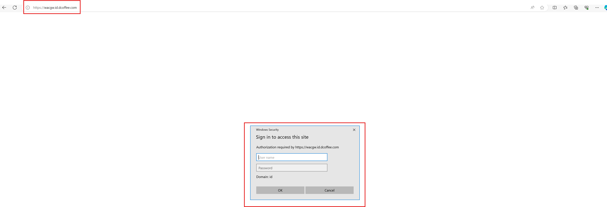
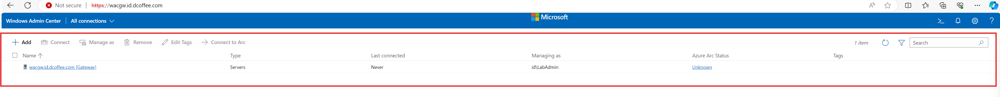
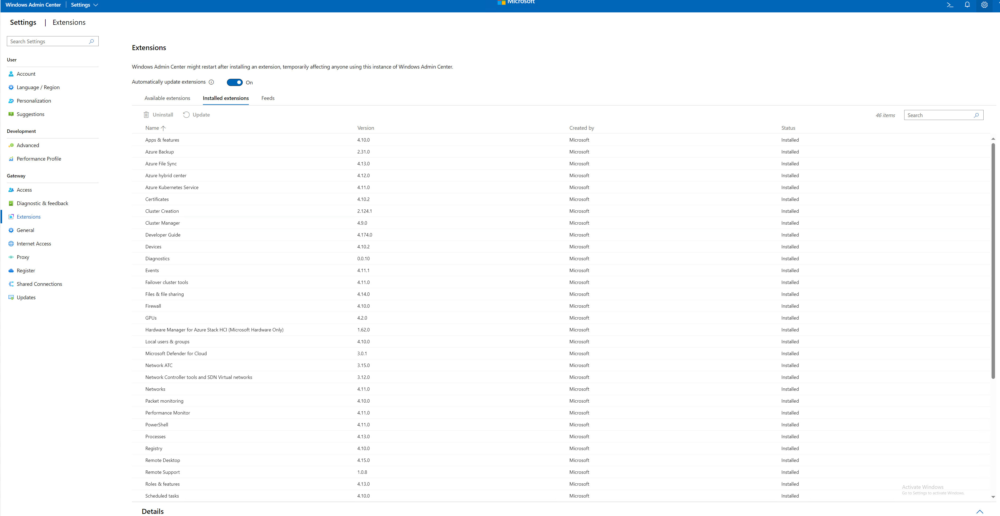

## 3. Installing Windows Admin Center

For official documentation you can go here: [Install Windows Admin Center](https://learn.microsoft.com/en-us/windows-server/manage/windows-admin-center/deploy/install)
In this Lab we are going to install Windows Admin Center on Server Core (WACGW machine). All the script here are included in [Install-WAC.ps1](Install-WAC.ps1)
>This example is demonstration of Windows Admin Center deployed with self-signed certificate on port 443 (HTTPS). Self-signed cert will be valid for limited time, therefore you should use signed certificate in production, or use Windows Admin Center on Windows Client machine


### Step 1 Download and Install Windows Admin Center

Run the following script fom Management machine
```powershell
    ##Install Windows Admin Center Gateway 
    $GatewayServerName="WACGW"
    #Download Windows Admin Center if not present
    if (-not (Test-Path -Path "$env:USERPROFILE\Downloads\WindowsAdminCenter.msi")){
        Start-BitsTransfer -Source https://aka.ms/WACDownload -Destination "$env:USERPROFILE\Downloads\WindowsAdminCenter.msi"
        #Or preview (not updated for some time)
        #Start-BitsTransfer -Source https://aka.ms/WACInsiderDownload -Destination "$env:USERPROFILE\Downloads\WindowsAdminCenter.msi"
    }
    #Create PS Session and copy install files to remote server
    #make sure maxevenlope is 8k
    Invoke-Command -ComputerName $GatewayServerName -ScriptBlock {Set-Item -Path WSMan:\localhost\MaxEnvelopeSizekb -Value 8192}
    $Session=New-PSSession -ComputerName $GatewayServerName
    Copy-Item -Path "$env:USERPROFILE\Downloads\WindowsAdminCenter.msi" -Destination "$env:USERPROFILE\Downloads\WindowsAdminCenter.msi" -ToSession $Session

    #Install Windows Admin Center
    Invoke-Command -Session $session -ScriptBlock {
        Start-Process msiexec.exe -Wait -ArgumentList "/i $env:USERPROFILE\Downloads\WindowsAdminCenter.msi /qn /L*v log.txt REGISTRY_REDIRECT_PORT_80=1 SME_PORT=443 SSL_CERTIFICATE_OPTION=generate"
    } -ErrorAction Ignore

    $Session | Remove-PSSession

    #add certificate to trusted root certs (workaround to trust HTTPs cert on WACGW)
    start-sleep 30
    $cert = Invoke-Command -ComputerName $GatewayServerName -ScriptBlock {Get-ChildItem Cert:\LocalMachine\My\ |where subject -eq "CN=Windows Admin Center"}
    $cert | Export-Certificate -FilePath $env:TEMP\WACCert.cer
    Import-Certificate -FilePath $env:TEMP\WACCert.cer -CertStoreLocation Cert:\LocalMachine\Root\
 
```

### Step 2 Configure Resource-Based constrained delegation

>to trust delegated credentials, you must configure nodes to trust delegated credentials from windows admin center. Following code will do that for all Azure Stack HCI servers in domain. If not configured, you would see constant pop-ups for password when connecting to servers.
```powershell
#Configure Resource-Based constrained delegation
Install-WindowsFeature -Name RSAT-AD-PowerShell
$gatewayObject = Get-ADComputer -Identity $GatewayServerName
$computers = (Get-ADComputer -Filter {OperatingSystem -eq "Azure Stack HCI"}).Name

foreach ($computer in $computers){
	$computerObject = Get-ADComputer -Identity $computer
	Set-ADComputer -Identity $computerObject -PrincipalsAllowedToDelegateToAccount $gatewayObject
}
```
### Step 3 Update Installed Extensions

```powershell
#update installed extensions
#https://docs.microsoft.com/en-us/windows-server/manage/windows-admin-center/configure/use-powershell
#Copy Posh Modules from wacgw
$Session=New-PSSession -ComputerName $GatewayServerName
Copy-Item -Path "C:\Program Files\Windows Admin Center\PowerShell\" -Destination "C:\Program Files\Windows Admin Center\PowerShell\" -Recurse -FromSession $Session
$Session | Remove-PSSession

#Import Posh Modules
$Items=Get-ChildItem -Path "C:\Program Files\Windows Admin Center\PowerShell\Modules" -Recurse | Where-Object Extension -eq ".psm1"
foreach ($Item in $Items){
    Import-Module $Item.fullName
}

#list commands
Get-Command -Module ExtensionTools

#grab installed extensions
$InstalledExtensions=Get-Extension -GatewayEndpoint https://$GatewayServerName | Where-Object status -eq Installed
$ExtensionsToUpdate=$InstalledExtensions | Where-Object IsLatestVersion -eq $False

foreach ($Extension in $ExtensionsToUpdate){
    Update-Extension -GatewayEndpoint https://$GatewayServerName -ExtensionId $Extension.ID
}
```

### Expected Result

Open using Microsoft Edge on Management Machine and point out to https://wacgw.th.dcoffee.com (or using your own domain name)


> Login using your Domain admin which is also local admin to the managed nodes


Check on the Settings > extensions, all installed extensions are up to date.
