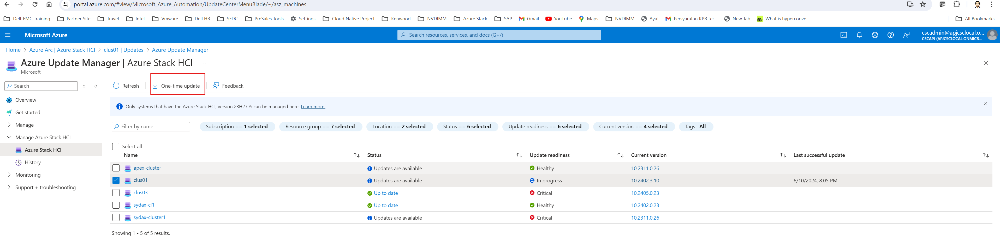

## 4a. Update Azure Stack HCI 23H2 via PowerShell

Now that you have deployed your 23H2 cluster you realize the cluster is a little bit outdated.


Check detail documentation [here](https://learn.microsoft.com/en-us/azure-stack/hci/update/update-via-powershell-23h2).

### Task 1 - Connect to one of your Azure Stack HCI Cluster Node

```powershell
$cred = Get-Credential
Enter-PSSession -ComputerName th-mc660-2 -Credential $cred
```

### Task 2 - Identify the stamp version on your cluster

```powershell
Get-StampInformation
```


Compare to the [release notes](https://learn.microsoft.com/en-us/azure-stack/hci/known-issues-2402) and see known issues.


### Task 3 - Validate System Health

Run the following command to validate system health via the Environment Checker.
```powershell
$result = Test-EnvironmentReadiness
$result | ft Name,Status,Severity
```

> In this release, the informational failures for **Test-CauSetup** are expected and will not impact the updates.

### Task 4 - Discover the updates online

Verify the update service discovers the update package
```powershell
Get-SolutionUpdate | ft DisplayName, State
$Update = Get-SolutionUpdate 
$Update.ComponentVersions
```


### Task 5 - Download, check readiness and install updates

#### Step 1 - Download and install the update

```powershell
Get-SolutionUpdate | Start-SolutionUpdate
```


#### Step 2 - Track the update progress

```powershell
Get-SolutionUpdate | ft Version,State,UpdateStateProperties,HealthState
```


> Once the installation is complete, the **State** changes to **Installed**

#### Step 3 - Verify the installation
```powershell
Get-SolutionUpdateEnvironment | ft State, CurrentVersion
cmd /c ver
```


> note on the portal we still see available updates. This is because we just updated to the same release train, and there are another available baseline release.
Check on the release information [here](https://learn.microsoft.com/en-us/azure-stack/hci/release-information-23h2).


### Task 6 - Troubleshoot Updates
#### Step 1 - Collect update logs
```powershell
$cred = Get-Credential
Enter-PSSession -ComputerName th-mc660-2 -Credential $cred
$Update = Get-SolutionUpdate | ? version -eq "<Version string>" -verbose
$Failure = $update | Get-SolutionUpdateRun
$Failure
```
> Note the ResourceID GUID. This GUID corresponds to the ActionPlanInstanceID.
Copy the logs for the **ActionPlanInstanceID** that you noted earlier, to a text file named log.txt. Use Notepad to open.
```powershell
Get-ActionplanInstance -ActionplanInstanceId <Action Plan Instance ID> >log.txt
notepad log.txt
```
#### Step 2 - Resume an update

```powershell
get-solutionupdate | start-solutionupdate
# To resume a previously failed update due to update health checks in a Warning state
#get-solutionUpdate | start-solutionUpdate -IgnoreWarnings
```

## 4b. Update Azure Stack HCI 23H2 via Azure Portal

### Task 1 - Browse for cluster updates

#### Step 1 - Go to Azure Update Manager > Manage Azure Stack HCI. Choose the cluster that you want to update and click one-time update

#### Step 2 - On the Check readiness page, review the list of readiness checks and their results.
* You can select the links under Affected systems to view more details and individual cluster results.

* Click **Next**
#### Step 3 - Select updates

> 2024.05 is just released I will wait it to be stable yet since I've heard Microsoft has some known issues with the release.


