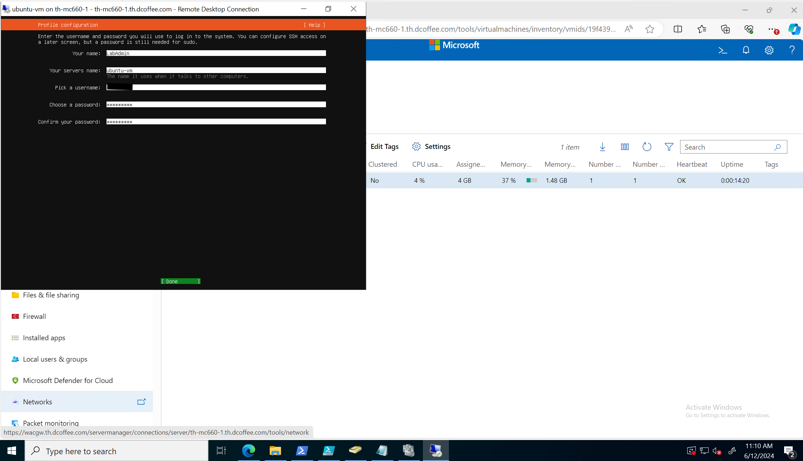

## 5. Azure Arc VM Management

Now that you have deployed your 23H2 cluster you are ready to create Arc VM from Portal. 
There are other way though, you can use Azure CLI, or Azure Resource Manager template too.
> make sure your entra user has at least **Contributor** level access at the subscription level

> make sure you are on supported region as per [Azure requirement](https://learn.microsoft.com/en-us/azure-stack/hci/concepts/system-requirements-23h2#azure-requirements)

> make sure your user has **"Azure Stack HCI Administrator"** Role

> for naming resourcse please consider [Azure naming best practice](https://learn.microsoft.com/en-us/azure/cloud-adoption-framework/ready/azure-best-practices/resource-naming#example-names-networking)

For more detail please check documentation [here](https://learn.microsoft.com/en-us/azure-stack/hci/manage/create-arc-virtual-machines?tabs=azureportal).

### Task 1 - Create VM Images from Azure Marketplace

This task will focus more on creating VM Images from Azure Marketplace. 
There are other way to create VM Images though: 1) using existing Image in Azure Storage Account or 2) using existing image in local share on your cluster.
> make sure you have storage path already created (deployment on Lab 02 already created 2 storage path)

#### Step 1 - Go to Resources > VM Images and Add VM Image from Azure MarketPlace

We are going to add Windows 2022 Data Center Azure Edition Hotpatch images
> remember your cluster custom location from cluster overview

Use the following options:
```
Basics:
    Subscription:       <use-your-subscription>
    Resource Group:     <use-your-resource-group>
    
    Save image as:      MarketPlaceWin22DCAzure-Hotpatch
    Custom Location:    <use-your-custom-location>
    Storage path:       Choose Automatically

Tags:
    <keep default>
```


#### Step 2 - Go to Resources > VM Images and List VM Images

> When image download is complete, the VM image shows up in the list of images and the **Status** shows as **Available**.

#### Step 3 (optional) - Create Linux Image from Azure CLI
On this step we are going to create linux Image from Azure CLI. Linux images are not yet available from Marketplace for Azure Stack HCI
* Download the latest supported Ubuntu server image [here](https://ubuntu.com/download/server).  
* The supported OS versions are Ubuntu 18.04, 20.04, and 22.04 LTS
* Prepare VM image from Ubuntu Image from your azure stack cluster (using powershell)
> This will enable guest management on the VMs
Run the following script from Management Machine
```powershell

$url="https://releases.ubuntu.com/22.04.4/ubuntu-22.04.4-live-server-amd64.iso?_ga=2.222611803.1926523896.1719726970-1435091834.1719726970&_gl=1*lg0woe*_gcl_au*MzQ2NTU1NDQuMTcxODE1MjkxMA.."
$dest="$env:USERPROFILE\Downloads\ubuntu-22.04.4-live-server-amd64.iso"
$storagepath="C:\ClusterStorage\UserStorage_1\"
$server = "th-mc660-1"
$hash="45f873de9f8cb637345d6e66a583762730bbea30277ef7b32c9c3bd6700a32b2"

## Download and copy Ubuntu ISO to one of the nodes

if (-not (Test-Path -Path $dest)){
    Start-BitsTransfer -Source $url -Destination $dest  
}
$filehash=Get-FileHash $dest -Algorithm SHA256
if ($filehash.hash.toLower().equals($hash)) {
    #Create PS Session and copy install files to remote server
    #make sure maxevenlope is 8k
    Invoke-Command -ComputerName $server -ScriptBlock {Set-Item -Path WSMan:\localhost\MaxEnvelopeSizekb -Value 8192}
    $Session=New-PSSession -ComputerName $server
    Copy-Item -Path $dest -Destination $storagepath -ToSession $Session
    $Session | Remove-PSSession
}

# Create new Ubuntu VM

Invoke-Command -ComputerName $server -ScriptBlock {
    $vmname = "ubuntu22.04.4-template"
    $vmram = [int64]4GB
    $vmboot = "CD"
    $isopath="C:\ClusterStorage\UserStorage_1\ubuntu-22.04.4-live-server-amd64.iso"
    $vmvhdpath= "C:\ClusterStorage\UserStorage_1\$vmname\$vmname.vhdx"
    $vmpath="C:\ClusterStorage\UserStorage_1\$vmname"
    $vmswitch="ConvergedSwitch(compute_management_storage)"

    New-VM -Name $vmname -MemoryStartupBytes $vmram -NewVHDPath $vmvhdpath -NewVHDSizeBytes 40GB -Path $vmpath -Generation 2 -SwitchName $vmswitch
    Add-VMDvdDrive -VMName $vmname -Path $isopath
    Set-VMFirmware –VMName $vmname –EnableSecureBoot On -SecureBootTemplate "MicrosoftUEFICertificateAuthority"
    $vmfirmware = Get-VMFirmware -VMname $vmname
    Set-VMFirmware -VMName $vmname -BootOrder $vmfirmware.BootOrder[2],$vmfirmware.BootOrder[1],$vmfirmware.BootOrder[0]
    Set-VMProcessor $vmname -Count 2
    Start-VM $vmname
}
```
* Go to Windows admin center and connect to single hosts "th-mc660-1" using RDP (Choose download RDP file)
> the VM is not part of clustergroup yet so you can not use cluster view in Windows Admin Center
* Setup the Ubuntu OS and enter your admin username and password

* Configure and clean up the VM (you can ssh or RDP)

```bash
sudo apt update && sudo apt upgrade
sudo apt install linux-azure -y
sudo apt install openssh-server openssh-client -y
# configure passwordless sudo. add the following command at the end of /etc/sudoers file by using visudo
# sudo visudo
# ALL ALL=(ALL) NOPASSWD:ALL

sudo rm -f /etc/cloud/cloud.cfg.d/50-curtin-networking.cfg /etc/cloud/cloud.cfg.d/curtin-preserve-sources.cfg /etc/cloud/cloud.cfg.d/99-installer.cfg /etc/cloud/cloud.cfg.d/subiquity-disable-cloudinit-networking.cfg
sudo rm -f /etc/cloud/ds-identify.cfg
sudo rm -f /etc/netplan/*.yaml

sudo cloud-init clean --logs --seed
sudo rm -rf /var/lib/cloud/ /var/log/* /tmp/*
sudo apt-get clean

rm -f ~/.bash_history 
export HISTSIZE=0 
logout
```
* Shutdown the VM (run from Management Machine)
```powershell
$server = "th-mc660-1"
$vmname = "ubuntu22.04.4-template"
Invoke-Command -ComputerName $servers -ScriptBlock {
Stop-VM $vmname
}
```
* Create the VM Image using Azure CLI on one of the cluster node

```powershell

$vmname = "ubuntu22.04.4-template"
$ResourceGroupName="dcoffee-rg"
$Location="eastus"
$CustomLocation = "/subscriptions/<your-subscriptions>/resourcegroups/dcoffee-rg/providers/microsoft.extendedlocation/customlocations/dcoffee-clus01-cl"
$OsType = "Linux"
$SubscriptionID="<your-subscriptions>"
$ImagePath ="C:\ClusterStorage\UserStorage_1\$vmname\$vmname.vhdx"
$ImageName="Ubuntu-22.04.4"
az login --use-device-code
az stack-hci-vm image create --subscription $SubscriptionID -g $ResourceGroupName --custom-location $CustomLocation --location $Location --image-path $ImagePath --name $ImageName --debug --os-type $OsType

```
#### Expected Result

the output of image creation would be something like this:

```

az stack-hci-vm image create --subscription $SubscriptionID -g $ResourceGroupName --custom-location $CustomLocation --location $Location --image-path $ImagePath --name $ImageName --debug --os-type $OsType
cli.knack.cli: Command arguments: ['stack-hci-vm', 'image', 'create', '--subscription', '<your-subscriptions>', '-g', 'dcoffee-rg', '--custom-location', '/subscriptions/<your-subscriptions>/resourcegroups/dcoffee-rg/providers/microsoft.extendedlocation/customlocations/dcoffee-clus01-cl', '--location', 'eastus', '--image-path', 'C:\\ClusterStorage\\UserStorage_1\\ubuntu2-vm\\ubuntu2-vm.vhdx', '--name', 'Ubuntu-22.04.4', '--debug', '--os-type', 'Linux']
cli.knack.cli: __init__ debug log:
Enable color in terminal.
Enable VT mode.
cli.knack.cli: Event: Cli.PreExecute []
cli.knack.cli: Event: CommandParser.OnGlobalArgumentsCreate [<function CLILogging.on_global_arguments at 0x022BC4A8>, <function OutputProducer.on_global_arguments at 0x023BF6E8>, <function CLIQuery.on_global_arguments at 0x024D8340>]
cli.knack.cli: Event: CommandInvoker.OnPreCommandTableCreate []
cli.azure.cli.core: Modules found from index for 'stack-hci-vm': ['azext_stack_hci_vm']
cli.azure.cli.core: Loading command modules:
cli.azure.cli.core: Name                  Load Time    Groups  Commands
cli.azure.cli.core: Total (0)                 0.000         0         0
cli.azure.cli.core: These extensions are not installed and will be skipped: ['azext_ai_examples', 'azext_next']
cli.azure.cli.core: Loading extensions:
cli.azure.cli.core: Name                  Load Time    Groups  Commands  Directory
cli.azure.cli.core: stack-hci-vm              0.975         8        37  C:\CloudContent\AzCliExtensions\stack-hci-vm
cli.azure.cli.core: Total (1)                 0.975         8        37
cli.azure.cli.core: Loaded 8 groups, 37 commands.
cli.azure.cli.core: Found a match in the command table.
cli.azure.cli.core: Raw command  : stack-hci-vm image create
cli.azure.cli.core: Command table: stack-hci-vm image create
cli.knack.cli: Event: CommandInvoker.OnPreCommandTableTruncate [<function AzCliLogging.init_command_file_logging at 0x0467C460>]
cli.azure.cli.core.azlogging: metadata file logging enabled - writing logs to 'C:\Users\LabAdmin\.azure\commands\2024-06-28.00-34-46.stack-hci-vm_image_create.33640.log'.
az_command_data_logger: command args: stack-hci-vm image create --subscription {} -g {} --custom-location {} --location {} --image-path {} --name {} --debug --os-type {}
cli.knack.cli: Event: CommandInvoker.OnPreArgumentLoad [<function register_global_subscription_argument.<locals>.add_subscription_parameter at 0x046A76A0>]
cli.knack.cli: Event: CommandInvoker.OnPostArgumentLoad []
cli.knack.cli: Event: CommandInvoker.OnPostCommandTableCreate [<function register_ids_argument.<locals>.add_ids_arguments at 0x046B64F0>, <function register_cache_arguments.<locals>.add_cache_arguments at 0x046B66E8>]
cli.knack.cli: Event: CommandInvoker.OnCommandTableLoaded []
cli.knack.cli: Event: CommandInvoker.OnPreParseArgs []
cli.knack.cli: Event: CommandInvoker.OnPostParseArgs [<function OutputProducer.handle_output_argument at 0x023BF730>, <function CLIQuery.handle_query_parameter at 0x024D8388>, <function register_ids_argument.<locals>.parse_ids_arguments at 0x046B66A0>]
az_command_data_logger: extension name: stack-hci-vm
az_command_data_logger: extension version: 1.1.2

<skipped>

{
  "extendedLocation": {
    "name": "/subscriptions/<your-subscriptions>/resourcegroups/dcoffee-rg/providers/microsoft.extendedlocation/customlocations/dcoffee-clus01-cl",
    "type": "CustomLocation"
  },
  "id": "/subscriptions/<your-subscriptions>/resourceGroups/dcoffee-rg/providers/Microsoft.AzureStackHCI/galleryimages/Ubuntu-22.04.4",
  "location": "eastus",
  "name": "Ubuntu-22.04.4",
  "properties": {
    "identifier": null,
    "imagePath": null,
    "osType": "Linux",
    "provisioningState": "Succeeded",
    "status": {
      "downloadStatus": {},
      "errorCode": "",
      "errorMessage": "",
      "progressPercentage": 100,
      "provisioningStatus": {
        "operationId": "9d900c03-8c12-4040-9657-806c12c6ebe4*614911A26C9DDDAC5C8223772CEA5EB2783CA71C8B3898FFC01741E87A577CA2",
        "status": "Succeeded"
      }
    },
    "storagepathId": "/subscriptions/<your-subscriptions>/resourceGroups/dcoffee-rg/providers/Microsoft.AzureStackHCI/storagecontainers/UserStorage1-9881979760fd413cb8bc4d6ec1667494",
    "version": {
      "name": null,
      "properties": {
        "storageProfile": {
          "osDiskImage": {}
        }
      }
    }
  },
  "resourceGroup": "dcoffee-rg",
  "systemData": {
    "createdAt": "2024-06-28T00:34:51.908956+00:00",
    "createdBy": "cscadmin@apjcsclocal.onmicrosoft.com",
    "createdByType": "User",
    "lastModifiedAt": "2024-06-28T00:37:22.412191+00:00",
    "lastModifiedBy": "319f651f-7ddb-4fc6-9857-7aef9250bd05",
    "lastModifiedByType": "Application"
  },
  "tags": null,
  "type": "microsoft.azurestackhci/galleryimages"
}
cli.knack.cli: Event: Cli.SuccessfulExecute []
cli.knack.cli: Event: Cli.PostExecute [<function AzCliLogging.deinit_cmd_metadata_logging at 0x0467C580>]
az_command_data_logger: exit code: 0
cli.__main__: Command ran in 160.109 seconds (init: 1.003, invoke: 159.106)
telemetry.main: Begin splitting cli events and extra events, total events: 1
telemetry.client: Accumulated 0 events. Flush the clients.
telemetry.main: Finish splitting cli events and extra events, cli events: 1
telemetry.save: Save telemetry record of length 3517 in cache
telemetry.main: Begin creating telemetry upload process.
telemetry.process: Creating upload process: "C:\Program Files (x86)\Microsoft SDKs\Azure\CLI2\python.exe C:\Program Files (x86)\Microsoft SDKs\Azure\CLI2\Lib\site-packages\azure\cli\telemetry\__init__.pyc C:\Users\LabAdmin\.azure"
telemetry.process: Return from creating process
telemetry.main: Finish creating telemetry upload process.
```


#### Known Issues

##### 1. Creation of VM Images failed (Windows or Linux) using Portal or CLI

If you failed to deploy VM Images using Azure Marketplace (portal) or using Azure CLI and received error as the following:


The output of az stack-hci-vm image create looks something like this:

```
PS C:\Users\LabAdmin> az stack-hci-vm image create --subscription $SubscriptionID -g $ResourceGroupName --custom-location $CustomLocation --location $Location --image-path $ImagePath --name $ImageName --debug --os-type $OsType
cli.knack.cli: Command arguments: ['stack-hci-vm', 'image', 'create', '--subscription', '368ac09c-01c9-4b47-9142-a7581c6694a3', '-g', 'dcoffee-rg', '--custom-location', '/subscriptions/368ac09c-01c9-4b47-9142-a7581c6694a3/resourcegroups/dcoffee-rg/providers/microsoft.extendedlocation/customlocations/dcoffee-clus02-cl', '--location', 'eastus', '--image-path', 'C:\\ClusterStorage\\UserStorage_1\\ubuntu22.04.4-template\\ubuntu22.04.4-template.vhdx', '--name', 'clus02-Ubuntu-22.04.4', '--debug', '--os-type', 'Linux']
cli.knack.cli: __init__ debug log:
Enable color in terminal.
Enable VT mode.

<snipped>

azure.core.exceptions.HttpResponseError: (Timeout) Timedout while retrieving MocHealthChecker resource. Last error: MocHealthCheckerList is empty.: Timedout
Code: Timeout
Message: Timedout while retrieving MocHealthChecker resource. Last error: MocHealthCheckerList is empty.: Timedout

cli.azure.cli.core.azclierror: (Timeout) Timedout while retrieving MocHealthChecker resource. Last error: MocHealthCheckerList is empty.: Timedout
Code: Timeout
Message: Timedout while retrieving MocHealthChecker resource. Last error: MocHealthCheckerList is empty.: Timedout                              
az_command_data_logger: (Timeout) Timedout while retrieving MocHealthChecker resource. Last error: MocHealthCheckerList is empty.: Timedout     
Code: Timeout                                                                                                                                   
Message: Timedout while retrieving MocHealthChecker resource. Last error: MocHealthCheckerList is empty.: Timedout                              
cli.knack.cli: Event: Cli.PostExecute [<function AzCliLogging.deinit_cmd_metadata_logging at 0x04838208>]                                       
az_command_data_logger: exit code: 1                                                                                                            
cli.__main__: Command ran in 1540.814 seconds (init: 0.702, invoke: 1540.112)                                                                   
telemetry.main: Begin splitting cli events and extra events, total events: 1                                                                    
telemetry.client: Accumulated 0 events. Flush the clients.                                                                                      
telemetry.main: Finish splitting cli events and extra events, cli events: 1                                                                     
telemetry.save: Save telemetry record of length 4107 in cache                                                                                   
telemetry.main: Begin creating telemetry upload process.                                                                                        
telemetry.process: Creating upload process: "C:\Program Files (x86)\Microsoft SDKs\Azure\CLI2\python.exe C:\Program Files (x86)\Microsoft SDKs\Azure\CLI2\Lib\site-packages\azure\cli\telemetry\__init__.pyc C:\Users\LabAdmin\.azure"                                                          
telemetry.process: Return from creating process                                                                                                 
telemetry.main: Finish creating telemetry upload process.  
```

**Collect AKSHCI Logs and send it to Microsoft Support**

```
$csv_path="C:\ClusterStorage\Infrastructure_1\Shares\SU1_Infrastructure_1\MocArb\WorkingDirectory\Appliance"
$VMIP_1="10.0.0.112"
Get-ArcHCILogs -workDirectory $csv_path -kvaTokenPath $csv_path\kvatoken.tok -ip $VMIP_1 
```

The output should be something loke this:

```
PS C:\Users\LabAdmin> $csv_path="C:\ClusterStorage\Infrastructure_1\Shares\SU1_Infrastructure_1\MocArb\WorkingDirectory\Appliance"
>> $VMIP_1="10.0.0.112"
>> Get-ArcHCILogs -workDirectory $csv_path -kvaTokenPath $csv_path\kvatoken.tok -ip $VMIP_1
>>
WARNING: The names of some imported commands from the module 'Moc' include unapproved verbs that might make them less discoverable. To find the
 commands with unapproved verbs, run the Import-Module command again with the Verbose parameter. For a list of approved verbs, type Get-Verb.
WARNING: The names of some imported commands from the module 'Common' include unapproved verbs that might make them less discoverable. To find
the commands with unapproved verbs, run the Import-Module command again with the Verbose parameter. For a list of approved verbs, type
Get-Verb.
WARNING: The names of some imported commands from the module 'Moc' include unapproved verbs that might make them less discoverable. To find the
 commands with unapproved verbs, run the Import-Module command again with the Verbose parameter. For a list of approved verbs, type Get-Verb.
WARNING: The names of some imported commands from the module 'Common' include unapproved verbs that might make them less discoverable. To find
the commands with unapproved verbs, run the Import-Module command again with the Verbose parameter. For a list of approved verbs, type
Get-Verb.
C:\ClusterStorage\Infrastructure_1\ArcHci\archcilogs_20240701030428
Logs were successfully saved to "C:\ClusterStorage\Infrastructure_1\ArcHci\archcilogs_20240701030428.zip"
C:\ClusterStorage\Infrastructure_1\ArcHci\archcilogs_20240701030428.zip
```

### Task 2 - Create Logical Networks

This task will create multiple subnet that you can add as logical networks via portal to the clusters.
Please check detail documentation [here](https://learn.microsoft.com/en-us/azure-stack/hci/manage/create-logical-networks?tabs=azurecli).

#### Step - 1 Add New DHCP Scope in DHCP server (DC machine) 

Remember that in the Labconfig we have created Additional 4 networks in DC with corresponding VLAN 1-4
```powershell
# Additional Networks configuration in DC
$LABConfig.AdditionalNetworksConfig += @{ NetName = 'subnet1'; NetAddress='10.0.1.'; NetVLAN='1'; Subnet='255.255.255.0'}
$LABConfig.AdditionalNetworksConfig += @{ NetName = 'subnet2'; NetAddress='10.0.2.'; NetVLAN='2'; Subnet='255.255.255.0'}
$LABConfig.AdditionalNetworksConfig += @{ NetName = 'subnet3'; NetAddress='10.0.3.'; NetVLAN='3'; Subnet='255.255.255.0'}
$LABConfig.AdditionalNetworksConfig += @{ NetName = 'subnet4'; NetAddress='10.0.4.'; NetVLAN='4'; Subnet='255.255.255.0'}
```
We need to add the DHCP scopes to provide DHCP for those networks (I will activate DHCP for only Even Number networks, the Odd one should be inactive, hence client IP address will use static )
Run the following script on Management machine:
```powershell
#define networks, Odd number DHCP True, Even Number DHCP false
$domain="th.dcoffee.com"
$Server="DC"

# install RSAT-DHCP if not already
Install-WindowsFeature -Name "RSAT-DHCP", "RSAT-RemoteAccess", "RSAT-Clustering","Hyper-V-PowerShell"

#download Azure modules
$Modules="az.resources","Az.CustomLocation","Az.Accounts"
foreach ($Module in $Modules){
    if (!(Get-InstalledModule -Name $Module -ErrorAction Ignore)){
        Install-Module -Name $Module -Force
    }
}

$Networks=@()
1..4 | ForEach-Object{
    If ($_ % 2 -eq 0) {
        $dhcp=$True
    } else {
        $dhcp=$False
    }
    $Networks+= @{ Name="subnet$_"; VLANID=$_; NICIP="10.0.$_.1"; PrefixLength=24; ScopeID = "10.0.$_.0"; StartRange="10.0.$_.10"; EndRange="10.0.$_.254"; SubnetMask='255.255.255.0'; DomainName=$domain; DHCPEnabled=$dhcp }  
}

# add dhcp scope for all networks
foreach ($Network in $Networks){
    #Add DHCP Scope
    if (-not (Get-DhcpServerv4Scope -CimSession $Server -ScopeId $network.ScopeID -ErrorAction Ignore)){
        Add-DhcpServerv4Scope -CimSession $Server -StartRange $Network.StartRange -EndRange $Network.EndRange -Name $Network.Name -State Active -SubnetMask $Network.SubnetMask
    }
    #disable/enable
    if ($Network.DHCPEnabled){
        Set-DhcpServerv4Scope -CimSession $Server -ScopeId $Network.ScopeID -State Active
    }else{
        Set-DhcpServerv4Scope -CimSession $Server -ScopeId $Network.ScopeID -State InActive
    }

    #Configure dhcp options
    #6 - Domain Name Server
    Set-DhcpServerv4OptionValue -CimSession $Server -OptionId 6 -Value $Network.NICIP -ScopeId $Network.ScopeID
    #3 - Gateway
    Set-DhcpServerv4OptionValue -CimSession $Server -OptionId 3 -Value $Network.NICIP -ScopeId $Network.ScopeID
    #15 - Domain Name
    Set-DhcpServerv4OptionValue -CimSession $Server -OptionId 15 -Value $Network.DomainName -ScopeId $Network.ScopeID
}

#make sure routing is enabled on DC
Invoke-Command -ComputerName $Server -ScriptBlock {
    #restart routing... just to make sure
    Restart-Service RemoteAccess
    Restart-Service DHCPServer
}
```
#### Expected Result

Got to DHCP MMC console

> you might need to authorize the DHCP servers if it is suddenly de-authorized

* Test add new NIC in Management VM using Hyper-V Manager and set VLAN ID to 2 for example and see if it gets DHCP leased

#### Step - 2 Configure Logical Networks using PowerShell

Use the following PowerShell script which uses ARM template (json).
> Somehow for static logical networks we could not use -TemplateParamterObject in New-AzResourceGroupDeployment command
so we use -TemplateParameterFile instead and create new temporary parameter file in JSON.

```powershell
#define variables

$ClusterName="clus01"
$ClusterNodes=(Get-ClusterNode -Cluster $ClusterName).Name
$VirtualSwitchName=(Get-VMSwitch -CimSession $ClusterNodes[0]).Name
$Location="EastUS"
$ResourceGroupName="dcoffee-rg"
$CustomLocationName="dcoffee-clus01-cl"
$CustomLocationID=(Get-AzCustomLocation -ResourceGroupName $ResourceGroupName -Name $CustomLocationName).ID

# define networks manually

$Networks=@()
$Networks+= @{ Name='Management'; ipAllocationMethod="Dynamic"; vlan=0 ; tags=[PSCustomObject]@{}}
$Networks+= @{ Name='subnet1'; ipAllocationMethod="Static"; addressPrefix="10.0.1.0/24" ; vlan=1 ; ipPools=@("10.0.1.10","10.0.1.255") ; dnsServers=@("10.0.1.1") ; defaultGateway="10.0.1.1" ; tags=[PSCustomObject]@{}}
$Networks+= @{ Name='subnet2'; ipAllocationMethod="Dynamic"; vlan=2 ; tags=[PSCustomObject]@{}}
$Networks+= @{ Name='subnet3'; ipAllocationMethod="Static"; addressPrefix="10.0.3.0/24" ; vlan=3 ; ipPools=@("10.0.3.10","10.0.3.255") ; dnsServers=@("10.0.3.1") ; defaultGateway="10.0.3.1" ; tags=[PSCustomObject]@{}}
$Networks+= @{ Name='subnet4'; ipAllocationMethod="Dynamic"; vlan=4 ; tags=[PSCustomObject]@{}}


#create templates
$staticTemplate = @"
{
    "`$schema": "https://schema.management.azure.com/schemas/2019-04-01/deploymentTemplate.json#",
    "contentVersion": "1.0.0.0",
    "parameters": {
        "name": {
            "type": "String"
        },
        "ipAllocationMethod": {
            "type": "String"
        },
        "addressPrefix": {
            "type": "String"
        },
        "vlan": {
            "type": "Int"
        },
        "location": {
            "type": "String"
        },
        "customLocationId": {
            "type": "String"
        },
        "vmSwitchName": {
            "type": "String"
        },
        "tags": {
            "type": "Object"
        },
        "ipPools": {
            "type": "Array"
        },
        "dnsServers": {
            "type": "Array"
        },
        "defaultGateway": {
            "type": "String"
        }
    },
    "resources": [
        {
            "type": "microsoft.azurestackhci/logicalnetworks",
            "apiVersion": "2023-09-01-preview",
            "name": "[parameters('name')]",
            "location": "[parameters('location')]",
            "extendedLocation": {
                "type": "CustomLocation",
                "name": "[parameters('customLocationId')]"
            },
            "tags": {},
            "properties": {
                "subnets": [
                    {
                        "name": "[parameters('name')]",
                        "properties": {
                            "ipAllocationMethod": "[parameters('ipAllocationMethod')]",
                            "addressPrefix": "[parameters('addressPrefix')]",
                            "vlan": "[parameters('vlan')]",
                            "ipPools": "[parameters('ipPools')]",
                            "routeTable": {
                                "properties": {
                                    "routes": [
                                        {
                                            "name": "[parameters('name')]",
                                            "properties": {
                                                "addressPrefix": "0.0.0.0/0",
                                                "nextHopIpAddress": "[parameters('defaultGateway')]"
                                            }
                                        }
                                    ]
                                }
                            }
                        }
                    }
                ],
                "vmSwitchName": "[parameters('vmSwitchName')]",
                "dhcpOptions": {
                    "dnsServers": "[parameters('dnsServers')]"
                }
            }
        }
    ],
    "outputs": {}
}
"@

$DynamicTemplate=@"
{
    "`$schema": "https://schema.management.azure.com/schemas/2019-04-01/deploymentTemplate.json#",
    "contentVersion": "1.0.0.0",
    "parameters": {
        "name": {
            "type": "String"
        },
        "ipAllocationMethod": {
            "type": "String"
        },
        "vlan": {
            "type": "Int"
        },
        "location": {
            "type": "String"
        },
        "customLocationId": {
            "type": "String"
        },
        "vmSwitchName": {
            "type": "String"
        },
        "tags": {
            "type": "Object"
        }
    },
    "resources": [
        {
            "type": "microsoft.azurestackhci/logicalnetworks",
            "apiVersion": "2023-09-01-preview",
            "name": "[parameters('name')]",
            "location": "[parameters('location')]",
            "extendedLocation": {
                "type": "CustomLocation",
                "name": "[parameters('customLocationId')]"
            },
            "tags": {},
            "properties": {
                "subnets": [
                    {
                        "name": "[parameters('name')]",
                        "properties": {
                            "ipAllocationMethod": "[parameters('ipAllocationMethod')]",
                            "vlan": "[parameters('vlan')]"
                        }
                    }
                ],
                "vmSwitchName": "[parameters('vmSwitchName')]"
            }
        }
    ],
    "outputs": {}
}

"@

$templateFileStatic = New-TemporaryFile
Set-Content -Path $templateFileStatic.FullName -Value $staticTemplate

$templateFileDynamic = New-TemporaryFile
Set-Content -Path $templateFileDynamic.FullName -Value $DynamicTemplate

$ExistingNetworks=Get-AzResource -ResourceGroupName $ResourceGroupName -ResourceType microsoft.azurestackhci/logicalNetworks

foreach ($Network in $Networks){
    if (-not ($ExistingNetworks.Name -Contains $Network.Name)){
        if ($Network.ipAllocationMethod -eq "Dynamic"){
            $templateParameterObject = @{
                name = $network.name
                ipAllocationMethod = "Dynamic"
                vlan=$Network.VLAN
                location=$Location
                customLocationId=$CustomLocationID
                vmSwitchName=$VirtualSwitchName
                tags=$Network.Tags
            }
            New-AzResourceGroupDeployment -ResourceGroupName $ResourceGroupName -TemplateFile $templateFileDynamic.FullName -TemplateParameterObject $templateParameterObject
        }else{
            #this dows not work
            <#
            $TemplateParameterObject = @{
                name = $network.name
                ipAllocationMethod = "Static"
                addressPrefix = $Network.addressPrefix
                vlan=$Network.VLAN
                location=$Location
                customLocationId=$CustomLocationID
                vmSwitchName=$VirtualSwitchName
                ipPools=$Network.IPPools
                dnsServers=$Network.DNSServers
                defaultGateway=$Network.DefaultGateway
                tags=$Network.Tags
            }
            New-AzResourceGroupDeployment -ResourceGroupName $ResourceGroupName -TemplateFile $templateFileStatic.FullName -TemplateParameterObject $templateParameterObject
            #>
            #Create parameter file
            $ParamFile=@"
{
    "`$schema": "https://schema.management.azure.com/schemas/2015-01-01/deploymentParameters.json#",
    "contentVersion": "1.0.0.0",
    "parameters": {
        "name": {
            "value": "$($network.name)"
        },
        "ipAllocationMethod": {
            "value": "Static"
        },
        "addressPrefix": {
            "value": "$($Network.addressPrefix)"
        },
        "vlan": {
            "value": $($Network.VLAN)
        },
        "location": {
            "value": "$Location"
        },
        "customLocationId": {
            "value": "$CustomLocationID"
        },
        "vmSwitchName": {
            "value": "$VirtualSwitchName"
        },
        "tags": {
            "value": {}
        },
        "ipPools": {
            "value": [
                {
                    "start": "$($Network.IPPools[0])",
                    "end": "$($Network.IPPools[1])"
                }
            ]
        },
        "dnsServers": {
            "value": [
                "$($Network.DNSServers)"
            ]
        },
        "defaultGateway": {
            "value": "$($Network.DefaultGateway)"
        }
    }
}
"@
        $parameterfile = New-TemporaryFile
        Set-Content -Path $parameterfile.FullName -Value $ParamFile
        New-AzResourceGroupDeployment -ResourceGroupName $ResourceGroupName -TemplateFile $templateFileStatic.FullName -TemplateParameterFile $parameterfile.FullName
        Remove-Item $parameterfile.FullName
        }

    }else{
        Write-Output "$($Network.Name) network already exists"
    }
}
Remove-Item $templateFileStatic.FullName
Remove-Item $templateFileDynamic.FullName
```

#### Expected Result


### Task 3a - Create Arc VMs (Windows) using DHCP from Portal

Now that you have all Azure resources created (VM Images and Logical Networks) you are ready to create Azure Arc VMs.
In this task, I will create Windows 2022 DC Azure Edition from Images that is created from Azure Marketplace and use Dynamic Network Interface using Dynamic Logical Networks (DHCP assigned).

#### Step 1 - Go to your Azure Stack HCI cluster in the portal and click Resources > Virtual Machines


Use the following parameters to create Virtual Machine from Portal:
```
Basics:
    
    Project details

    Subscription:               <use-your-subscription>
    Resource Group:             <use-your-resource-group>

    Instance details

    Virtual machine name:       test-win22azure-vm
    Custom location:            <automatically populated and grayed out>
    Virtual machine kind:       <automatically populated and grayed out>
    Security type:              Standard (Choose Trusted launch VM if you want to enable secureboot and vTPM)
    Storage path:               Choose manually (UserStorage2-<id> (TB of TB available))
    Image:                      Win22DCAzure-Hotpatch
    Virtual processor count:    4
    Memory (MB):                8192 
    Memory type:                static

    VM extensions           
    
    Enable guest management:    Yes

    Administrator account

    Username:                   <use-local-administrator>
    Password:                   <use-local-administrator-password>
    Confirm password:           <confirmed-your-password>
    
    Domain join

    Enable domain join:         Leave this un-ticked (no need to have domain joined VM for now)
```
* Click Next
> I deliberately use UserStorage2 CSV for my VM just to balance the capacity


```
Disks:

    Add new disk
    
    <skip this step as we do not require data disk for now>
```
* Click Next


```
Networking:

    Add network interface (just one for now)
    
    Name:                   test-win22azure-vm-eth01
    Network:                subnet2 (this one use DHCP)
    IPv4 type:              DHCP
```

* Click Add and then Next


* Skip Tags for now


* Review and Create


> you can also download a template for creating with ARM template later

#### Step 2 - Check the Result


Let's see them on Windows Admin Center on-premise:


> After deployment there is always one VM running which is actually Arc Resource Bridge to provide Azure Arc Custom Location object.

Check whether DHCP provides leased IP address to this VM:


#### Step 3 - Connect to the VM

Now let's try to connect to the VM. First make sure guest management is running (I thought deployment has taken care guest deployment since I set enabled, but looks like it didn't enable it )

* Go to VM > Configuration and Enable Guest Management in VM extensions


> looks like it does not work enabling from portal, let's try from Azure CLI:
* Run the following script

```powershell
# verify VM is running

$VMname="test-win22azure-vm"
$RGname="dcoffee-rg"

# Install Az CLI module if not exists yet (we have not installed any in Management machine so let's install them)

$ProgressPreference = 'SilentlyContinue'; Invoke-WebRequest -Uri https://aka.ms/installazurecliwindowsx64 -OutFile .\AzureCLI.msi; Start-Process msiexec.exe -Wait -ArgumentList '/I AzureCLI.msi /quiet'; Remove-Item .\AzureCLI.msi

# you might need to close powershell windows and start a new one
az login --use-device-code
az stack-hci-vm show --name $VMname --resource-group $RGname

# it will ask you to install the stack-hci-vm extension, type Y
```
If the agent is running it will show the result as shown in the following snippets:
```
...
"vmAgent": {
        "statuses": [
          {
            "code": "ProvisioningState/succeeded",
            "displayStatus": "Connected",
            "level": "Info",
            "message": "Successfully established connection with mocguestagent",
            "time": "2024-06-14T00:22:10+00:00"
          },
          {
            "code": "ProvisioningState/succeeded",
            "displayStatus": "Connected",
            "level": "Info",
            "message": "New mocguestagent version detected 'v0.14.0-2-g5c6a4b32'",
            "time": "2024-06-14T00:22:11+00:00"
          }
        ],
        "vmConfigAgentVersion": "v0.14.0-2-g5c6a4b32"
      }
    }
...
```
> Look for **code: ProvisioningState/succeeded** and **displayStatus: Connected** this means the guest agent is running

* Enable guest management on a VM with guest agent running
> you need to run this on cluster node, running on Management node will fail
```powershell
az stack-hci-vm update --name $VMname --enable-agent true --resource-group $RGname
```


* Now the guest managemet is enabled in the Portal

* Now let's try to connect

Follow step here to enable SSH on Windows and Arc-enabled Servers:
* [SSH access to Azure Arc-enabled servers](https://learn.microsoft.com/en-us/azure/azure-arc/servers/ssh-arc-overview?tabs=azure-cli)
* [Get Started with OpenSSH for Windows](https://learn.microsoft.com/en-us/windows-server/administration/openssh/openssh_install_firstuse?tabs=powershell)
> Note: You can also use OpenSSH for Arc-enabled servers extensions (install extension using portal or azure cli)


* Connecting VM from Windows Admin Center


### Task 3b - Create Arc VMs (Windows) using DHCP from Azure CLI

Run the following script from the cluster nodes or Management Machine
> az cli should work from anywhere

```powershell

# Define Parameters for Azure CLI

$vmName ="test2-win22azure-vm"
$subscription =  "<your-subscriptions>"
$resource_group = "dcoffee-rg"
$customLocationName = "dcoffee-clus01-cl"
$customLocationID ="/subscriptions/<your-subscriptions>/resourcegroups/dcoffee-rg/providers/microsoft.extendedlocation/customlocations/dcoffee-clus01-cl"
$location = "eastus"
$computerName = "th-mc660-1"
$userName = "LabAdmin"
$password = "<admin-password>"
$imageName ="Win22DCAzure-Hotpatch"
$nicName ="test2-win22azure-vm-eth01"   
$lnetName ="subnet2"

az login --use-device-code
    
# create network interface with dynamic IP(DHCP) - no need to specify ip address - only works for windows

az stack-hci-vm network nic create --subscription $subscription --resource-group $resource_group --custom-location $customLocationID --location $location --name $nicName --subnet-id $lnetName
az stack-hci-vm network nic list --resource-group $resource_group
az stack-hci-vm create --name $vmName --resource-group $resource_group --admin-username $userName --admin-password $password --computer-name $computerName --image $imageName --location $location --authentication-type all --nics $nicName --custom-location $customLocationID --hardware-profile memory-mb="8192" processors="4"
```

#### Expected Result

the network interface creation output would be something like this:

```
PS C:\Users\LabAdmin> az stack-hci-vm network nic create --subscription $subscription --resource-group $resource_group --custom-location $customLocationID --location $location --name $nicName --subnet-id $lnetName
Command group 'stack-hci-vm' is experimental and under development. Reference and support levels: https://aka.ms/CLI_refstatus
{
  "extendedLocation": {
    "name": "/subscriptions/<your-subscriptions>/resourcegroups/dcoffee-rg/providers/microsoft.extendedlocation/customlocations/dcoffee-clus01-cl",
    "type": "CustomLocation"
  },
  "id": "/subscriptions/<your-subscriptions>/resourceGroups/dcoffee-rg/providers/Microsoft.AzureStackHCI/networkinterfaces/test2-win22azure-vm-eth01",
  "location": "eastus",
  "name": "test2-win22azure-vm-eth01",
  "properties": {
    "dnsSettings": {
      "dnsServers": null
    },
    "ipConfigurations": [
      {
        "name": null,
        "properties": {
          "gateway": null,
          "prefixLength": null,
          "privateIpAddress": null,
          "privateIpAllocationMethod": null,
          "subnet": {
            "id": "/subscriptions/<your-subscriptions>/resourceGroups/dcoffee-rg/providers/Microsoft.AzureStackHCI/logicalnetworks/subnet2",
            "resourceGroup": "dcoffee-rg"
          }
        }
      }
    ],
    "macAddress": null,
    "provisioningState": "Succeeded",
    "resourceName": null,
    "status": {}
  },
  "resourceGroup": "dcoffee-rg",
  "systemData": {
    "createdAt": "2024-06-27T12:16:26.324640+00:00",
    "createdBy": "cscadmin@apjcsclocal.onmicrosoft.com",
    "createdByType": "User",
    "lastModifiedAt": "2024-06-27T12:18:06.036299+00:00",
    "lastModifiedBy": "319f651f-7ddb-4fc6-9857-7aef9250bd05",
    "lastModifiedByType": "Application"
  },
  "tags": null,
  "type": "microsoft.azurestackhci/networkinterfaces"
}
PS C:\Users\LabAdmin>
```

the output of VM creation would be something like this:

```
PS C:\Users\LabAdmin> az stack-hci-vm create --name $vmName --resource-group $resource_group --admin-username $userName --admin-password $password --computer-name $computerName --image $imageName --location $location --authentication-type all --nics $nicName --custom-location $customLocationID --hardware-profile memory-mb="8192" processors="4"
Command group 'stack-hci-vm' is experimental and under development. Reference and support levels: https://aka.ms/CLI_refstatus
{
  "extendedLocation": {
    "name": "/subscriptions/<your-subscriptions>/resourcegroups/dcoffee-rg/providers/microsoft.extendedlocation/customlocations/dcoffee-clus01-cl",
    "type": "CustomLocation"
  },
  "id": "/subscriptions/<your-subscriptions>/resourceGroups/dcoffee-rg/providers/Microsoft.HybridCompute/machines/test2-win22azure-vm/providers/Microsoft.AzureStackHCI/virtualMachineInstances/default",
  "name": "default",
  "properties": {
    "guestAgentInstallStatus": {
      "errorDetails": [
        {
          "code": "Timeout",
          "message": "Timed out installing ArcForServerAgent. Last error: rpc error: code = Unknown desc = Failed to run command due to error rpc error: code = Unknown desc = RunCommand request [VirtualMachine:<name:\"test2-win22azure-vm-<your-subscriptions>-dcoffee-rg-0aff56b7\" id:\"DC34A70D-9F7E-4B25-9FF9-718B75F1FE30\" os:<> > Source:<CommandID:\"InstallArcAgent\" > RunCommandInputParameters:<Name:\"AgentConfig\" Value:\"{\\\"cloud\\\":\\\"AzureCloud\\\",\\\"vmid\\\":\\\"d0b6dd9b-f9e1-43d3-8ff7-dc4cfdd3be0d\\\",\\\"kind\\\":\\\"HCI\\\",\\\"private-key\\\":\\\"MIIEpQIBAAKCAQEA1lmk8G4Q1NUdQ+oAkT2yne5L5oCDroaV6zZZLFZWIU6/nN4sflbuj4ozEVhk+o/UmStfv8Ya6dETyF/jFFQrIIHdSSQ4Tq7eIb7lbm159QnmcKf1JZEYOUfVJ3nWQjIsUJTpP1qxGGruax47QfwY/lcI5TzbtLXbZBHJ0fl7Ne1CuYpGUOyKslf46zyDsa5IX6/aT3Wz8nOd5Y90dTpsyueW9mQ07ziPuoa6E81W2ZDNNr3HOTZhbUrge1Qtg55KKelKvFA6mttpbys4rBkp5+FHcywnGUkMeRGe2skHsgoCXiiQqx2G7pO4/4YofZxc6oBzQmYpmW1Zz3XRWjd0fwIDAQABAoIBAF0LTK2RGX1JhQqV6Oki/wXPCuNjpcV8ZldToCG+2GRc6pANYQL2eVeVhdVhqXOaO47BZS65r7UPLKct+EQ6xP23YXb+YfLFtWawlqb4npffVEhSn/dOpFU4+S3JlVfmr5XLDfSSSY1v3U5iMRbTd4XwAcyAPl6TEki97/1VbkZZizaqAfZTjXozIFwjAgFcezmedybyEwGcmQzScBdjcLpcb2wPfF98Y3R+oc4iRCQo3vYsYD7BGYqTW0ToSfrUvEMG0U8YnPqGLUivtAaSGg5sSSxCgMo4sPXpjgZh4a1lFg9psdGBPBGjydCLW76dx+IjxARTHQrpWx4fdcZSxAECgYEA2CkkVsblxL8H5hsjPJkKT9uu4JbGlHHhmNLzB+1zHbBkWA5AEkE4Qduat2MkaEsEEzhBHyiO/PJm/HX3NE2NoAZEaxKUnkDFkXE5b56uIgrD27ttykOAj8l48Mxggg5VVBuM20QvgANG6kWvIDmf9rwpMuBFcygdxIWPGWXlLG8CgYEA/dsT7qwZvqCpZCtaX9JkEs84HRehETb/yDo/JsEyEhMx86v3bNb1DBAlHVsZEshQOdvUSKYYV/4V8Z/3w58u+yGZv4B293bac+9JEWs9PSHhmZI0BcFleIXkF07E4s1mUsqHikAr0TAf7REwxDdfsDBAcmqO/ZZmkObj8qWhYPECgYEAzBbENZ5jUEihN5QFx/Ai+VVMnsYcxglj2/vH9IMvvidOBoml2tZzPFMQl/dmZ4X0WgUyDy4nGxHvRIxIk7xpbF6eeI25flVfdDv347hpZsDNPYiQV3k2SAwMQSZmNEU+MUQ10MxnILF3Yjfa6k0eCEKNj3iKefi1alhDzNIU98cCgYEAz9THqdSeszHn3MmdkOu34KpkX3UT+fsUSEJfp4PuUVwDvmJhDGukbb7eE/2cNoNnIyd10hChx5CPOKXl+/NcTGBC9sTfIVTeHqKeKLOqjF0rzUYkbz3ZrGW5ytdDXAgbqNaFR0uoU/hZewZi7ZIENkQaz1GsRbMXv7Q4lVTDHZECgYEA1m9SB+oaEdU+/hLrqPtV9QMIs6xMjH6Gqthx4Mn+GW7jrRU/BrLeJWVzrXIuGjgH9itEyPp/tCPYTX0rbEpzUIz9Dvblt0z60df1QEwYb6Nl1fm8HrfRupeRhwVDssbvgSawUor0ASGJCWJcdj7ZvK5nVxQz8UBXIRRlEBPOjp8=\\\",\\\"resource-name\\\":\\\"test2-win22azure-vm\\\",\\\"subscription-id\\\":\\\"<your-subscriptions>\\\",\\\"resource-group\\\":\\\"dcoffee-rg\\\",\\\"resource-namespace\\\":\\\"Microsoft.HybridCompute\\\",\\\"tenant-id\\\":\\\"2fc994a3-81d2-4ba3-ad3e-c1d68b3aaf6b\\\",\\\"location\\\":\\\"eastus\\\",\\\"correlation-id\\\":\\\"eff6a40f-dd47-427a-a13e-e365e18321b2\\\",\\\"msi-cert-retries\\\":26,\\\"proxyurl\\\":\\\"\\\"}\" > OperationID:\"82d838f1-3487-11ef-a5a3-02ec00110008\" ] returned with FAILED execution state: Run Command Failed: Run Command Failed: Run Command Failed"
        }
      ],
      "status": "Failed"
    },
    "hardwareProfile": {
      "dynamicMemoryConfig": {
        "maximumMemoryMb": null,
        "minimumMemoryMb": null,
        "targetMemoryBuffer": null
      },
      "memoryMb": 8192,
      "processors": 4,
      "vmSize": "Custom"
    },
    "httpProxyConfig": null,
    "instanceView": {
      "vmAgent": {
        "statuses": [
          {
            "code": "ProvisioningState/succeeded",
            "displayStatus": "Connected",
            "level": "Info",
            "message": "Successfully established connection with mocguestagent",
            "time": "2024-06-27T12:57:52Z"
          },
          {
            "code": "ProvisioningState/succeeded",
            "displayStatus": "Connected",
            "level": "Info",
            "message": "New mocguestagent version detected 'v0.14.0-2-g5c6a4b32'",
            "time": "2024-06-27T12:57:48Z"
          }
        ],
        "vmConfigAgentVersion": "v0.14.0-2-g5c6a4b32"
      }
    },
    "networkProfile": {
      "networkInterfaces": [
        {
          "id": "/subscriptions/<your-subscriptions>/resourceGroups/dcoffee-rg/providers/Microsoft.AzureStackHCI/networkinterfaces/test2-win22azure-vm-eth01",
          "resourceGroup": "dcoffee-rg"
        }
      ]
    },
    "osProfile": {
      "adminPassword": null,
      "adminUsername": "LabAdmin",
      "computerName": "th-mc660-1",
      "linuxConfiguration": {
        "disablePasswordAuthentication": false,
        "provisionVmAgent": true,
        "provisionVmConfigAgent": true,
        "ssh": {
          "publicKeys": null
        }
      },
      "windowsConfiguration": {
        "enableAutomaticUpdates": null,
        "provisionVmAgent": true,
        "provisionVmConfigAgent": true,
        "ssh": {
          "publicKeys": null
        },
        "timeZone": null
      }
    },
    "provisioningState": "Succeeded",
    "securityProfile": {
      "enableTpm": false,
      "securityType": null,
      "uefiSettings": {
        "secureBootEnabled": true
      }
    },
    "status": {
      "errorCode": "",
      "errorMessage": "",
      "powerState": "Running"
    },
    "storageProfile": {
      "dataDisks": [],
      "imageReference": {
        "id": "/subscriptions/<your-subscriptions>/resourceGroups/dcoffee-rg/providers/microsoft.azurestackhci/marketplacegalleryimages/Win22DCAzure-Hotpatch",
        "resourceGroup": "dcoffee-rg"
      },
      "osDisk": {
        "id": null,
        "osType": "Windows"
      },
      "storagepathId": "/subscriptions/<your-subscriptions>/resourceGroups/dcoffee-rg/providers/Microsoft.AzureStackHCI/storagecontainers/UserStorage2-ffb0cb403cc44734b9f4ad113a7f9d4c"
    },
    "vmId": "d0b6dd9b-f9e1-43d3-8ff7-dc4cfdd3be0d"
  },
  "resourceGroup": "dcoffee-rg",
  "systemData": {
    "createdAt": "2024-06-27T12:42:13.594634+00:00",
    "createdBy": "cscadmin@apjcsclocal.onmicrosoft.com",
    "createdByType": "User",
    "lastModifiedAt": "2024-06-27T13:19:34.318660+00:00",
    "lastModifiedBy": "319f651f-7ddb-4fc6-9857-7aef9250bd05",
    "lastModifiedByType": "Application"
  },
  "tags": null,
  "type": "microsoft.azurestackhci/virtualmachineinstances"
}
PS C:\Users\LabAdmin>
```
> Note: arcAgent is failed to install with the following error:

```
Timed out installing ArcForServerAgent. 
Last error: rpc error: code = Unknown desc = Failed to run command due to error rpc error: code = Unknown desc = RunCommand request [VirtualMachine:<name:\"test2-win22azure-vm-<your-subscriptions>-dcoffee-rg-0aff56b7\" id:\"DC34A70D-9F7E-4B25-9FF9-718B75F1FE30\" os:<> > Source:<CommandID:\"InstallArcAgent\" > RunCommandInputParameters:<Name:\"AgentConfig\" Value:\"{\\\"cloud\\\":\\\"AzureCloud\\\",\\\"vmid\\\":\\\"d0b6dd9b-f9e1-43d3-8ff7-dc4cfdd3be0d\\\",\\\"kind\\\":\\\"HCI\\\",\\\"private-key\\\":\\\"MIIEpQIBAAKCAQEA1lmk8G4Q1NUdQ+oAkT2yne5L5oCDroaV6zZZLFZWIU6/nN4sflbuj4ozEVhk+o/UmStfv8Ya6dETyF/jFFQrIIHdSSQ4Tq7eIb7lbm159QnmcKf1JZEYOUfVJ3nWQjIsUJTpP1qxGGruax47QfwY/lcI5TzbtLXbZBHJ0fl7Ne1CuYpGUOyKslf46zyDsa5IX6/aT3Wz8nOd5Y90dTpsyueW9mQ07ziPuoa6E81W2ZDNNr3HOTZhbUrge1Qtg55KKelKvFA6mttpbys4rBkp5+FHcywnGUkMeRGe2skHsgoCXiiQqx2G7pO4/4YofZxc6oBzQmYpmW1Zz3XRWjd0fwIDAQABAoIBAF0LTK2RGX1JhQqV6Oki/wXPCuNjpcV8ZldToCG+2GRc6pANYQL2eVeVhdVhqXOaO47BZS65r7UPLKct+EQ6xP23YXb+YfLFtWawlqb4npffVEhSn/dOpFU4+S3JlVfmr5XLDfSSSY1v3U5iMRbTd4XwAcyAPl6TEki97/1VbkZZizaqAfZTjXozIFwjAgFcezmedybyEwGcmQzScBdjcLpcb2wPfF98Y3R+oc4iRCQo3vYsYD7BGYqTW0ToSfrUvEMG0U8YnPqGLUivtAaSGg5sSSxCgMo4sPXpjgZh4a1lFg9psdGBPBGjydCLW76dx+IjxARTHQrpWx4fdcZSxAECgYEA2CkkVsblxL8H5hsjPJkKT9uu4JbGlHHhmNLzB+1zHbBkWA5AEkE4Qduat2MkaEsEEzhBHyiO/PJm/HX3NE2NoAZEaxKUnkDFkXE5b56uIgrD27ttykOAj8l48Mxggg5VVBuM20QvgANG6kWvIDmf9rwpMuBFcygdxIWPGWXlLG8CgYEA/dsT7qwZvqCpZCtaX9JkEs84HRehETb/yDo/JsEyEhMx86v3bNb1DBAlHVsZEshQOdvUSKYYV/4V8Z/3w58u+yGZv4B293bac+9JEWs9PSHhmZI0BcFleIXkF07E4s1mUsqHikAr0TAf7REwxDdfsDBAcmqO/ZZmkObj8qWhYPECgYEAzBbENZ5jUEihN5QFx/Ai+VVMnsYcxglj2/vH9IMvvidOBoml2tZzPFMQl/dmZ4X0WgUyDy4nGxHvRIxIk7xpbF6eeI25flVfdDv347hpZsDNPYiQV3k2SAwMQSZmNEU+MUQ10MxnILF3Yjfa6k0eCEKNj3iKefi1alhDzNIU98cCgYEAz9THqdSeszHn3MmdkOu34KpkX3UT+fsUSEJfp4PuUVwDvmJhDGukbb7eE/2cNoNnIyd10hChx5CPOKXl+/NcTGBC9sTfIVTeHqKeKLOqjF0rzUYkbz3ZrGW5ytdDXAgbqNaFR0uoU/hZewZi7ZIENkQaz1GsRbMXv7Q4lVTDHZECgYEA1m9SB+oaEdU+/hLrqPtV9QMIs6xMjH6Gqthx4Mn+GW7jrRU/BrLeJWVzrXIuGjgH9itEyPp/tCPYTX0rbEpzUIz9Dvblt0z60df1QEwYb6Nl1fm8HrfRupeRhwVDssbvgSawUor0ASGJCWJcdj7ZvK5nVxQz8UBXIRRlEBPOjp8=\\\",\\\"resource-name\\\":\\\"test2-win22azure-vm\\\",\\\"subscription-id\\\":\\\"<your-subscriptions>\\\",\\\"resource-group\\\":\\\"dcoffee-rg\\\",\\\"resource-namespace\\\":\\\"Microsoft.HybridCompute\\\",\\\"tenant-id\\\":\\\"2fc994a3-81d2-4ba3-ad3e-c1d68b3aaf6b\\\",\\\"location\\\":\\\"eastus\\\",\\\"correlation-id\\\":\\\"eff6a40f-dd47-427a-a13e-e365e18321b2\\\",\\\"msi-cert-retries\\\":26,\\\"proxyurl\\\":\\\"\\\"}\" > OperationID:\"82d838f1-3487-11ef-a5a3-02ec00110008\" ] returned with FAILED execution state: Run Command Failed: Run Command Failed: Run Command Failed"
```


### Task 4a - Create Arc VMs (Linux) using Static from Azure CLI

Run the following script from the cluster nodes.
> somehow it doesn't work remotely from Management machine

```powershell

# Define parameters for Azure CLI

$vmName ="test-ubuntu2-vm"
$subscription = "<your-subscriptions>"
$resource_group = "dcoffee-rg"
$customLocationName = "dcoffee-clus01-cl"
$customLocationID ="/subscriptions/<your-subscriptions>/resourcegroups/dcoffee-rg/providers/microsoft.extendedlocation/customlocations/dcoffee-clus01-cl"
$location = "eastus"
$userName = "labadmin"
$password = "<admin-password>"
#$imageName ="Ubuntu-VM"
$imageName ="Ubuntu-22.04.4"
#$nicName ="test-ubuntu-vm-eth01"
$nicName ="test-ubuntu2-vm-eth01" 
$storagePathName = "UserStorage2-ffb0cb403cc44734b9f4ad113a7f9d4c"
$storagePathId = "/subscriptions/<your-subscriptions>/resourceGroups/dcoffee-rg/providers/Microsoft.AzureStackHCI/storagecontainers/UserStorage2-ffb0cb403cc44734b9f4ad113a7f9d4c"
$lnetName = "subnet1"
$gateway ="10.0.1.1"
$ipAddress ="10.0.1.11"
$computerName = "th-mc660-1"


az login --use-device-code

# create network interface with static IP

az stack-hci-vm network nic create --subscription $subscription --resource-group $resource_group --custom-location $customLocationID --location $location --name $nicName --subnet-id $lnetName --ip-address $ipAddress
az stack-hci-vm network nic list --resource-group $resource_group
az stack-hci-vm create --name $vmName --resource-group $resource_group --admin-username $userName --admin-password $password --computer-name $computerName --image $imageName --location $location --authentication-type all --nics $nicName --custom-location $customLocationID --hardware-profile memory-mb="8192" processors="4" --storage-path-id $storagePathId
```

#### Expected Result

the output of nic creation would be something like this:
```
PS C:\Users\LabAdmin> az stack-hci-vm network nic create --subscription $subscription --resource-group $resource_group --custom-location $customLocationID --location $location --name $nicName --subnet-id $lnetName --ip-address $ipAddress
Command group 'stack-hci-vm' is experimental and under development. Reference and support levels: https://aka.ms/CLI_refstatus
{
  "extendedLocation": {
    "name": "/subscriptions/<<your-subscriptions>>/resourcegroups/dcoffee-rg/providers/microsoft.extendedlocation/customlocations/dcoffee-clus01-cl",
    "type": "CustomLocation"
  },
  "id": "/subscriptions/<your-subscriptions>/resourceGroups/dcoffee-rg/providers/Microsoft.AzureStackHCI/networkinterfaces/test-ubuntu2-vm-eth01",
  "location": "eastus",
  "name": "test-ubuntu2-vm-eth01",
  "properties": {
    "dnsSettings": {
      "dnsServers": null
    },
    "ipConfigurations": [
      {
        "name": null,
        "properties": {
          "gateway": "10.0.1.1",
          "prefixLength": "24",
          "privateIpAddress": "10.0.1.99",
          "privateIpAllocationMethod": null,
          "subnet": {
            "id": "/subscriptions/<your-subscriptions>/resourceGroups/dcoffee-rg/providers/Microsoft.AzureStackHCI/logicalnetworks/subnet1",
            "resourceGroup": "dcoffee-rg"
          }
        }
      }
    ],
    "macAddress": null,
    "provisioningState": "Succeeded",
    "resourceName": null,
    "status": {}
  },
  "resourceGroup": "dcoffee-rg",
  "systemData": {
    "createdAt": "2024-06-28T01:06:54.129816+00:00",
    "createdBy": "cscadmin@apjcsclocal.onmicrosoft.com",
    "createdByType": "User",
    "lastModifiedAt": "2024-06-28T01:08:21.412819+00:00",
    "lastModifiedBy": "319f651f-7ddb-4fc6-9857-7aef9250bd05",
    "lastModifiedByType": "Application"
  },
  "tags": null,
  "type": "microsoft.azurestackhci/networkinterfaces"
}
```

the output of vm creation would be something like this:
```
PS C:\Users\LabAdmin> az stack-hci-vm create --name $vmName --resource-group $resource_group --admin-username $userName --admin-password $password --computer-name $computerName --image $imageName --location $location --authentication-type all --nics $nicName --custom-location $customLocationID --hardware-profile memory-mb="8192" processors="4" --storage-path-id $storagePathId
Command group 'stack-hci-vm' is experimental and under development. Reference and support levels: https://aka.ms/CLI_refstatus
{
  "extendedLocation": {
    "name": "/subscriptions/<your-subscriptions>/resourcegroups/dcoffee-rg/providers/microsoft.extendedlocation/customlocations/dcoffee-clus01-cl",
    "type": "CustomLocation"
  },
  "id": "/subscriptions/<your-subscriptions>/resourceGroups/dcoffee-rg/providers/Microsoft.HybridCompute/machines/test-ubuntu2-vm/providers/Microsoft.AzureStackHCI/virtualMachineInstances/default",
  "name": "default",
  "properties": {
    "hardwareProfile": {
      "dynamicMemoryConfig": {
        "maximumMemoryMb": null,
        "minimumMemoryMb": null,
        "targetMemoryBuffer": null
      },
      "memoryMb": 8192,
      "processors": 4,
      "vmSize": "Custom"
    },
    "httpProxyConfig": null,
    "instanceView": {
      "vmAgent": {
        "statuses": [
          {
            "code": "ProvisioningState/succeeded",
            "displayStatus": "Connected",
            "level": "Info",
            "message": "Successfully established connection with mocguestagent",
            "time": "2024-06-28T01:17:01Z"
          },
          {
            "code": "ProvisioningState/succeeded",
            "displayStatus": "Connected",
            "level": "Info",
            "message": "New mocguestagent version detected 'v0.14.0-2-g5c6a4b32'",
            "time": "2024-06-28T01:16:59Z"
          }
        ],
        "vmConfigAgentVersion": "v0.14.0-2-g5c6a4b32"
      }
    },
    "networkProfile": {
      "networkInterfaces": [
        {
          "id": "/subscriptions/<your-subscriptions>/resourceGroups/dcoffee-rg/providers/Microsoft.AzureStackHCI/networkinterfaces/test-ubuntu2-vm-eth01",
          "resourceGroup": "dcoffee-rg"
        }
      ]
    },
    "osProfile": {
      "adminPassword": null,
      "adminUsername": "labadmin",
      "computerName": "th-mc660-1",
      "linuxConfiguration": {
        "disablePasswordAuthentication": false,
        "provisionVmAgent": true,
        "provisionVmConfigAgent": true,
        "ssh": {
          "publicKeys": null
        }
      },
      "windowsConfiguration": {
        "enableAutomaticUpdates": null,
        "provisionVmAgent": true,
        "provisionVmConfigAgent": true,
        "ssh": {
          "publicKeys": null
        },
        "timeZone": null
      }
    },
    "provisioningState": "Succeeded",
    "securityProfile": {
      "enableTpm": false,
      "securityType": null,
      "uefiSettings": {
        "secureBootEnabled": true
      }
    },
    "status": {
      "errorCode": "",
      "errorMessage": "",
      "powerState": "Running"
    },
    "storageProfile": {
      "dataDisks": [],
      "imageReference": {
        "id": "/subscriptions/<your-subscriptions>/resourceGroups/dcoffee-rg/providers/Microsoft.AzureStackHCI/galleryimages/Ubuntu-22.04.4",
        "resourceGroup": "dcoffee-rg"
      },
      "osDisk": {
        "id": null,
        "osType": "Linux"
      },
      "storagepathId": "/subscriptions/<your-subscriptions>/resourceGroups/dcoffee-rg/providers/Microsoft.AzureStackHCI/storagecontainers/UserStorage2-ffb0cb403cc44734b9f4ad113a7f9d4c"
    },
    "vmId": "a0b065b0-d403-4c5e-9573-616df9c43731"
  },
  "resourceGroup": "dcoffee-rg",
  "systemData": {
    "createdAt": "2024-06-28T01:09:35.588218+00:00",
    "createdBy": "cscadmin@apjcsclocal.onmicrosoft.com",
    "createdByType": "User",
    "lastModifiedAt": "2024-06-28T01:19:17.548085+00:00",
    "lastModifiedBy": "319f651f-7ddb-4fc6-9857-7aef9250bd05",
    "lastModifiedByType": "Application"
  },
  "tags": null,
  "type": "microsoft.azurestackhci/virtualmachineinstances"
}
PS C:\Users\LabAdmin>
```


### Task 4b - Create Arc VMs (Linux) using Static from Portal

* Basics
```
Basics:
    
    Project details

    Subscription:               <use-your-subscription>
    Resource Group:             <use-your-resource-group>

    Instance details

    Virtual machine name:       test-ubuntu1-vm
    Custom location:            <automatically populated and grayed out>
    Virtual machine kind:       <automatically populated and grayed out>
    Security type:              Standard (Choose Trusted launch VM if you want to enable secureboot and vTPM)
    Storage path:               Choose automatically
    Image:                      Ubuntu-VM
    Virtual processor count:    4
    Memory (MB):                8192 
    Memory type:                static

    VM extensions           
    
    Enable guest management:    Yes

    Root user

    Username:                   labadmin (not azureuser)
    Password:                   <use-local-administrator-password>
    Confirm password:           <confirmed-your-password>
    SSH public key resources:   Generate new key pair
    Key pair name:              test-ubuntu1-vm_key_
```


* Disks
```
Disks:

    Add new disk
    
    <skip this step as we do not require data disk for now>
```


* Networking
```
Networking:

    Add network interface (just one for now)
    
    Name:                   test-ubuntu1-vm-eth01
    Network:                subnet1 (this one use Static)
    IPv4 type:              Static
    Allocation Method       Automatic (let it be assigned from pool)
```


* Tags


* Review and Create


#### Expected Result


#### Connect to Linux VM using SSH

##### Step 1. Using Portal (Browser)

**1. using Entra ID**
<work in progress>
**2. using SSH Private Key**
When creating linux vm from portal, the private key (file with *.pem extensions) will be downloaded automatically. Open the file and copy and paste to SSH Private key field as the following diagram:


**3. using local password**

Go to your **Virtual Machine > Setings > Connect**
Choose **Password**, and then enter your **username**
Click **Connect in browser**


##### Step 2. Using Azure CLI

**1. using Entra ID**
<work in progress>
**2. using SSH Private Key**
When creating linux vm from portal, the private key (file with *.pem extensions) will be downloaded automatically. locate the file and use it as parameter for az ssh arc:

```powershell
$subscription = <your-subscriptions>
$resource_group = <your-resourcegroup>
$vmname = <your-vmname>
$username = <your-username>
$privateKeyFile="$env:USERPROFILE\Downloads\cl3ubuntuvm2_key.pem"
az ssh arc --subscription $subscription --resource-group $resource_group --name $vmname" --local-user $username  --private-key-file $privateKeyFile
```
The output would be something like this:
```powershell
PS C:\Users\LabAdmin> $privateKeyFile="$env:USERPROFILE\Downloads\cl3ubuntuvm2_key.pem"
PS C:\Users\LabAdmin> az ssh arc --subscription $subscription --resource-group $resource_group --name $vmname --local-user $username  --private-key-file $privateKeyFile
labadmin@cl3ubuntuvm1's password:
Welcome to Ubuntu 22.04.4 LTS (GNU/Linux 6.5.0-1023-azure x86_64)

 * Documentation:  https://help.ubuntu.com
 * Management:     https://landscape.canonical.com
 * Support:        https://ubuntu.com/pro

 System information as of Wed Jul  3 02:54:23 AM UTC 2024

  System load:  0.0                Processes:             133
  Usage of /:   41.5% of 18.01GB   Users logged in:       0
  Memory usage: 4%                 IPv4 address for eth0: 10.0.1.11
  Swap usage:   0%

 * Strictly confined Kubernetes makes edge and IoT secure. Learn how MicroK8s
   just raised the bar for easy, resilient and secure K8s cluster deployment.

   https://ubuntu.com/engage/secure-kubernetes-at-the-edge

Expanded Security Maintenance for Applications is not enabled.

3 updates can be applied immediately.
To see these additional updates run: apt list --upgradable

Enable ESM Apps to receive additional future security updates.
See https://ubuntu.com/esm or run: sudo pro status


Last login: Wed Jul  3 02:51:06 2024 from 127.0.0.1
labadmin@id-mc660-1:~$
```
> Not sure why it still asking for password, it should be using private key authentication

**3. using local password**

Go to any machine with Azure CLI enabled and ssh extension installed and run the following command:

```powershell
$subscription = <your-subscriptions>
$resource_group = <your-resourcegroup>
$vmname = <your-vmname>
$username = <your-username>
az ssh arc --subscription $subscription --resource-group $resource_group --name $vmname" --local-user $username
```

The output would be something like this:
```
PS C:\Users\LabAdmin> az ssh arc --subscription $subscription --resource-group $resource_group --name $vmName --local-user $userName
The command requires the extension ssh. Do you want to install it now? The command will continue to run after the extension is installed. (Y/n): Y
Run 'az config set extension.use_dynamic_install=yes_without_prompt' to allow installing extensions without prompt.
Default enabled including preview versions for extension installation now. Disabled in future release. Use '--allow-preview true' to enable it specifically if needed. Use '--allow-preview false' to install stable version only.
Successfuly installed SSH Connectivity Proxy file C:\Users\LabAdmin\.clientsshproxy\sshProxy_windows_amd64_1_3_026973.exe
Successfuly installed SSH Connectivity Proxy License file C:\Users\LabAdmin\.clientsshproxy\LICENSE.txt
Successfuly installed SSH Connectivity Proxy License file C:\Users\LabAdmin\.clientsshproxy\ThirdPartyNotice.txt
Port 22 is not allowed for SSH connections in this resource. Would you like to update the current Service Configuration in the endpoint to allow connections to port 22? If you would like to update the Service Configuration to allow connections to a different port, please provide the -Port parameter or manually set up the Service Configuration. (y/n): y
Finished[#############################################################]  100.0000%
{"level":"error","msg":"error connecting to wss://azgnrelay-eastus-l1.servicebus.windows.net/$hc/microsoft.hybridcompute/machines/879dfeaf85c01d7c162b24fde577f799f71bda9063d0f3c55a6676fa45a950ee/1719962291878554624/v2%3Fsb-hc-action=connect\u0026sb-hc-id=a1322e45-dea4-4e8e-b76b-a4bfceb02c28. 404 Endpoint does not exist. TrackingId:a1322e45-dea4-4e8e-b76b-a4bfceb02c28_G11, SystemTracker:sb://azgnrelay-eastus-l1.servicebus.windows.net/microsoft.hybridcompute/machines/879dfeaf85c01d7c162b24fde577f799f71bda9063d0f3c55a6676fa45a950ee/1719962291878554624/v2, Timestamp:2024-07-02T23:18:29. websocket: bad handshake ","proxyVersion":"1.3.026973"}
{"level":"fatal","msg":"sshproxy: error connecting to the address: 404 Endpoint does not exist. TrackingId:a1322e45-dea4-4e8e-b76b-a4bfceb02c28_G11, SystemTracker:sb://azgnrelay-eastus-l1.servicebus.windows.net/microsoft.hybridcompute/machines/879dfeaf85c01d7c162b24fde577f799f71bda9063d0f3c55a6676fa45a950ee/1719962291878554624/v2, Timestamp:2024-07-02T23:18:29. websocket: bad handshake","proxyVersion":"1.3.026973"}
kex_exchange_identification: Connection closed by remote host
SSH connection failed, possibly caused by new service configuration setup. Retrying the connect


PS C:\Users\LabAdmin>
PS C:\Users\LabAdmin>
PS C:\Users\LabAdmin> az ssh arc --subscription $subscription --resource-group $resource_group --name $vmName --local-user $userName
The authenticity of host 'cl3ubuntuvm1 (<no hostip for proxy command>)' can't be established.
ECDSA key fingerprint is SHA256:HicZrcRtO1GsbXB8QMVxfVOHjovTNwE2oiaABNqvoMw.
Are you sure you want to continue connecting (yes/no/[fingerprint])? yes
Warning: Permanently added 'cl3ubuntuvm1' (ECDSA) to the list of known hosts.
labadmin@cl3ubuntuvm1's password:
Welcome to Ubuntu 22.04.4 LTS (GNU/Linux 6.5.0-1023-azure x86_64)

 * Documentation:  https://help.ubuntu.com
 * Management:     https://landscape.canonical.com
 * Support:        https://ubuntu.com/pro

 System information as of Tue Jul  2 11:20:35 PM UTC 2024

  System load:  0.0                Processes:             130
  Usage of /:   41.5% of 18.01GB   Users logged in:       0
  Memory usage: 4%                 IPv4 address for eth0: 10.0.1.11
  Swap usage:   0%

 * Strictly confined Kubernetes makes edge and IoT secure. Learn how MicroK8s
   just raised the bar for easy, resilient and secure K8s cluster deployment.

   https://ubuntu.com/engage/secure-kubernetes-at-the-edge

Expanded Security Maintenance for Applications is not enabled.

6 updates can be applied immediately.
3 of these updates are standard security updates.
To see these additional updates run: apt list --upgradable

Enable ESM Apps to receive additional future security updates.
See https://ubuntu.com/esm or run: sudo pro status


labadmin@id-mc660-1:~$ ls -alht
total 28K
drwxr-x--- 4 labadmin labadmin 4.0K Jul  1 03:28 .
-rw------- 1 labadmin labadmin    0 Jul  1 03:28 .bash_history
-rw-r--r-- 1 labadmin labadmin    0 Jul  1 02:37 .sudo_as_admin_successful
drwx------ 2 labadmin labadmin 4.0K Jul  1 02:36 .cache
drwx------ 2 labadmin labadmin 4.0K Jul  1 02:31 .ssh
drwxr-xr-x 3 root     root     4.0K Jul  1 02:31 ..
-rw-r--r-- 1 labadmin labadmin  220 Jan  6  2022 .bash_logout
-rw-r--r-- 1 labadmin labadmin 3.7K Jan  6  2022 .bashrc
-rw-r--r-- 1 labadmin labadmin  807 Jan  6  2022 .profile
```
> you may need to reconnect as the first time you connect, it will try to install the extension and Service Configuration.

#### Known Issues

##### 1. Creation Linux VM failed due to the use of unsupported OS version

if the result of Linux VM creation failed with error like the following, using Azure CLI or Azure Portal:
```
moc-operator virtualmachine serviceClient returned an error while reconciling: 
rpc error: code = Unknown desc = Could not establish HyperV connection for VM ID [B1BF4AE9-ECA6-4AE8-ABEF-C64581E3FCFB] within [900] seconds, 
error: [<nil>] (Code: moc-operator virtualmachine serviceClient returned an error while reconciling: rpc error: 
code = Unknown desc = Could not establish HyperV connection for VM ID [B1BF4AE9-ECA6-4AE8-ABEF-C64581E3FCFB] within [900] seconds, error: [<nil>])
```


Then you are not using a supported Linux OS version, create new Linux Image with supported OS version.
