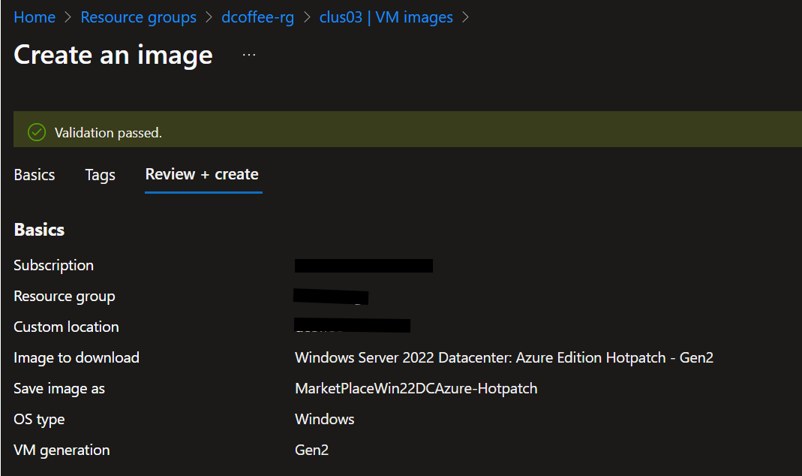
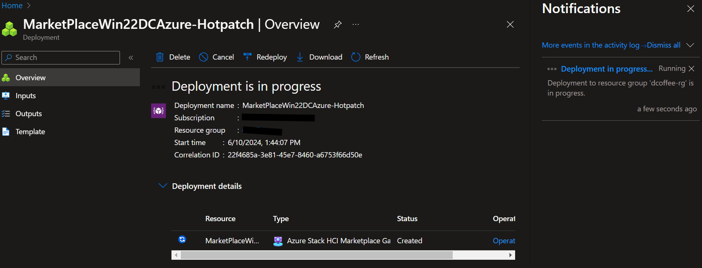
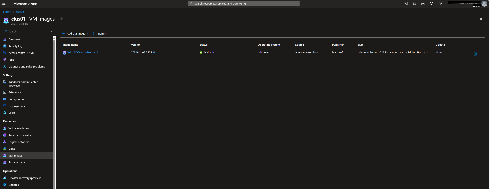
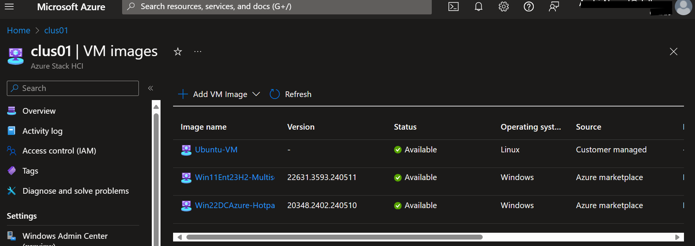
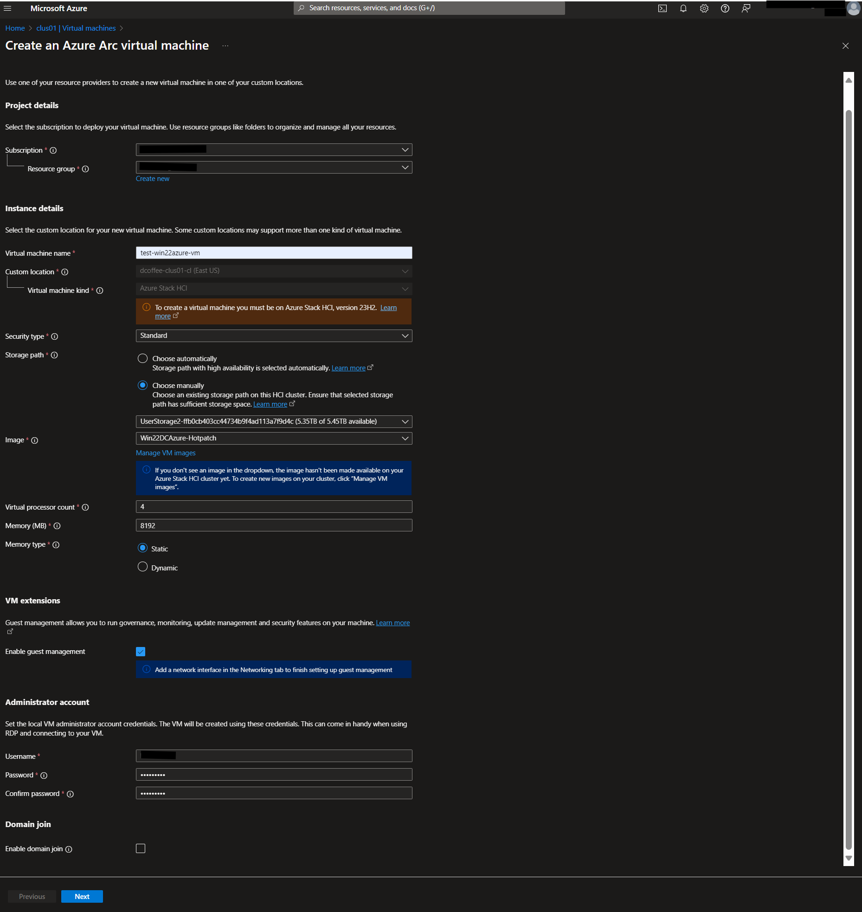
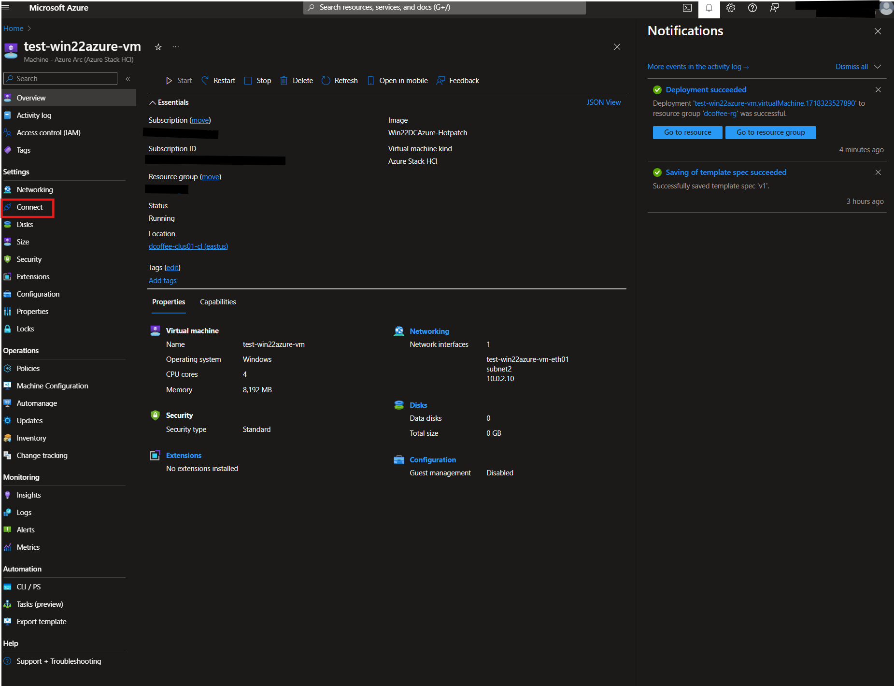
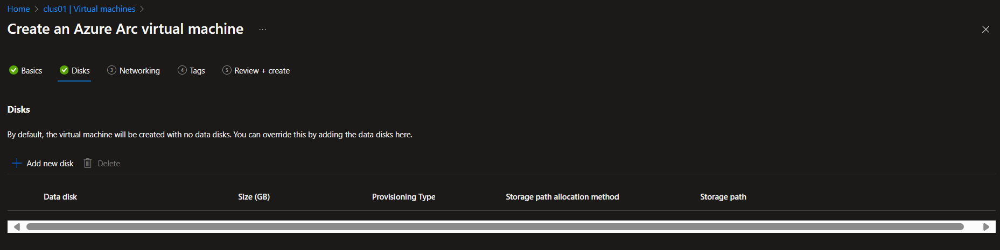

## 4. Azure Arc VM Management

Now that you have deployed your 23H2 cluster you are ready to create Arc VM from Portal. 
There are other way though, you can use Azure CLI, or Azure Resource Manager template too.
> make sure your entra user has at least **Contributor** level access at the subscription level

> make sure you are on supported region as per [Azure requirement](https://learn.microsoft.com/en-us/azure-stack/hci/concepts/system-requirements-23h2#azure-requirements)

> make sure your user has **"Azure Stack HCI Administrator"** Role

> for naming resourcse please consider [Azure naming best practice](https://learn.microsoft.com/en-us/azure/cloud-adoption-framework/ready/azure-best-practices/resource-naming#example-names-networking)

For more detail please check documentation [here](https://learn.microsoft.com/en-us/azure-stack/hci/manage/create-arc-virtual-machines?tabs=azureportal).

### Task 1 - Create VM Images from Azure Marketplace

This task will focus more on creating VM Images from Azure Marketplace. 
There are other way to create VM Images though: 1) using existing Image in Azure Storage Account or 2) using existing image in local share on your cluster.
> make sure you have storage path already created (deployment on Lab 02 already created 2 storage path)

#### Step 1 - Go to Resources > VM Images and Add VM Image from Azure MarketPlace

We are going to add Windows 2022 Data Center Azure Edition Hotpatch images
> remember your cluster custom location from cluster overview

Use the following options:
```
Basics:
    Subscription:       <use-your-subscription>
    Resource Group:     <use-your-resource-group>
    
    Save image as:      MarketPlaceWin22DCAzure-Hotpatch
    Custom Location:    <use-your-custom-location>
    Storage path:       Choose Automatically

Tags:
    <keep default>
```



#### Step 2 - Go to Resources > VM Images and List VM Images

> When image download is complete, the VM image shows up in the list of images and the **Status** shows as **Available**.

#### Step 3 (optional) - Create Linux Image from Azure CLI
On this step we are going to create linux Image from Azure CLI. Linux images are not yet available from Marketplace for Azure Stack HCI
* Download the latest supported Ubuntu server image [here](https://ubuntu.com/download/server).  
* The supported OS versions are Ubuntu 18.04, 20.04, and 22.04 LTS
* Prepare VM image from Ubuntu Image from your azure stack cluster (using powershell)
> This will enable guest management on the VMs
Run the following script from Management Machine
```powershell
# Copy downloaded Ubuntu file to ClusterSharedVolume
copy-item -path .\ubuntu-24.04-live-server-amd64.iso -Destination '\\th-mc660-1\c$\ClusterStorage\UserStorage_1\'

# Create new Ubuntu VM
$server = "th-mc660-1"

Invoke-Command -ComputerName $servers -ScriptBlock {
    $vmname = "ubuntu-vm"
    $vmram = [int64]4GB
    $vmboot = "CD"
    $isopath="C:\ClusterStorage\UserStorage_1\ubuntu-24.04-live-server-amd64.iso"
    $vmvhdpath= "C:\ClusterStorage\UserStorage_1\$vmname\$vmname.vhdx"
    $vmpath="C:\ClusterStorage\UserStorage_1\$vmname"
    $vmswitch="ConvergedSwitch(compute_management_storage)"

    New-VM -Name $vmname -MemoryStartupBytes $vmram -NewVHDPath $vmvhdpath -NewVHDSizeBytes 40GB -Path $vmpath -Generation 2 -SwitchName $vmswitch
    Add-VMDvdDrive -VMName $vmname -Path $isopath
    Set-VMFirmware –VMName $vmname –EnableSecureBoot On -SecureBootTemplate "MicrosoftUEFICertificateAuthority"
    $vmfirmware = Get-VMFirmware -VMname $vmname
    Set-VMFirmware -VMName $vmname -BootOrder $vmfirmware.BootOrder[2],$vmfirmware.BootOrder[1],$vmfirmware.BootOrder[0]
    Set-VMProcessor $vmname -Count 2
    Start-VM $vmname
}
```
* Go to Windows admin center and connect to single hosts "th-mc660-1" using RDP (Choose download RDP file)
> the VM is not part of clustergroup yet so you can not use cluster view in Windows Admin Center
* Setup the Ubuntu OS and enter your admin username and password

* Configure and clean up the VM (you can ssh or RDP)

```bash
sudo apt update && sudo apt upgrade
sudo apt install linux-azure -y
sudo apt install openssh-server openssh-client -y
# configure passwordless sudo. add the following command at the end of /etc/sudoers file by using visudo
# sudo visudo
# ALL ALL=(ALL) NOPASSWD:ALL

sudo rm -f /etc/cloud/cloud.cfg.d/50-curtin-networking.cfg /etc/cloud/cloud.cfg.d/curtin-preserve-sources.cfg /etc/cloud/cloud.cfg.d/99-installer.cfg /etc/cloud/cloud.cfg.d/subiquity-disable-cloudinit-networking.cfg
sudo rm -f /etc/cloud/ds-identify.cfg
sudo rm -f /etc/netplan/*.yaml

sudo cloud-init clean --logs --seed
sudo rm -rf /var/lib/cloud/ /var/log/* /tmp/*
sudo apt-get clean

rm -f ~/.bash_history 
export HISTSIZE=0 
logout
```
* Shutdown the VM (run from Management Machine)
```powershell
$server = "th-mc660-1"
$vmname = "ubuntu-vm"
Invoke-Command -ComputerName $servers -ScriptBlock {
Stop-VM $vmname
}
```
* Create the VM Image using Azure CLI on one of the cluster node

```powershell
$ResourceGroupName="dcoffee-rg"
$Location="eastus"
$CustomLocation = "/subscriptions/368ac09c-01c9-4b47-9142-a7581c6694a3/resourcegroups/dcoffee-rg/providers/microsoft.extendedlocation/customlocations/dcoffee-clus01-cl"
$OsType = "Linux"
$SubscriptionID="368ac09c-01c9-4b47-9142-a7581c6694a3"
$ImagePath ="C:\ClusterStorage\UserStorage_1\ubuntu-vm\ubuntu-vm.vhdx"
$ImageName="Ubuntu-VM"
az login --use-device-code
az stack-hci-vm image create --subscription $SubscriptionID -g $ResourceGroupName --custom-location $CustomLocation --location $Location --image-path $ImagePath --name $ImageName --debug --os-type $OsType
```
#### Expected Result


### Task 2 - Create Logical Networks

This task will create multiple subnet that you can add as logical networks via portal to the clusters.
Please check detail documentation [here](https://learn.microsoft.com/en-us/azure-stack/hci/manage/create-logical-networks?tabs=azurecli).

#### Step - 1 Add New DHCP Scope in DHCP server (DC machine) 

Remember that in the Labconfig we have created Additional 4 networks in DC with corresponding VLAN 1-4
```powershell
# Additional Networks configuration in DC
$LABConfig.AdditionalNetworksConfig += @{ NetName = 'subnet1'; NetAddress='10.0.1.'; NetVLAN='1'; Subnet='255.255.255.0'}
$LABConfig.AdditionalNetworksConfig += @{ NetName = 'subnet2'; NetAddress='10.0.2.'; NetVLAN='2'; Subnet='255.255.255.0'}
$LABConfig.AdditionalNetworksConfig += @{ NetName = 'subnet3'; NetAddress='10.0.3.'; NetVLAN='3'; Subnet='255.255.255.0'}
$LABConfig.AdditionalNetworksConfig += @{ NetName = 'subnet4'; NetAddress='10.0.4.'; NetVLAN='4'; Subnet='255.255.255.0'}
```
We need to add the DHCP scopes to provide DHCP for those networks (I will activate DHCP for only Even Number networks, the Odd one should be inactive, hence client IP address will use static )
Run the following script on Management machine:
```powershell
#define networks, Odd number DHCP True, Even Number DHCP false
$domain="th.dcoffee.com"
$Server="DC"
$Networks=@()
1..4 | ForEach-Object{
    If ($_ % 2 -eq 0) {
        $dhcp=$True
    } else {
        $dhcp=$False
    }
    $Networks+= @{ Name="subnet$_"; VLANID=$_; NICIP="10.0.$_.1"; PrefixLength=24; ScopeID = "10.0.$_.0"; StartRange="10.0.$_.10"; EndRange="10.0.$_.254"; SubnetMask='255.255.255.0'; DomainName=$domain; DHCPEnabled=$dhcp }  
}

# add dhcp scope for all networks
foreach ($Network in $Networks){
    #Add DHCP Scope
    if (-not (Get-DhcpServerv4Scope -CimSession $Server -ScopeId $network.ScopeID -ErrorAction Ignore)){
        Add-DhcpServerv4Scope -CimSession $Server -StartRange $Network.StartRange -EndRange $Network.EndRange -Name $Network.Name -State Active -SubnetMask $Network.SubnetMask
    }
    #disable/enable
    if ($Network.DHCPEnabled){
        Set-DhcpServerv4Scope -CimSession $Server -ScopeId $Network.ScopeID -State Active
    }else{
        Set-DhcpServerv4Scope -CimSession $Server -ScopeId $Network.ScopeID -State InActive
    }

    #Configure dhcp options
    #6 - Domain Name Server
    Set-DhcpServerv4OptionValue -CimSession $Server -OptionId 6 -Value $Network.NICIP -ScopeId $Network.ScopeID
    #3 - Gateway
    Set-DhcpServerv4OptionValue -CimSession $Server -OptionId 3 -Value $Network.NICIP -ScopeId $Network.ScopeID
    #15 - Domain Name
    Set-DhcpServerv4OptionValue -CimSession $Server -OptionId 15 -Value $Network.DomainName -ScopeId $Network.ScopeID
}

#make sure routing is enabled on DC
Invoke-Command -ComputerName $Server -ScriptBlock {
    #restart routing... just to make sure
    Restart-Service RemoteAccess
    Restart-Service DHCPServer
}
```
#### Expected Result

Got to DHCP MMC console

> you might need to authorize the DHCP servers if it is suddenly de-authorized

* Test add new NIC in Management VM using Hyper-V Manager and set VLAN ID to 2 for example and see if it gets DHCP leased

#### Step - 2 Configure Logical Networks using PowerShell

Use the following PowerShell script which uses ARM template (json).
> Somehow for static logical networks we could not use -TemplateParamterObject in New-AzResourceGroupDeployment command
so we use -TemplateParameterFile instead and create new temporary parameter file in JSON.

```powershell
#define variables

$ClusterName="clus01"
$ClusterNodes=(Get-ClusterNode -Cluster $ClusterName).Name
$VirtualSwitchName=(Get-VMSwitch -CimSession $ClusterNodes[0]).Name
$Location="EastUS"
$ResourceGroupName=""
$CustomLocationName=""
$CustomLocationID=(Get-AzCustomLocation -ResourceGroupName $ResourceGroupName -Name $CustomLocationName).ID

# define networks manually

$Networks=@()
$Networks+= @{ Name='Management'; ipAllocationMethod="Dynamic"; vlan=0 ; tags=[PSCustomObject]@{}}
$Networks+= @{ Name='subnet1'; ipAllocationMethod="Static"; addressPrefix="10.0.1.0/24" ; vlan=1 ; ipPools=@("10.0.1.10","10.0.1.255") ; dnsServers=@("10.0.1.1") ; defaultGateway="10.0.1.1" ; tags=[PSCustomObject]@{}}
$Networks+= @{ Name='subnet2'; ipAllocationMethod="Dynamic"; vlan=2 ; tags=[PSCustomObject]@{}}
$Networks+= @{ Name='subnet3'; ipAllocationMethod="Static"; addressPrefix="10.0.3.0/24" ; vlan=3 ; ipPools=@("10.0.3.10","10.0.3.255") ; dnsServers=@("10.0.3.1") ; defaultGateway="10.0.3.1" ; tags=[PSCustomObject]@{}}
$Networks+= @{ Name='subnet4'; ipAllocationMethod="Dynamic"; vlan=4 ; tags=[PSCustomObject]@{}}


#create templates
$staticTemplate = @"
{
    "`$schema": "https://schema.management.azure.com/schemas/2019-04-01/deploymentTemplate.json#",
    "contentVersion": "1.0.0.0",
    "parameters": {
        "name": {
            "type": "String"
        },
        "ipAllocationMethod": {
            "type": "String"
        },
        "addressPrefix": {
            "type": "String"
        },
        "vlan": {
            "type": "Int"
        },
        "location": {
            "type": "String"
        },
        "customLocationId": {
            "type": "String"
        },
        "vmSwitchName": {
            "type": "String"
        },
        "tags": {
            "type": "Object"
        },
        "ipPools": {
            "type": "Array"
        },
        "dnsServers": {
            "type": "Array"
        },
        "defaultGateway": {
            "type": "String"
        }
    },
    "resources": [
        {
            "type": "microsoft.azurestackhci/logicalnetworks",
            "apiVersion": "2023-09-01-preview",
            "name": "[parameters('name')]",
            "location": "[parameters('location')]",
            "extendedLocation": {
                "type": "CustomLocation",
                "name": "[parameters('customLocationId')]"
            },
            "tags": {},
            "properties": {
                "subnets": [
                    {
                        "name": "[parameters('name')]",
                        "properties": {
                            "ipAllocationMethod": "[parameters('ipAllocationMethod')]",
                            "addressPrefix": "[parameters('addressPrefix')]",
                            "vlan": "[parameters('vlan')]",
                            "ipPools": "[parameters('ipPools')]",
                            "routeTable": {
                                "properties": {
                                    "routes": [
                                        {
                                            "name": "[parameters('name')]",
                                            "properties": {
                                                "addressPrefix": "0.0.0.0/0",
                                                "nextHopIpAddress": "[parameters('defaultGateway')]"
                                            }
                                        }
                                    ]
                                }
                            }
                        }
                    }
                ],
                "vmSwitchName": "[parameters('vmSwitchName')]",
                "dhcpOptions": {
                    "dnsServers": "[parameters('dnsServers')]"
                }
            }
        }
    ],
    "outputs": {}
}
"@

$DynamicTemplate=@"
{
    "`$schema": "https://schema.management.azure.com/schemas/2019-04-01/deploymentTemplate.json#",
    "contentVersion": "1.0.0.0",
    "parameters": {
        "name": {
            "type": "String"
        },
        "ipAllocationMethod": {
            "type": "String"
        },
        "vlan": {
            "type": "Int"
        },
        "location": {
            "type": "String"
        },
        "customLocationId": {
            "type": "String"
        },
        "vmSwitchName": {
            "type": "String"
        },
        "tags": {
            "type": "Object"
        }
    },
    "resources": [
        {
            "type": "microsoft.azurestackhci/logicalnetworks",
            "apiVersion": "2023-09-01-preview",
            "name": "[parameters('name')]",
            "location": "[parameters('location')]",
            "extendedLocation": {
                "type": "CustomLocation",
                "name": "[parameters('customLocationId')]"
            },
            "tags": {},
            "properties": {
                "subnets": [
                    {
                        "name": "[parameters('name')]",
                        "properties": {
                            "ipAllocationMethod": "[parameters('ipAllocationMethod')]",
                            "vlan": "[parameters('vlan')]"
                        }
                    }
                ],
                "vmSwitchName": "[parameters('vmSwitchName')]"
            }
        }
    ],
    "outputs": {}
}

"@

$templateFileStatic = New-TemporaryFile
Set-Content -Path $templateFileStatic.FullName -Value $staticTemplate

$templateFileDynamic = New-TemporaryFile
Set-Content -Path $templateFileDynamic.FullName -Value $DynamicTemplate

$ExistingNetworks=Get-AzResource -ResourceGroupName $ResourceGroupName -ResourceType microsoft.azurestackhci/logicalNetworks

foreach ($Network in $Networks){
    if (-not ($ExistingNetworks.Name -Contains $Network.Name)){
        if ($Network.ipAllocationMethod -eq "Dynamic"){
            $templateParameterObject = @{
                name = $network.name
                ipAllocationMethod = "Dynamic"
                vlan=$Network.VLAN
                location=$Location
                customLocationId=$CustomLocationID
                vmSwitchName=$VirtualSwitchName
                tags=$Network.Tags
            }
            New-AzResourceGroupDeployment -ResourceGroupName $ResourceGroupName -TemplateFile $templateFileDynamic.FullName -TemplateParameterObject $templateParameterObject
        }else{
            #this dows not work
            <#
            $TemplateParameterObject = @{
                name = $network.name
                ipAllocationMethod = "Static"
                addressPrefix = $Network.addressPrefix
                vlan=$Network.VLAN
                location=$Location
                customLocationId=$CustomLocationID
                vmSwitchName=$VirtualSwitchName
                ipPools=$Network.IPPools
                dnsServers=$Network.DNSServers
                defaultGateway=$Network.DefaultGateway
                tags=$Network.Tags
            }
            New-AzResourceGroupDeployment -ResourceGroupName $ResourceGroupName -TemplateFile $templateFileStatic.FullName -TemplateParameterObject $templateParameterObject
            #>
            #Create parameter file
            $ParamFile=@"
{
    "`$schema": "https://schema.management.azure.com/schemas/2015-01-01/deploymentParameters.json#",
    "contentVersion": "1.0.0.0",
    "parameters": {
        "name": {
            "value": "$($network.name)"
        },
        "ipAllocationMethod": {
            "value": "Static"
        },
        "addressPrefix": {
            "value": "$($Network.addressPrefix)"
        },
        "vlan": {
            "value": $($Network.VLAN)
        },
        "location": {
            "value": "$Location"
        },
        "customLocationId": {
            "value": "$CustomLocationID"
        },
        "vmSwitchName": {
            "value": "$VirtualSwitchName"
        },
        "tags": {
            "value": {}
        },
        "ipPools": {
            "value": [
                {
                    "start": "$($Network.IPPools[0])",
                    "end": "$($Network.IPPools[1])"
                }
            ]
        },
        "dnsServers": {
            "value": [
                "$($Network.DNSServers)"
            ]
        },
        "defaultGateway": {
            "value": "$($Network.DefaultGateway)"
        }
    }
}
"@
        $parameterfile = New-TemporaryFile
        Set-Content -Path $parameterfile.FullName -Value $ParamFile
        New-AzResourceGroupDeployment -ResourceGroupName $ResourceGroupName -TemplateFile $templateFileStatic.FullName -TemplateParameterFile $parameterfile.FullName
        Remove-Item $parameterfile.FullName
        }

    }else{
        Write-Output "$($Network.Name) network already exists"
    }
}
Remove-Item $templateFileStatic.FullName
Remove-Item $templateFileDynamic.FullName
```

#### Expected Result


### Task 2 - Create Arc VMs (Windows) using DHCP from Portal

Now that you have all Azure resources created (VM Images and Logical Networks) you are ready to create Azure Arc VMs.
In this task, I will create Windows 2022 DC Azure Edition from Images that is created from Azure Marketplace and use Dynamic Network Interface using Dynamic Logical Networks (DHCP assigned).

#### Step 1 - Go to your Azure Stack HCI cluster in the portal and click Resources > Virtual Machines


Use the following parameters to create Virtual Machine from Portal:
```
Basics:
    
    Project details

    Subscription:               <use-your-subscription>
    Resource Group:             <use-your-resource-group>

    Instance details

    Virtual machine name:       test-win22azure-vm
    Custom location:            <automatically populated and grayed out>
    Virtual machine kind:       <automatically populated and grayed out>
    Security type:              Standard (Choose Trusted launch VM if you want to enable secureboot and vTPM)
    Storage path:               Choose manually (UserStorage2-<id> (TB of TB available))
    Image:                      Win22DCAzure-Hotpatch
    Virtual processor count:    4
    Memory (MB):                8192 
    Memory type:                static

    VM extensions           
    
    Enable guest management:    Yes

    Administrator account

    Username:                   <use-local-administrator>
    Password:                   <use-local-administrator-password>
    Confirm password:           <confirmed-your-password>
    
    Domain join

    Enable domain join:         Leave this un-ticked (no need to have domain joined VM for now)
```
* Click Next
> I deliberately use UserStorage2 CSV for my VM just to balance the capacity



```
Disks:

    Add new disk
    
    <skip this step as we do not require data disk for now>
```
* Click Next


```
Networking:

    Add network interface (just one for now)
    
    Name:                   test-win22azure-vm-eth01
    Network:                subnet2 (this one use DHCP)
    IPv4 type:              DHCP
```

* Click Add and then Next


* Skip Tags for now


* Review and Create


> you can also download a template for creating with ARM template later

#### Step 2 - Check the Result




Let's see them on Windows Admin Center on-premise:


> After deployment there is always one VM running which is actually Arc Resource Bridge to provide Azure Arc Custom Location object.

Check whether DHCP provides leased IP address to this VM:


#### Step 3 - Connect to the VM

Now let's try to connect to the VM. First make sure guest management is running (I thought deployment has taken care guest deployment since I set enabled, but looks like it didn't enable it )

* Go to VM > Configuration and Enable Guest Management in VM extensions


> looks like it does not work enabling from portal, let's try from Azure CLI:
* Run the following script

```powershell
# verify VM is running

$VMname="test-win22azure-vm"
$RGname="dcoffee-rg"

# Install Az CLI module if not exists yet (we have not installed any in Management machine so let's install them)

$ProgressPreference = 'SilentlyContinue'; Invoke-WebRequest -Uri https://aka.ms/installazurecliwindowsx64 -OutFile .\AzureCLI.msi; Start-Process msiexec.exe -Wait -ArgumentList '/I AzureCLI.msi /quiet'; Remove-Item .\AzureCLI.msi

# you might need to close powershell windows and start a new one
az login --use-device-code
az stack-hci-vm show --name $VMname --resource-group $RGname

# it will ask you to install the stack-hci-vm extension, type Y
```
If the agent is running it will show the result as shown in the following snippets:
```
...
"vmAgent": {
        "statuses": [
          {
            "code": "ProvisioningState/succeeded",
            "displayStatus": "Connected",
            "level": "Info",
            "message": "Successfully established connection with mocguestagent",
            "time": "2024-06-14T00:22:10+00:00"
          },
          {
            "code": "ProvisioningState/succeeded",
            "displayStatus": "Connected",
            "level": "Info",
            "message": "New mocguestagent version detected 'v0.14.0-2-g5c6a4b32'",
            "time": "2024-06-14T00:22:11+00:00"
          }
        ],
        "vmConfigAgentVersion": "v0.14.0-2-g5c6a4b32"
      }
    }
...
```
> Look for **code: ProvisioningState/succeeded** and **displayStatus: Connected** this means the guest agent is running

* Enable guest management on a VM with guest agent running.

```powershell
az stack-hci-vm update --name $VMname --enable-agent true --resource-group $RGname
```
* Now the guest managemet is enabled in the Portal

* Now let's try to connect

Follow step here to enable SSH on Windows and Arc-enabled Servers:
* [SSH access to Azure Arc-enabled servers](https://learn.microsoft.com/en-us/azure/azure-arc/servers/ssh-arc-overview?tabs=azure-cli)
* [Get Started with OpenSSH for Windows](https://learn.microsoft.com/en-us/windows-server/administration/openssh/openssh_install_firstuse?tabs=powershell)
> Note: You can also use OpenSSH for Arc-enabled servers extensions (install extension using portal or azure cli)


* Connecting VM from Windows Admin Center


### Task 3 - Create Arc VMs (Linux) using Static from Azure CLI

Run the following script from the cluster nodes.
> somehow it doesn't work remotely from Management machine

```powershell

# Define parameters for Azure CLI

$vmName ="test-ubuntu-vm"
$subscription = "<your-subscriptions>"
$resource_group = "dcoffee-rg"
$customLocationName = "dcoffee-clus01-cl"
$customLocationID ="/subscriptions/<your-subscriptions>/resourcegroups/dcoffee-rg/providers/microsoft.extendedlocation/customlocations/dcoffee-clus01-cl"
$location = "eastus"
$userName = "labadmin"
$password = "<admin-password>"
$imageName ="Ubuntu-VM"
$nicName ="test-ubuntu-vm-eth01"
$storagePathName = "UserStorage2-ffb0cb403cc44734b9f4ad113a7f9d4c"
$storagePathId = "/subscriptions/<your-subscriptions>/resourceGroups/dcoffee-rg/providers/Microsoft.AzureStackHCI/storagecontainers/UserStorage2-ffb0cb403cc44734b9f4ad113a7f9d4c"
$lnetName = "subnet1"
$gateway ="10.0.1.1"
$ipAddress ="10.0.1.10"
$computerName = "th-mc660-1"


az login --use-device-code

# create network interface with static IP

az stack-hci-vm network nic create --subscription $subscription --resource-group $resource_group --custom-location $customLocationID --location $location --name $nicName --subnet-id $lnetName --ip-address $ipAddress
az stack-hci-vm network nic list --resource-group $resource_group
az stack-hci-vm create --name $vmName --resource-group $resource_group --admin-username $userName --admin-password $password --computer-name $computerName --image $imageName --location $location --authentication-type all --nics $nicName --custom-location $customLocationID --hardware-profile memory-mb="8192" processors="4" --storage-path-id $storagePathId
```

#### Expected Result

so far no luck:

```
moc-operator virtualmachine serviceClient returned an error while reconciling: 
rpc error: code = Unknown desc = Could not establish HyperV connection for VM ID [B1BF4AE9-ECA6-4AE8-ABEF-C64581E3FCFB] within [900] seconds, 
error: [<nil>] (Code: moc-operator virtualmachine serviceClient returned an error while reconciling: rpc error: 
code = Unknown desc = Could not establish HyperV connection for VM ID [B1BF4AE9-ECA6-4AE8-ABEF-C64581E3FCFB] within [900] seconds, error: [<nil>])
```

### Task 3b - Create Arc VMs (Linux) using Static from Portal

* Basics
```
Basics:
    
    Project details

    Subscription:               <use-your-subscription>
    Resource Group:             <use-your-resource-group>

    Instance details

    Virtual machine name:       test-ubuntu1-vm
    Custom location:            <automatically populated and grayed out>
    Virtual machine kind:       <automatically populated and grayed out>
    Security type:              Standard (Choose Trusted launch VM if you want to enable secureboot and vTPM)
    Storage path:               Choose automatically
    Image:                      Ubuntu-VM
    Virtual processor count:    4
    Memory (MB):                8192 
    Memory type:                static

    VM extensions           
    
    Enable guest management:    Yes

    Root user

    Username:                   labadmin (not azureuser)
    Password:                   <use-local-administrator-password>
    Confirm password:           <confirmed-your-password>
    SSH public key resources:   Generate new key pair
    Key pair name:              test-ubuntu1-vm_key_
```


* Disks
```
Disks:

    Add new disk
    
    <skip this step as we do not require data disk for now>
```


* Networking
```
Networking:

    Add network interface (just one for now)
    
    Name:                   test-ubuntu1-vm-eth01
    Network:                subnet1 (this one use Static)
    IPv4 type:              Static
    Allocation Method       Automatic (let it be assigned from pool)
```


* Tags


* Review and Create


#### Expected Result

So far no luck too the same error as when creating azure CLI:

