## 6. Azure Arc AKS Management

One of the cool capabilities of Azure Arc enabled-AKS or AKS Hybrid is that now, you can create AKS cluster from Azure Portal, CLI and also ARM template. 
In this section I will describe in detail my experience deploying Azure Arc enabled AKS on Azure Stack HCI using Portal and CLI

* You need to have a working Azure Stack HCI version 23H3 cluster
* You need to have Kubernetes Cluster Administrator access (member of Microsoft Entra group)
* Noted down your Subscription ID and Custom Location ID
* You already created Logical Network, noted down the logical network ID. Please check this [step](../05-AzArcVM-Management/) if you have not.

### Task 1 - Create AKS cluster from Azure Portal

#### Step 1 - Go to your Azure Stack HCI Cluster in the portal and click Resources > Virtual Machines

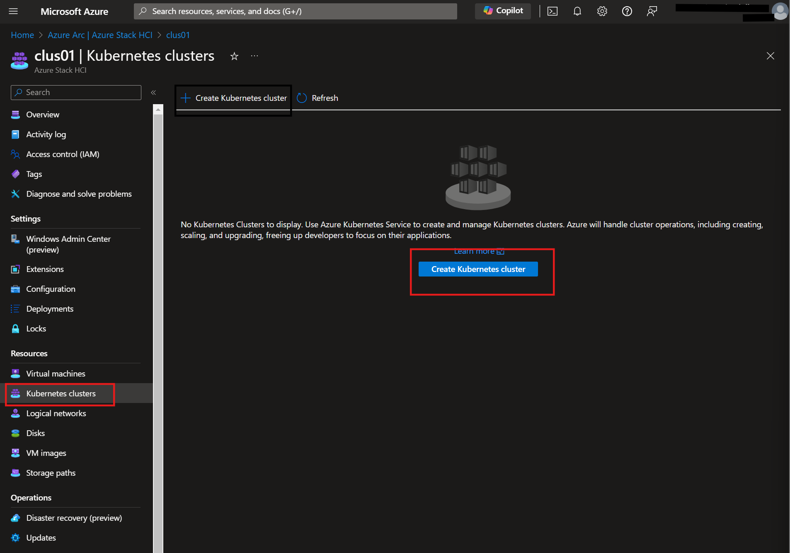

#### Step 2 - Basics

On The Basics page, configure the following options and click *Next: Node pools*

```
Basics:
    
    Project details

    Subscription:               <use-your-subscription>
    Resource Group:             <use-your-resource-group>

    Cluster details

    Virtual machine name:       th-clus03-aks01
    Custom location:            Choose custom location which aligned to the cluster where you want the AKS cluster to run (you need Contributor access to custom location)
    Kubernetes version:         Leave as Default (1.26.6)
    
    Primary node pool         
    
    Node size:                  Leave as Default (Standard_A4_v2 2vCPUs, 8 GiB RAM)
    Node count:                 2

    Administrator account

    Username:                   clouduser (default, can not changed)
    SSH public key source:      <Generate new key pair>
    key pair name:              th-clus03-aks01-key
    
```
> Note: There is always a primary linux node pool required which at least contained Azure arc agents containers

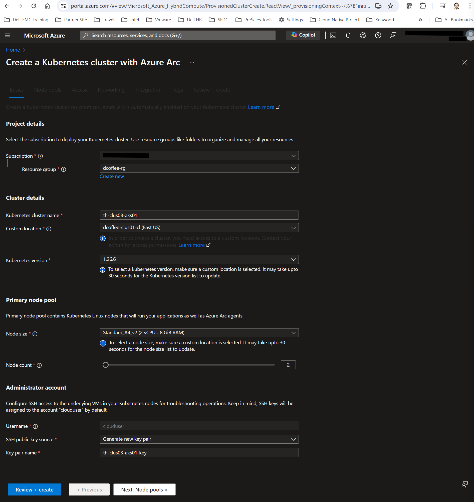

#### Step 3 - Node pools

On The Node pools page, configure the following options and click *Next: Access*

```
Node pools:
    
    Control plane nodes

    Control plane node size:     Leave as Default (Standard_A4_v2 2vCPUs, 8 GiB RAM)
    Control plane node count:    1 (if production choose 3 for HA)

    Node pools

    Virtual machine name:       th-clus03-aks01
    Custom location:            Choose custom location which aligned to the cluster where you want the AKS cluster to run (you need Contributor access to custom location)
    Kubernetes version:         Leave as Default (1.26.6)
    
    Primary node pool         
    
    Node size:                  Leave as Default (Standard_A4_v2 2vCPUs, 8 GiB RAM)
    Node count:                 2

    Node pools

    add aditional node pools if required (for example windows node pool for windows container)
    at this stage we just enough with 1 linux node pool.
  
```
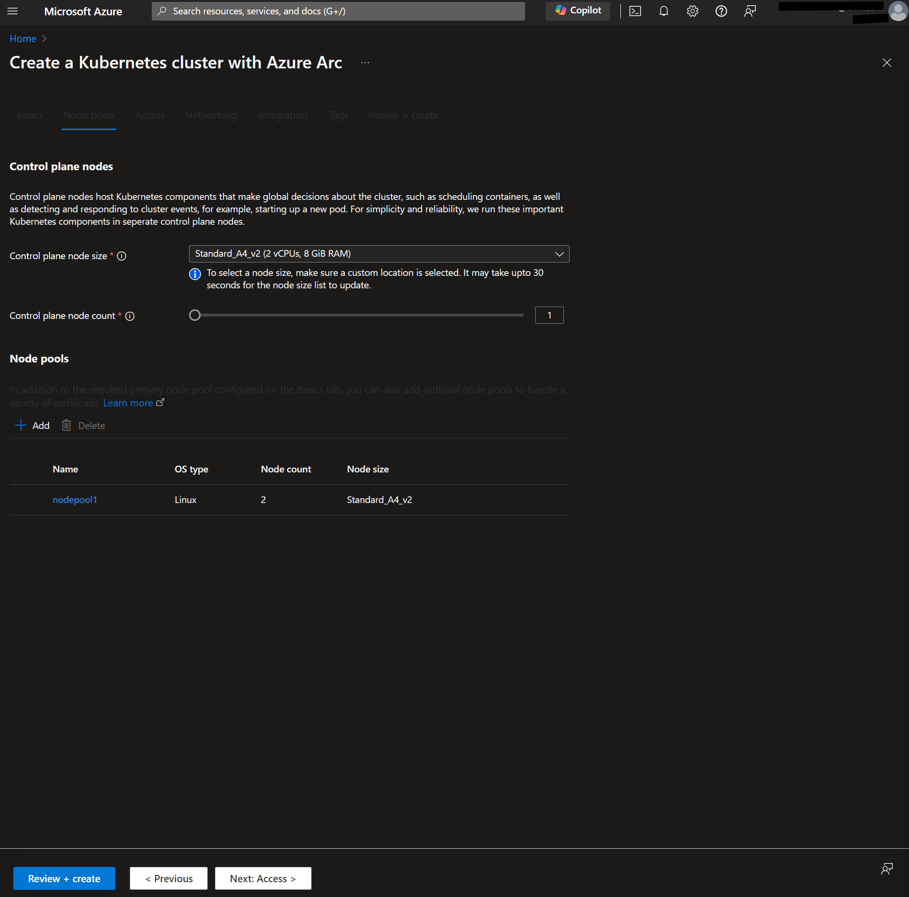

#### Step 4a - Access

On The Access page, configure the following options and click *Next: Networking*

```
Access:
    
    Authentication and Authorization

    Authentication and Authorization:     Leave as Default (Local accounts with K8s RBAC)
```
> Note: if you choose Entra ID for Authentication you need to assigned entra ID group to cluster admin role and add your user to the group

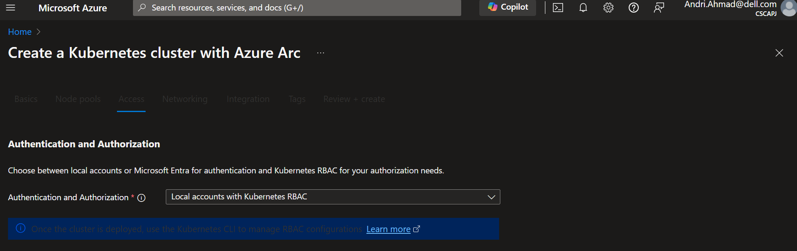

#### Step 4b - Access

On The Access page, configure the following options and click *Next: Networking*

```
Access:
    
    Authentication and Authorization

    Authentication and Authorization:   Microsoft Entra authentication with Kubernetes RBAC
    Cluster admin ClusterRoleBinding:   Choose Entra group: <aks-admins>          
```
> Note: This will enable you to connect to AKS arc anywhere without requiring to have connectivity to on-premise

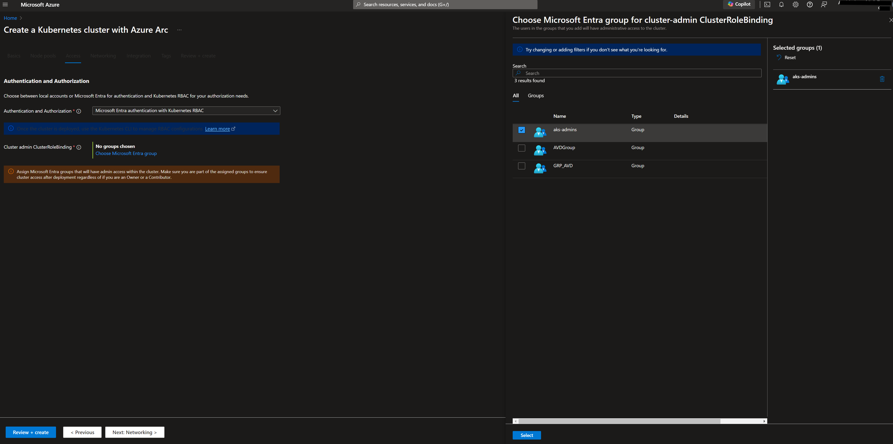

#### Step 5 - Networking

On The Networking page, configure the following options and click *Next: Integration*

```
Networking:

    Logical network:                    subnet3 (this is using Static)
    Control plane IP:                   10.0.3.9 (need to be outside of IP pool 10.0.3.10-10.0.3.255)     
```
> Note: This settings can not be changed after created. You must also use Static Logical Network, Dynamic (using DHCP) is not supported today.

> Note: Network Load-Balancer will be configured later after cluster is created if required.

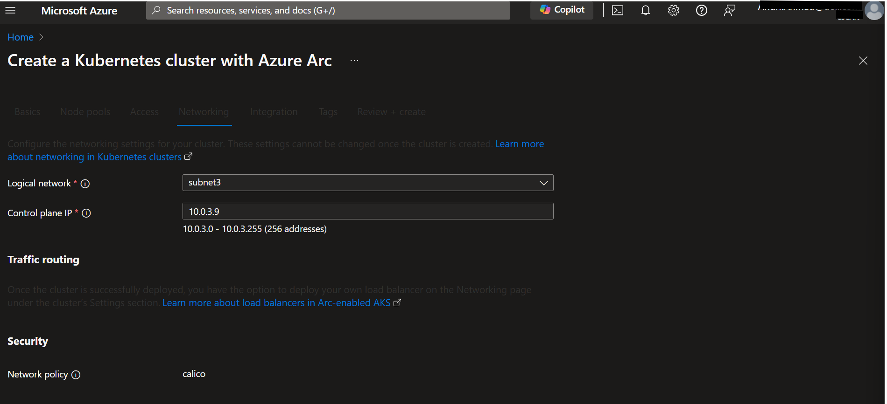

#### Step 6 - Integration

On The Integration page, configure the following options and click *Next: Tags*

```
Azure Monitor:

    Container monitoring:               Leave this as Disabled
   
```
> Note: We will do it later once the cluster is created if required (this will add some costs)

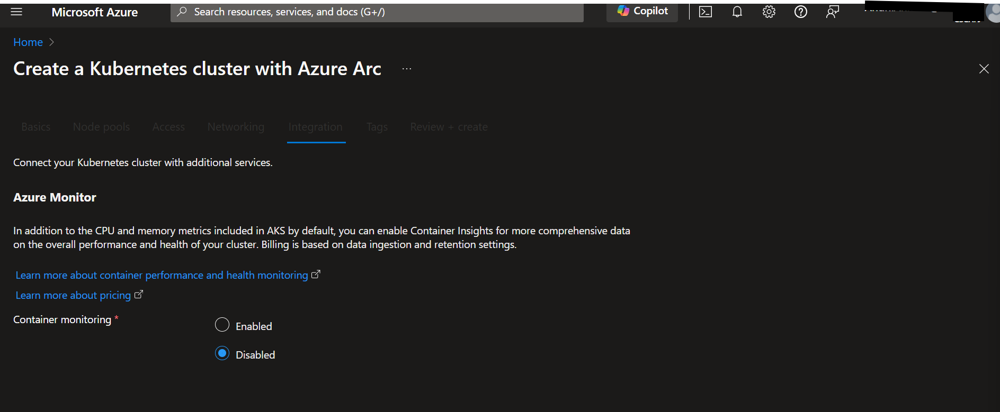

#### Step 7 - Tags

On The Tags page, skip this and click *Next: Review + create*

Configuration will be validated click *Create*
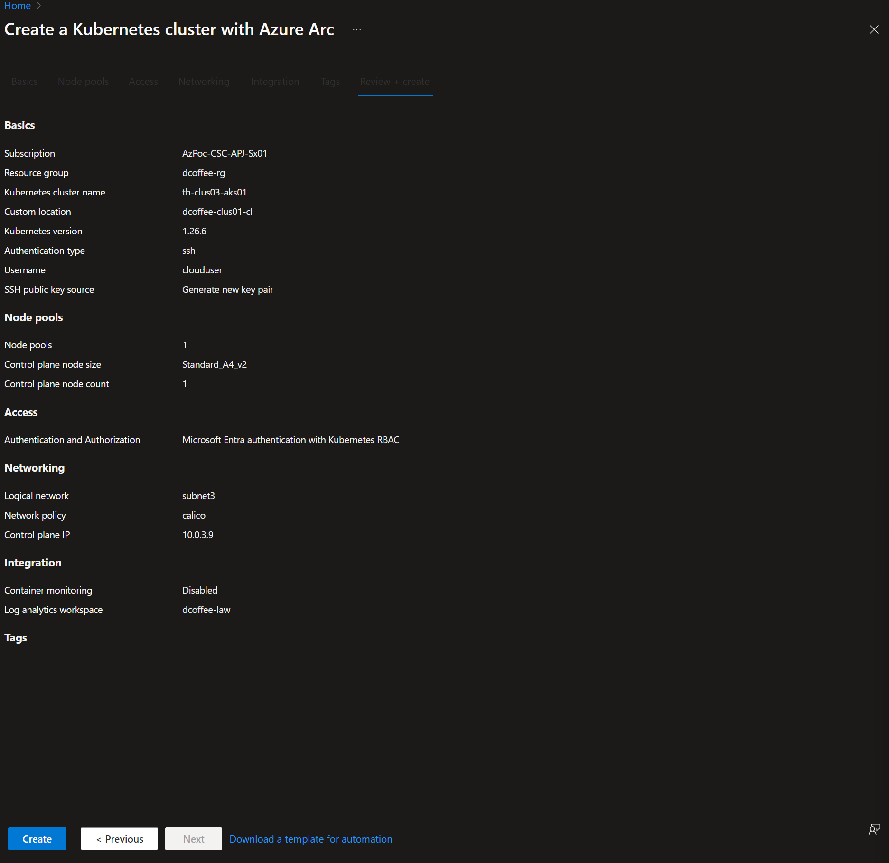

>You can also download a Template for automation later

#### Expected Results

**Deployment Progress**:

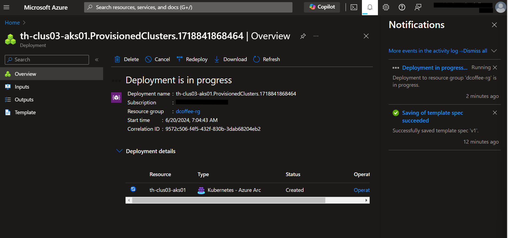
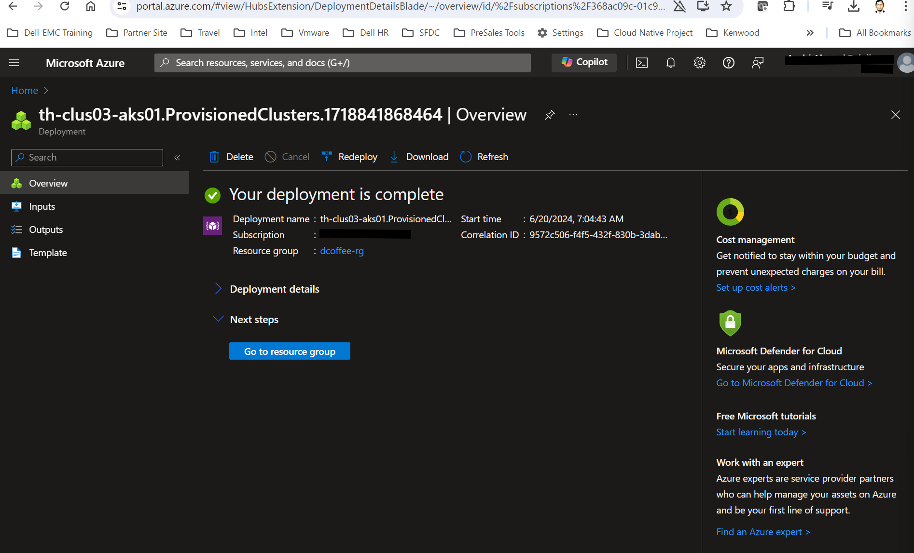
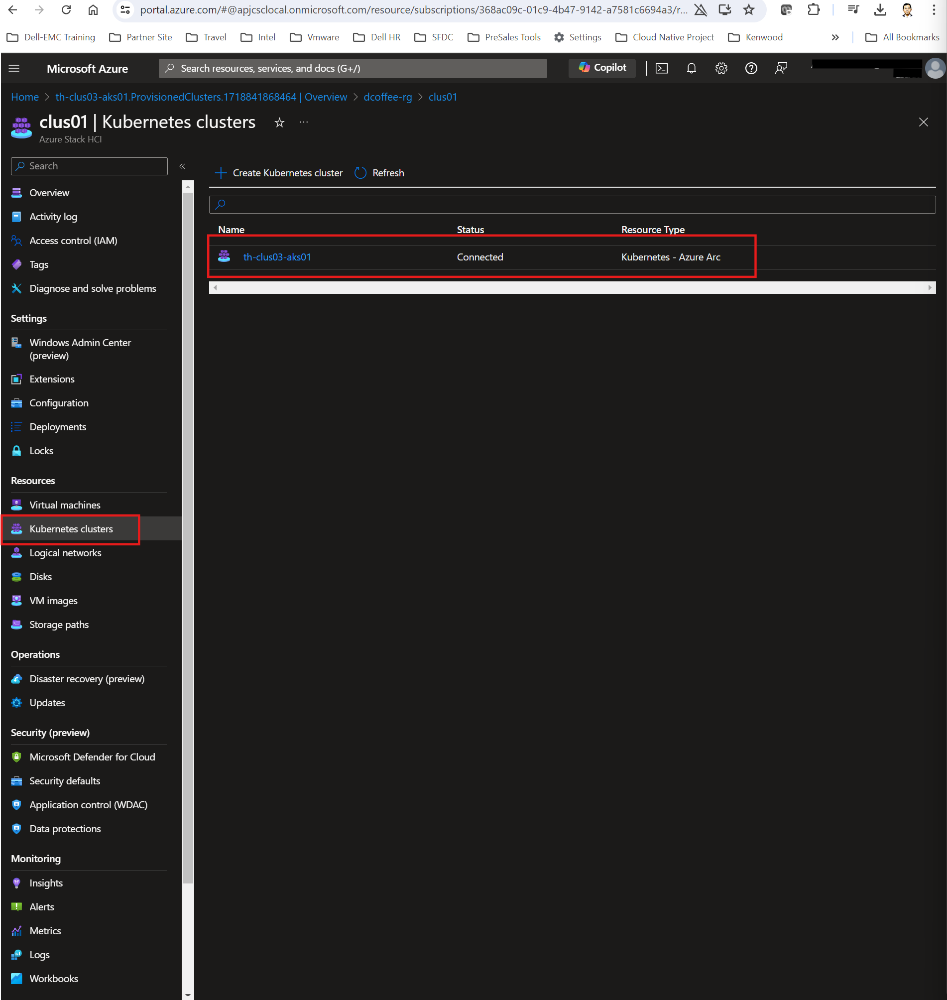

**Check on Windows Admin Center**

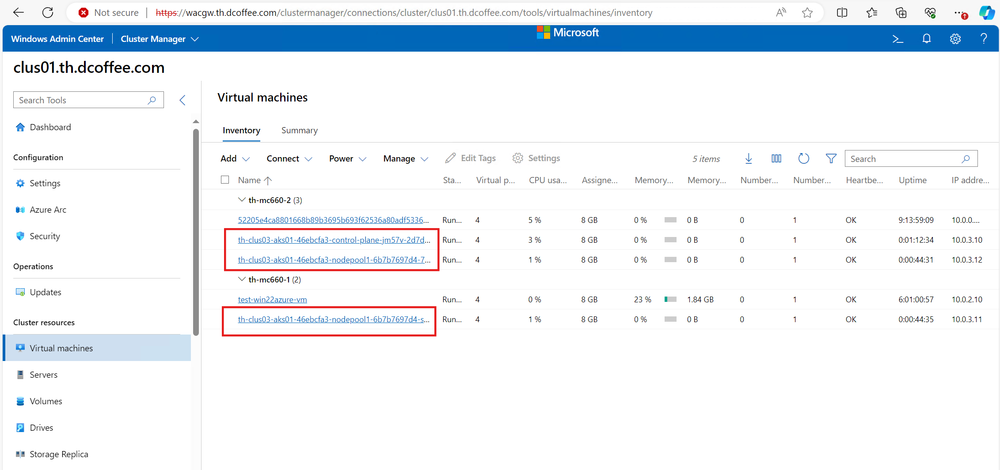

> You can see the deployment create 3 VMs: 1 Control Plane and 2 Worker Node from NodePool1

### Task 2 - Create AKS cluster from Azure CLI

Now let's try to create AKS clusters from Azure CLI.

#### Step 1 - Make sure you have all the prerequisite

* Azure Subscription ID
* Custom Location ID of your cluster
* Logical NetworkID, make sure you use Static Logical network

Run the following Script on Management machine to get CustomLocationID
```powershell

$subscription = "368ac09c-01c9-4b47-9142-a7581c6694a3"
$resource_group = "dcoffee-rg"
$customLocationName = "dcoffee-clus01-cl"
$location = "eastus"

# login first if you haven't already
az login --use-device-code

# install required azure cli extensions
az extension add -n aksarc --upgrade
az extension add -n customlocation --upgrade
az extension add -n stack-hci-vm --upgrade
az extension add -n connectedk8s --upgrade

$customLocationID = (az customlocation show --name $customLocationName --resource-group $resource_group --query "id" -o tsv)
```
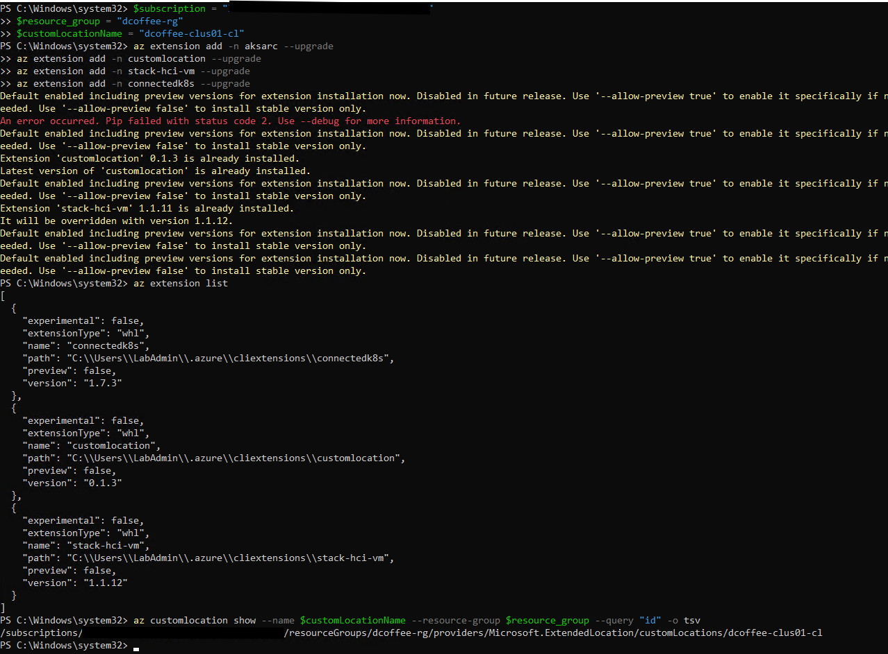

Run the following Script on Management machine to get Logical Network ID

```powershell
$lnetName = "subnet1"
$lnetid = (az stack-hci-vm network lnet show --name $lnetName --resource-group $resource_group --query "id" -o tsv)
```

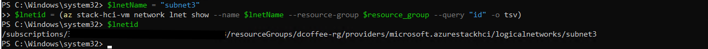

#### Step 2 - Install Kubectl on your machine

Follow this to install and setup kubectl on Windows
> [Install and Set up kubectl on Windows](https://kubernetes.io/docs/tasks/tools/install-kubectl-windows/)

I am going to use scoop here:

```powershell

# don't run Powershell as admin (RunAs) use regular PowerShell

Set-ExecutionPolicy -ExecutionPolicy RemoteSigned -Scope CurrentUser
Invoke-RestMethod -Uri https://get.scoop.sh | Invoke-Expression
```
The output would be something like this:

```
Execution Policy Change
The execution policy helps protect you from scripts that you do not trust. Changing the execution policy might expose you to the security risks described in the about_Execution_Policies help topic at
https:/go.microsoft.com/fwlink/?LinkID=135170. Do you want to change the execution policy?
[Y] Yes  [A] Yes to All  [N] No  [L] No to All  [S] Suspend  [?] Help (default is "N"): A
Initializing...
Downloading...
Extracting...
Creating shim...
Adding ~\scoop\shims to your path.
Scoop was installed successfully!
Type 'scoop help' for instructions.
PS C:\Users\LabAdmin>
```

> Note: scoop has problem using 7zip binary from www.7-zip.org use from sourceforge instead
```
notepad C:\Users\LabAdmin\scoop\buckets\main\bucket\7zip.json

# Change the following Version, URL and Hash with
"version": "24.06",
"architecture": {
        "64bit": {
            "url": "https://sourceforge.net/projects/sevenzip/files/7-Zip/24.06/7z2406-x64.msi",
            "hash": "946e32bf1eb545146ad47287d0837b01de86329c20f7081fc171d543a8578ec9",
            "extract_dir": "Files\\7-Zip"
        }

Leave other as default, then run:

scoop install 7zip
```

Now, install kubectl using scoop

```powershell
scoop install kubectl
kubectl version --client
```

The output would be something like this

```
PS C:\Users\LabAdmin> scoop install kubectl
Installing 'kubectl' (1.30.2) [64bit] from 'main' bucket
kubernetes-client-windows-amd64.tar.gz (30.3 MB) [========================================================================================================================================================================================================================================================================] 100%
Checking hash of kubernetes-client-windows-amd64.tar.gz ... ok.
Extracting kubernetes-client-windows-amd64.tar.gz ... done.
Linking ~\scoop\apps\kubectl\current => ~\scoop\apps\kubectl\1.30.2
Creating shim for 'kubectl'.
Creating shim for 'kubectl-convert'.
'kubectl' (1.30.2) was installed successfully!
PS C:\Users\LabAdmin> kubectl version --client
Client Version: v1.30.2
Kustomize Version: v5.0.4-0.20230601165947-6ce0bf390ce3
PS C:\Users\LabAdmin>
```

#### Step 3 - Create a AKS cluster
```powershell

# define parameters for az aksarc

$subscription = "368ac09c-01c9-4b47-9142-a7581c6694a3"
$resource_group = "dcoffee-rg"
$customLocationName = "dcoffee-clus01-cl"
$location = "eastus"
$aksclustername = "th-clus01-aks01"
$controlplaneIP = "10.0.1.9"
$aadgroupID = "4b5d705d-7c47-4731-b1ee-58c52165da1f"
$lnetName = "subnet1"

# login first if you haven't already
az login --use-device-code

$customLocationID = (az customlocation show --name $customLocationName --resource-group $resource_group --query "id" -o tsv)
$lnetid = (az stack-hci-vm network lnet show --name $lnetName --resource-group $resource_group --query "id" -o tsv)

# provision AKS cluster
az aksarc create -n $aksclustername -g $resource_group --custom-location $customlocationID --vnet-ids $lnetid --aad-admin-group-object-ids $aadgroupID --generate-ssh-keys --load-balancer-count 0  --control-plane-ip $controlplaneIP

```

#### Expected Results

The output would be something like this:

```
SSH key files 'C:\Users\LabAdmin\.ssh\id_rsa' and 'C:\Users\LabAdmin\.ssh\id_rsa.pub' have been generated under ~/.ssh to allow SSH access to the VM. If using machines without permanent storage like Azure Cloud Shell without an attached file share, back up your keys to a safe location
Please see Microsoft's privacy statement for more information: https://go.microsoft.com/fwlink/?LinkId=521839
Provisioning the AKSArc cluster. This operation might take a while...
{
  "extendedLocation": {
    "name": "/subscriptions/xxx/resourceGroups/dcoffee-rg/providers/Microsoft.ExtendedLocation/customLocations/dcoffee-clus01-cl",
    "type": "CustomLocation"
  },
  "id": "/subscriptions/xxx/resourceGroups/dcoffee-rg/providers/Microsoft.Kubernetes/connectedClusters/th-clus01-aks01/providers/Microsoft.HybridContainerService/provisionedClusterInstances/default",
  "name": "default",
  "properties": {
    "agentPoolProfiles": [
      {
        "count": 1,
        "enableAutoScaling": null,
        "kubernetesVersion": null,
        "maxCount": null,
        "maxPods": null,
        "minCount": null,
        "name": "nodepool1",
        "nodeLabels": null,
        "nodeTaints": null,
        "osSku": "CBLMariner",
        "osType": "Linux",
        "vmSize": "Standard_A4_v2"
      }
    ],
    "autoScalerProfile": null,
    "cloudProviderProfile": {
      "infraNetworkProfile": {
        "vnetSubnetIds": [
          "/subscriptions/xxx/resourceGroups/dcoffee-rg/providers/microsoft.azurestackhci/logicalnetworks/subnet1"
        ]
      }
    },
    "clusterVmAccessProfile": {
      "authorizedIpRanges": null
    },
    "controlPlane": {
      "controlPlaneEndpoint": {
        "hostIp": "10.0.1.9"
      },
      "count": 1,
      "vmSize": "Standard_A4_v2"
    },
    "kubernetesVersion": "1.27.3",
    "licenseProfile": {
      "azureHybridBenefit": "False"
    },
    "linuxProfile": {
      "ssh": {
        "publicKeys": [
          {
            "keyData": "ssh-rsa xxx"
          }
        ]
      }
    },
    "networkProfile": {
      "loadBalancerProfile": {
        "count": 0
      },
      "networkPolicy": "calico",
      "podCidr": "10.244.0.0/16"
    },
    "provisioningState": "Succeeded",
    "status": {
      "controlPlaneStatus": [
        {
          "errorMessage": null,
          "name": "ArcAgent",
          "phase": "provisioned",
          "ready": true
        },
        {
          "errorMessage": null,
          "name": "CloudProvider",
          "phase": "provisioned",
          "ready": true
        },
        {
          "errorMessage": null,
          "name": "Telemetry",
          "phase": "provisioned",
          "ready": true
        },
        {
          "errorMessage": null,
          "name": "CertificateAuthority",
          "phase": "provisioned",
          "ready": true
        },
        {
          "errorMessage": null,
          "name": "ProviderKeyVaultKms",
          "phase": "provisioned",
          "ready": true
        },
        {
          "errorMessage": null,
          "name": "ProviderCsiDriver",
          "phase": "provisioned",
          "ready": true
        },
        {
          "errorMessage": null,
          "name": "NfsCsiDriver",
          "phase": "provisioned",
          "ready": true
        },
        {
          "errorMessage": "Error: AddOnAvailable: csi-smb-controller: Deployment does not have minimum availability. ",
          "name": "SmbCsiDriver",
          "phase": "provisioning",
          "ready": null
        },
        {
          "errorMessage": null,
          "name": "KubeProxy",
          "phase": "provisioned",
          "ready": true
        }
      ],
      "currentState": "Succeeded",
      "errorMessage": null,
      "operationStatus": null
    },
    "storageProfile": {
      "nfsCsiDriver": {
        "enabled": true
      },
      "smbCsiDriver": {
        "enabled": true
      }
    }
  },
  "resourceGroup": "dcoffee-rg",
  "systemData": {
    "createdAt": "2024-06-21T02:22:04.427031+00:00",
    "createdBy": "xxx",
    "createdByType": "User",
    "lastModifiedAt": "2024-06-21T02:35:57.179071+00:00",
    "lastModifiedBy": "xxx",
    "lastModifiedByType": "Application"
  },
  "type": "microsoft.hybridcontainerservice/provisionedclusterinstances"
```

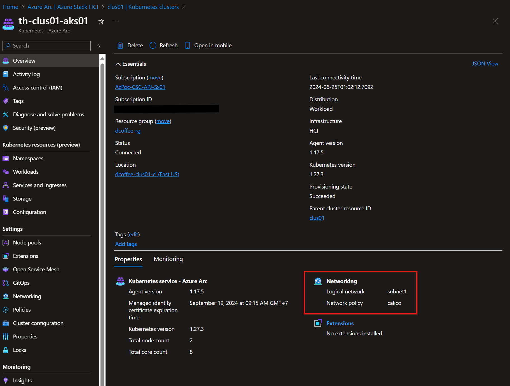
> the AKS cluster is running on subnet1 as defined in parameter

**Check on Windows Admin Center**

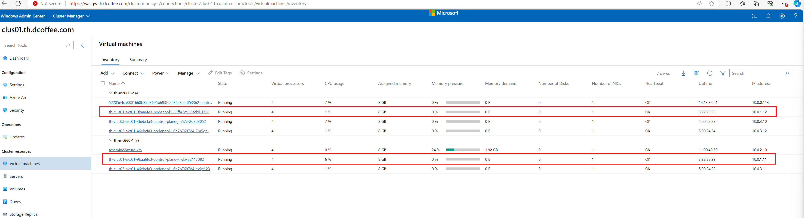
> You can see the deployment create 2 VMs: 1 Control Plane and 1 Worker Node from NodePool1
you also see that all the VMs are running on subnet1 (10.0.1.0/24)

### Task 3 - Connect to the kubernetes clusters

Now you can connect to your Kubernetes cluster by running the az connectedk8s proxy command from your development machine.
Make sure you sign in to Azure before running this command.
This command downloads the kubeconfig of your Kubernetes cluster to your development machine and opens a proxy connection channel to your on-premises Kubernetes cluster. The channel is open for as long as the command runs. Let this command run for as long as you want to access your cluster. 
If it times out, close the CLI window, open a fresh one, then run the command again.
You must have Contributor permissions on the resource group that hosts the Kubernetes cluster in order to run the following command successfully:

```powershell

$resource_group = "dcoffee-rg"
$aksclustername = "th-clus01-aks01"

# login first if you haven't already
az login --use-device-code

az connectedk8s proxy --name $aksclustername --resource-group $resource_group --file "~\.kube\config"

```

The output would be something like this:

```
PS C:\Users\LabAdmin> az connectedk8s proxy --name $aksclustername --resource-group $resource_group --file "~\.kube\config"
Proxy is listening on port 47011
Merged "th-clus01-aks01" as current context in C:\Users\LabAdmin\.kube\config
Start sending kubectl requests on 'th-clus01-aks01' context using kubeconfig at C:\Users\LabAdmin\.kube\config
Press Ctrl+C to close proxy.

```

Now open another terminal to use kubectl

```
PS C:\Users\LabAdmin> kubectl get nodes
NAME              STATUS   ROLES           AGE     VERSION
moc-ldg8d1iqwb3   Ready    control-plane   3d23h   v1.27.3
moc-lk3oqtsyffz   Ready    <none>          3d23h   v1.27.3
PS C:\Users\LabAdmin> kubectl get namespaces
NAME              STATUS   AGE
azure-arc         Active   3d23h
default           Active   3d23h
kube-node-lease   Active   3d23h
kube-public       Active   3d23h
kube-system       Active   3d23h
```

### Task 4 - Deploy Sample Application

#### Step 1 - Create a MetalLB load balancer from Azure Portal

The main purpose of a load balancer is to distribute traffic across multiple nodes in a Kubernetes cluster. 
This can help prevent downtime and improve overall performance of applications. 
AKS enabled by Azure Arc supports creating MetalLB load balancer instance on your Kubernetes cluster using the Arc Networking k8s-extension.

Prerequisite:
1. A Kubernetes cluster with at least one Linux node (created through portal or cli)
2. Assign IP Address for Load Balancer with the same subnet as the kubernetes logical networks. 
> Make sure it is outside of the pool and not overlapped with control plane IP address.

**Go to your AKS cluster and Navigate to Networking**

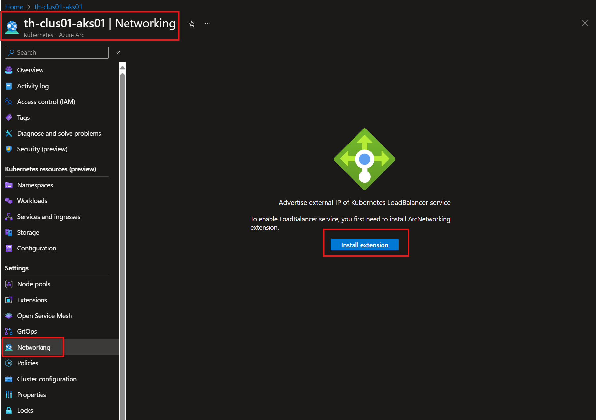
> Click Install to install the ArcNetworking k8s-extension

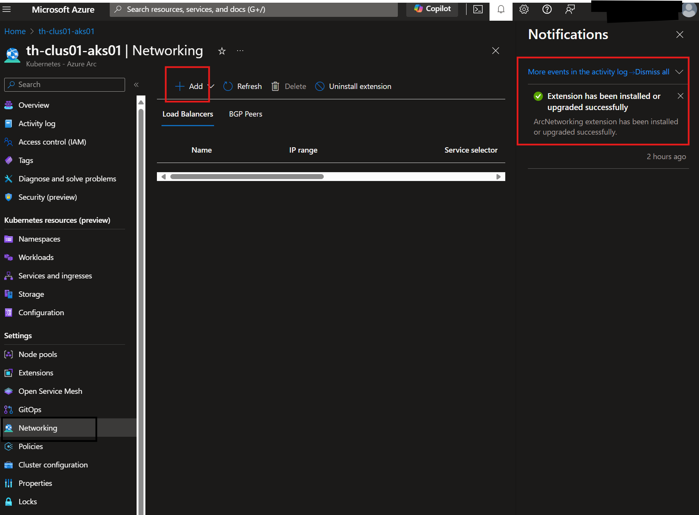

After the extension is successfully installed, you can create a load balancer service to the AKS cluster.

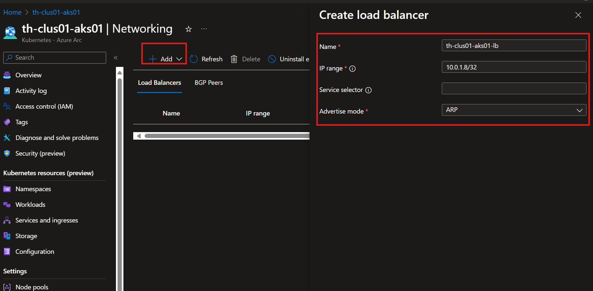
> Choose ARP for Adversite Mode since in this environment we don't have any BGP peers

#### Step 1a - Create a MetalLB load balancer from Azure CLI

