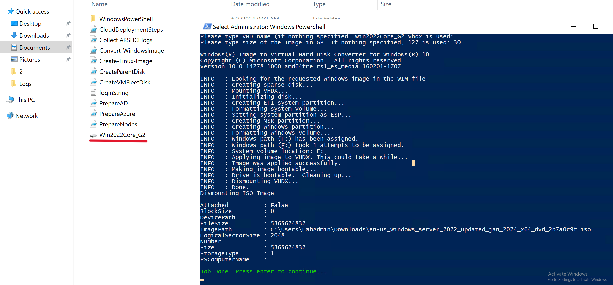

## 8. Test Azure Stack HCI Performance

### Prerequisites

* Follow Lab 1 - 2 to have a working Azure Stack HCI Clusters
* You will need the following ready in Management Machine:
	* Small Windows Server 2022 Core VHD (30GB size) for VMFleet Image baseline template. We are going to create this in Task 1, yo need to have the original Windows Server 2022 ISO.
	* CreateParentDisk.ps1 script
	* Convert-WindowsImage.ps1 script
	* CreateVMFleetDisk.ps1 script
* The script above has been created when you hydrated them in Lab 1. Copy them to the Management Machine

### Task 1 - Create Windows Server 2022 Core VHD

Let's create a small Windows Server 2022 Core VHD (30GB Size).

Step 1 - Ensure Management Machine has Hyper-V PowerShell Module and Hyper-V itself (to work with VHDs).

```powershell
#install Hyper-V using DISM, run the powershell as Administrator
Enable-WindowsOptionalFeature -FeatureName Microsoft-Hyper-V -Online -All -NoRestart
Install-WindowsFeature -Name "RSAT-Hyper-V-Tools"
```

Ouput of required Hyper-V modules is something like this:

```
PS C:\Windows\system32> get-Windowsfeature -Name "*Hyper-V*"

Display Name                                            Name                       Install State
------------                                            ----                       -------------
[X] Hyper-V                                             Hyper-V                        Installed
        [X] Hyper-V Management Tools                    RSAT-Hyper-V-Tools             Installed
            [X] Hyper-V GUI Management Tools            Hyper-V-Tools                  Installed
            [X] Hyper-V Module for Windows PowerShell   Hyper-V-PowerShell             Installed
```

Step 2 - Run CreateParentDisk.ps1 by right-clicking and selecting "Run with PowerShell"
Step 3 - Once asked, provide Windows Server 2022 ISO. Hit cancel to skip msu (cummulative update).
Step 4 - Select Windows Server 2022 DataCenter (Core or No Desktop Experience)
Step 5 - Hit Enter to keep the default name (Win2022Core_G2.vhdx) and Type 30 for 30GB VHD size

#### Expected Result




### Task 2 - Create VMFleet Image
### Task 3 - Deploy VMFleet and Measure Performance
### Task 4 - Cleanup VMFleet