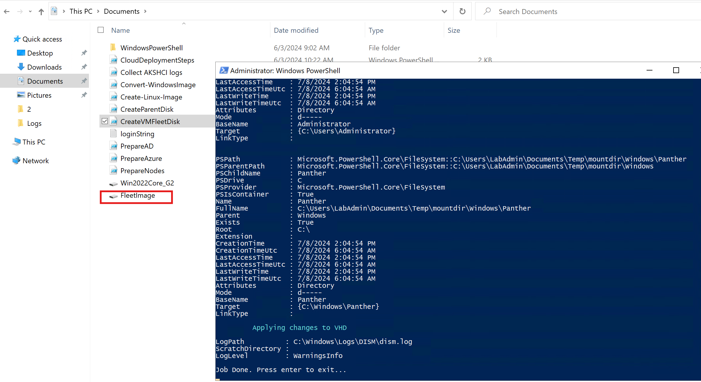

## 8. Test Azure Stack HCI Performance

### Prerequisites

* Follow Lab 1 - 2 to have a working Azure Stack HCI Clusters
* You will need the following ready in Management Machine:
	* Small Windows Server 2022 Core VHD (30GB size) for VMFleet Image baseline template. We are going to create this in Task 1, yo need to have the original Windows Server 2022 ISO.
	* CreateParentDisk.ps1 script
	* Convert-WindowsImage.ps1 script
	* CreateVMFleetDisk.ps1 script
* The script above has been created when you hydrated them in Lab 1. Copy them to the Management Machine

### Task 1 - Create Windows Server 2022 Core VHD

Let's create a small Windows Server 2022 Core VHD (30GB Size).

#### Step 1 - Ensure Management Machine has Hyper-V PowerShell Module and Hyper-V itself (to work with VHDs).

```powershell
#install Hyper-V using DISM, run the powershell as Administrator
Enable-WindowsOptionalFeature -FeatureName Microsoft-Hyper-V -Online -All -NoRestart
Install-WindowsFeature -Name "RSAT-Hyper-V-Tools"
```

Ouput of required Hyper-V modules is something like this:

```
PS C:\Windows\system32> get-Windowsfeature -Name "*Hyper-V*"

Display Name                                            Name                       Install State
------------                                            ----                       -------------
[X] Hyper-V                                             Hyper-V                        Installed
        [X] Hyper-V Management Tools                    RSAT-Hyper-V-Tools             Installed
            [X] Hyper-V GUI Management Tools            Hyper-V-Tools                  Installed
            [X] Hyper-V Module for Windows PowerShell   Hyper-V-PowerShell             Installed
```

#### Step 2 - Run CreateParentDisk.ps1 by right-clicking and selecting "Run with PowerShell"
#### Step 3 - Once asked, provide Windows Server 2022 ISO. Hit cancel to skip msu (cummulative update).
#### Step 4 - Select Windows Server 2022 DataCenter (Core or No Desktop Experience)
#### Step 5 - Hit Enter to keep the default name (Win2022Core_G2.vhdx) and Type 30 for 30GB VHD size

#### Expected Result


### Task 2 - Create VMFleet Image

Now, it's time to create VMFleet Image:

#### Step 1 - Run CreateVMFleetDisk.ps1 by right-clicking and selecting run with PowerShell
#### Step 2 - Provide Small Windows Server VHD that we've created in the Task 1
#### Step 3 - Provide Password for VMFleet Image (Please keep this password handy)

#### Expected Result



### Task 3 - Configure VMFleet Prerequisite

> Run all the steps from Management Machine

#### Step 1 - Install required PowerShell Module:

```powershell
    Install-PackageProvider -Name NuGet -MinimumVersion 2.8.5.201 -Force
    Install-Module -Name VMFleet -Force
    Install-Module -Name PrivateCloud.DiagnosticInfo -Force
```

#### Step 2 - Defined Variables and create "Collect" Volumes

```powershell
# Defined Variables

$ClusterName="clus02"
$Nodes=(Get-ClusterNode -Cluster $ClusterName).Name
$VolumeSize=200GB
$StoragePool=Get-StoragePool -CimSession $ClusterName | Where-Object OtherUsageDescription -eq "Reserved for S2D"

#Create Collect volume (thin provisioned)

if (-not (Get-Virtualdisk -CimSession $ClusterName -FriendlyName Collect -ErrorAction Ignore)){
    New-Volume -CimSession $CLusterName -StoragePool $StoragePool -FileSystem CSVFS_ReFS -FriendlyName Collect -Size $VolumeSize -ProvisioningType Thin
}
```
The output would be something like this:

```
PS C:\Windows\system32> #Create Collect volume (thin provisioned)
>> if (-not (Get-Virtualdisk -CimSession $ClusterName -FriendlyName Collect -ErrorAction Ignore)){
>>     New-Volume -CimSession $CLusterName -StoragePool $StoragePool -FileSystem CSVFS_ReFS -FriendlyName Collect -Size $VolumeSize -ProvisioningType Thin
>> }

DriveLetter FriendlyName FileSystemType DriveType HealthStatus OperationalStatus SizeRemaining      Size
----------- ------------ -------------- --------- ------------ ----------------- -------------      ----
            Collect      CSVFS_ReFS     Fixed     Healthy      OK                    197.17 GB 199.94 GB

PS C:\Windows\system32> Get-VirtualDisk -CimSession $ClusterName

FriendlyName              ResiliencySettingName FaultDomainRedundancy OperationalStatus HealthStatus    Size FootprintOnPool StorageEfficiency PSComputerName
------------              --------------------- --------------------- ----------------- ------------    ---- --------------- ----------------- --------------
Infrastructure_1          Mirror                1                     OK                Healthy       252 GB          505 GB            49.90% clus02
UserStorage_2             Mirror                1                     OK                Healthy      5.17 TB          107 GB            49.53% clus02
ClusterPerformanceHistory Mirror                1                     OK                Healthy        24 GB           49 GB            48.98% clus02
Collect                   Mirror                1                     OK                Healthy       200 GB           11 GB            45.45% clus02
UserStorage_1             Mirror                1                     OK                Healthy      5.17 TB          141 GB            49.65% clus02
``` 

### Task 4 - Deploy VMFleet and Measure Performance
### Task 5 - Cleanup VMFleet