## 11. Azure Virtual Desktop on Azure Stack HCI

### About the lab

In this Lab, we are going to deploy Azure Virtual Desktop on Azure Stack HCI 23H2 by using PowerShell.

References:
Learn.microsoft.com [Deploy Azure Virtual Desktop](https://learn.microsoft.com/en-us/azure/virtual-desktop/deploy-azure-virtual-desktop)
https://learn.microsoft.com/en-us/azure/virtual-desktop/azure-stack-hci-overview

Please find AVD terminology here: https://learn.microsoft.com/en-us/azure/virtual-desktop/terminology
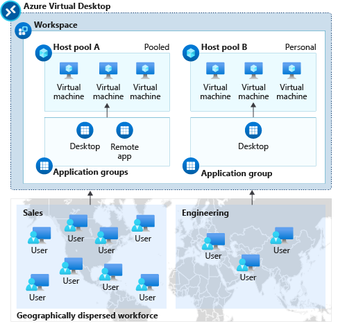


### Prerequisites

References:
Learn.microsoft.com [Prerequisites for Azure Virtual Desktop](https://learn.microsoft.com/en-us/azure/virtual-desktop/prerequisite)

at high-level, you need:

* An Azure account with an active subscription
* A supported identity provider
* A supported operating system for session host virtual machines
* Appropriate licenses
* Network connectivity
* A Remote Desktop client

#### Step 1 - Register Microsoft.DesktopVirtualization resource provider for your subscriptions.

> You must have permission to register a resource provider, which requires the */register/action operation. This is included if your account is assigned the **contributor** or **owner role** on your subscription.

Use the following powershell script to check and register if not exists the resource provider. Run from the Management Machine:

```powershell
# Setup some variables
$ResourceGroupName=""
$Location="eastus" #make sure location is lowercase, metadata for AVD only supported in certain region
$HostPoolPooled = "MC760-Pooled-Pool"
$HostPoolPersonal = "MC760-Personal-Pool"
$WorkspaceName="MC760-Workspace"

# Make sure User or SPN is contributor and user access administrator in Azure Subscriptions
# We are using SPN here:
# fill out the following variable to your environment
$tenantID = ""
$AdminSPNAppID=""
$AdminSPNName=""
$AdminPlainSecret=""
$AdminSecuredSecret = ConvertTo-SecureString $AdminPlainSecret -AsPlainText -Force
$AdminSPNCred = New-Object -TypeName System.Management.Automation.PSCredential -ArgumentList $AdminSPNAppID, $AdminSecuredSecret

#login to azure
#download and install Azure module

#Set PSGallery as a trusted repo
Set-PSRepository -Name "PSGallery" -InstallationPolicy Trusted

$ModuleNames="Az.Accounts","Az.Resources","Az.Compute","Az.DesktopVirtualization"
foreach ($ModuleName in $ModuleNames) {
    if (!(Get-InstalledModule -Name $ModuleName -ErrorAction Ignore)){
	    Install-Module -Name $ModuleName -Force
    }
} 

if (-not (Get-AzContext)){
	Connect-AzAccount -ServicePrincipal -TenantId $tenantID -Credential $AdminSPNCred
}

# Step 1 - Check if Microsoft.DesktopVirtualization resource provider is registered, create if it isn't.
if (!(Get-AzResourceProvider -ProviderNamespace Microsoft.DesktopVirtualization -ErrorAction Ignore)){
    Register-AzResourceProvider -ProviderNamespace Microsoft.DesktopVirtualization 
} else {
    Write-Output "Registered"
}
```
> Note: metadata for AVD only supported in certain region: https://learn.microsoft.com/en-us/azure/virtual-desktop/prerequisites?tabs=portal

#### Step 2 - Check if your SPN account has correct Azure RBAC

```powershell
# Step 2 - Check if the SPN has sufficient RBAC roles/permissions on the resource group:
$Subscription = Get-AzSubscription
$SubscriptionID = $Subscription.Id
$adminSPNObject = Get-AzADServicePrincipal -DisplayNameBeginsWith $AdminSPNName
$adminSPNObjID = $adminSPNObject.Id

# Check if the Roles should have Desktop Virtualization Contributor and Virtual Machine Contributor or just Contributor

$adminSPNRoles = Get-AzRoleAssignment -ObjectId $adminSPNObjID -Scope "/subscriptions/$SubscriptionID/resourceGroups/$ResourceGroupName" | Select-Object -Property RoleDefinitionName
$prerequisiteRoles = @('Desktop Virtualization Contributor','Virtual Machine Contributor','Azure Stack HCI VM Contributor','Contributor')
$sufficient = $adminSPNRoles| Where-Object RoleDefinitionName -in $prerequisiteRoles
if (!($sufficient)){
    Write-Output "SPN has insufficient roles: $sufficient"
} else {
    Write-Output "SPN has sufficient roles: $sufficient"
}
```
You can also check them in Azure Portal:

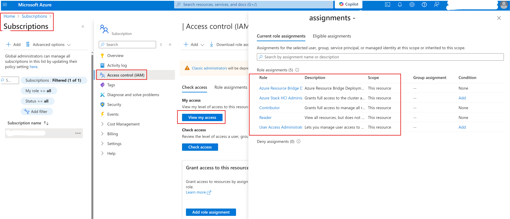

### Task 1 - Create a Host Pool

There are two type of Host Pool: Pooled or Personal. Pooled destkops are stateless where Personal are stateful. I will create both to test.

#### Step 1A - Create Pooled Host Pool

```powershell
$parameters = @{
     Name = $HostPoolPooled
     ResourceGroupName = $ResourceGroupName
     HostPoolType = 'Pooled'
     LoadBalancerType = 'BreadthFirst'
     PreferredAppGroupType = 'Desktop'
     MaxSessionLimit = '5'
     Location = $Location
}

New-AzWvdHostPool @parameters

# Check HostPool created in Azure
Get-AzWvdHostPool -Name $parameters.Name -ResourceGroupName $parameters.ResourceGroupName | FL *

```
#### Expected Result

```
PS C:\Windows\system32> New-AzWvdHostPool @parameters

Etag IdentityPrincipalId IdentityTenantId IdentityType Kind Location ManagedBy Name              PlanName PlanProduct PlanPromotionCode PlanPublisher PlanVersion SkuCapacity SkuFamily SkuN
                                                                                                                                                                                        ame
---- ------------------- ---------------- ------------ ---- -------- --------- ----              -------- ----------- ----------------- ------------- ----------- ----------- --------- ----
                                                            eastus             MC760-Pooled-Pool


PS C:\Windows\system32> Get-AzWvdHostPool -Name $parameters.Name -ResourceGroupName $parameters.ResourceGroupName | FL *


AgentUpdateMaintenanceWindow               :
AgentUpdateMaintenanceWindowTimeZone       :
AgentUpdateType                            :
AgentUpdateUseSessionHostLocalTime         :
ApplicationGroupReference                  : {}
CloudPcResource                            : False
CustomRdpProperty                          : drivestoredirect:s:*;audiomode:i:0;videoplaybackmode:i:1;redirectclipboard:i:1;redirectprinters:i:1;devicestoredirect:s:*;redirectcomports:i:1;redirectsmartcards:i:1;usbdevicestoredirect:s:*;enablecredsspsupport:i:1;redirectwebauthn:i:1;use multimon:i:1;
Description                                :
Etag                                       :
FriendlyName                               :
HostPoolType                               : Pooled
Id                                         : /subscriptions/368ac09c-01c9-4b47-9142-a7581c6694a3/resourcegroups/rg-sg-mc760/providers/Microsoft.DesktopVirtualization/hostpools/MC760-Pooled-Pool
Identity                                   : Microsoft.Azure.PowerShell.Cmdlets.DesktopVirtualization.Models.Api10.Identity
IdentityPrincipalId                        :
IdentityTenantId                           :
IdentityType                               :
Kind                                       :
LoadBalancerType                           : BreadthFirst
Location                                   : eastus
ManagedBy                                  :
MaxSessionLimit                            : 5
Name                                       : MC760-Pooled-Pool
ObjectId                                   : 37c135d5-6626-4a6c-b8c0-e9aba1af9b2b
PersonalDesktopAssignmentType              :
Plan                                       : Microsoft.Azure.PowerShell.Cmdlets.DesktopVirtualization.Models.Api10.Plan
PlanName                                   :
PlanProduct                                :
PlanPromotionCode                          :
PlanPublisher                              :
PlanVersion                                :
PreferredAppGroupType                      : Desktop
PrivateEndpointConnection                  : {}
PublicNetworkAccess                        : Enabled
RegistrationInfoExpirationTime             :
RegistrationInfoRegistrationTokenOperation :
RegistrationInfoToken                      :
Ring                                       :
Sku                                        : Microsoft.Azure.PowerShell.Cmdlets.DesktopVirtualization.Models.Api10.Sku
SkuCapacity                                :
SkuFamily                                  :
SkuName                                    :
SkuSize                                    :
SkuTier                                    :
SsoClientId                                :
SsoClientSecretKeyVaultPath                :
SsoSecretType                              :
SsoadfsAuthority                           :
StartVMOnConnect                           : False
SystemDataCreatedAt                        : 2/9/2024 10:32:30 AM
SystemDataCreatedBy                        : d329535d-0cf4-473a-8646-8c612949142a
SystemDataCreatedByType                    : Application
SystemDataLastModifiedAt                   : 2/9/2024 10:32:30 AM
SystemDataLastModifiedBy                   : d329535d-0cf4-473a-8646-8c612949142a
SystemDataLastModifiedByType               : Application
Tag                                        : Microsoft.Azure.PowerShell.Cmdlets.DesktopVirtualization.Models.Api10.ResourceModelWithAllowedPropertySetTags
Type                                       : Microsoft.DesktopVirtualization/hostpools
VMTemplate                                 :
ValidationEnvironment                      : False
```

You can also check on Azure Portal:

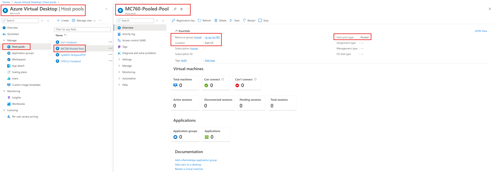

#### Step 1B - Create Personal Host Pool

```powershell
$parameters = @{
     Name = $HostPoolPersonal
     ResourceGroupName = $ResourceGroupName
     HostPoolType = 'Personal'
     LoadBalancerType = 'Persistent'
     PreferredAppGroupType = 'Desktop'
     PersonalDesktopAssignmentType = 'Automatic'
     Location = $Location
}

New-AzWvdHostPool @parameters

# Check HostPool created in Azure
Get-AzWvdHostPool -Name $parameters.Name -ResourceGroupName $parameters.ResourceGroupName | FL *

```
#### Expected Result

```
PS C:\Windows\system32> New-AzWvdHostPool @parameters

Etag IdentityPrincipalId IdentityTenantId IdentityType Kind Location ManagedBy Name                PlanName PlanProduct PlanPromotionCode PlanPublisher PlanVersion SkuCapacity SkuFamily SkuName SkuSize SkuTier
---- ------------------- ---------------- ------------ ---- -------- --------- ----                -------- ----------- ----------------- ------------- ----------- ----------- --------- ------- ------- -------
                                                            eastus             MC760-Personal-Pool


PS C:\Windows\system32> Get-AzWvdHostPool -Name $parameters.Name -ResourceGroupName $parameters.ResourceGroupName | FL *


AgentUpdateMaintenanceWindow               :
AgentUpdateMaintenanceWindowTimeZone       :
AgentUpdateType                            :
AgentUpdateUseSessionHostLocalTime         :
ApplicationGroupReference                  : {}
CloudPcResource                            : False
CustomRdpProperty                          : drivestoredirect:s:*;audiomode:i:0;videoplaybackmode:i:1;redirectclipboard:i:1;redirectprinters:i:1;devicestoredirect:s:*;redirectcomports:i:1;redirectsmartcards:i:1;usbdevicestoredirect:s:*;enablecredsspsupport:i:1;redirectwebauthn:i:1;use multimon:i:1;
Description                                :
Etag                                       :
FriendlyName                               :
HostPoolType                               : Personal
Id                                         : /subscriptions/368ac09c-01c9-4b47-9142-a7581c6694a3/resourcegroups/rg-sg-mc760/providers/Microsoft.DesktopVirtualization/hostpools/MC760-Personal-Pool
Identity                                   : Microsoft.Azure.PowerShell.Cmdlets.DesktopVirtualization.Models.Api10.Identity
IdentityPrincipalId                        :
IdentityTenantId                           :
IdentityType                               :
Kind                                       :
LoadBalancerType                           : Persistent
Location                                   : eastus
ManagedBy                                  :
MaxSessionLimit                            : 999999
Name                                       : MC760-Personal-Pool
ObjectId                                   : 54aa095a-d620-47c3-9fb1-5fdc47b9c733
PersonalDesktopAssignmentType              : Automatic
Plan                                       : Microsoft.Azure.PowerShell.Cmdlets.DesktopVirtualization.Models.Api10.Plan
PlanName                                   :
PlanProduct                                :
PlanPromotionCode                          :
PlanPublisher                              :
PlanVersion                                :
PreferredAppGroupType                      : Desktop
PrivateEndpointConnection                  : {}
PublicNetworkAccess                        : Enabled
RegistrationInfoExpirationTime             :
RegistrationInfoRegistrationTokenOperation :
RegistrationInfoToken                      :
Ring                                       :
Sku                                        : Microsoft.Azure.PowerShell.Cmdlets.DesktopVirtualization.Models.Api10.Sku
SkuCapacity                                :
SkuFamily                                  :
SkuName                                    :
SkuSize                                    :
SkuTier                                    :
SsoClientId                                :
SsoClientSecretKeyVaultPath                :
SsoSecretType                              :
SsoadfsAuthority                           :
StartVMOnConnect                           : False
SystemDataCreatedAt                        : 2/9/2024 2:34:48 PM
SystemDataCreatedBy                        : d329535d-0cf4-473a-8646-8c612949142a
SystemDataCreatedByType                    : Application
SystemDataLastModifiedAt                   : 2/9/2024 2:34:48 PM
SystemDataLastModifiedBy                   : d329535d-0cf4-473a-8646-8c612949142a
SystemDataLastModifiedByType               : Application
Tag                                        : Microsoft.Azure.PowerShell.Cmdlets.DesktopVirtualization.Models.Api10.ResourceModelWithAllowedPropertySetTags
Type                                       : Microsoft.DesktopVirtualization/hostpools
VMTemplate                                 :
ValidationEnvironment                      : False
```

You can also check on Azure Portal:

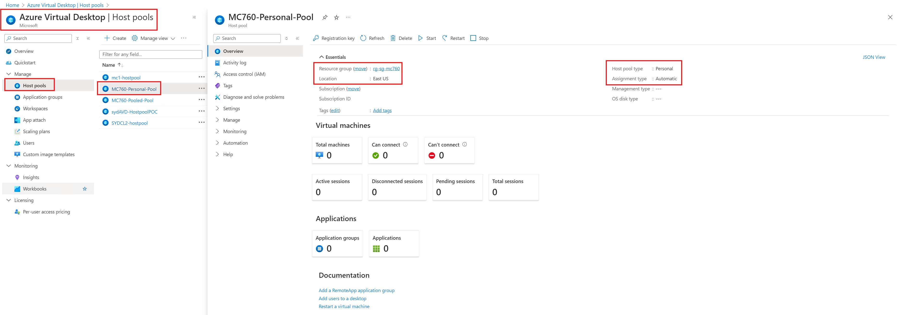

### Task 2 - Create a Workspace

Now let's create a workspace:

```powershell
$ResourceGroupName=""
$Location="eastus" #make sure location is lowercase, metadata for AVD only supported in certain region
$HostPoolPooled = "MC760-Pooled-Pool"
$HostPoolPersonal = "MC760-Personal-Pool"
$WorkspaceName="MC760-Workspace"

New-AzWvdWorkspace -Name $WorkspaceName -ResourceGroupName $ResourceGroupName -Location $Location

# Check Workspace created in Azure
Get-AzWvdWorkspace -Name $WorkspaceName -ResourceGroupName $ResourceGroupName | FL *

```

#### Expected Result

```
PS C:\Windows\system32> $WorkspaceName="MC760-Workspace"
PS C:\Windows\system32> New-AzWvdWorkspace -Name $WorkspaceName -ResourceGroupName $ResourceGroupName -Location $Location

Etag IdentityPrincipalId IdentityTenantId IdentityType Kind Location ManagedBy Name            PlanName PlanProduct PlanPromotionCode PlanPublisher PlanVersion SkuCapacity SkuFamily SkuName SkuSize SkuTier
---- ------------------- ---------------- ------------ ---- -------- --------- ----            -------- ----------- ----------------- ------------- ----------- ----------- --------- ------- ------- -------
                                                            eastus             MC760-Workspace

PS C:\Windows\system32> Get-AzWvdWorkspace -Name $WorkspaceName -ResourceGroupName $ResourceGroupName | FL *


ApplicationGroupReference    : {}
CloudPcResource              : False
Description                  :
Etag                         :
FriendlyName                 :
Id                           : /subscriptions/368ac09c-01c9-4b47-9142-a7581c6694a3/resourcegroups/rg-sg-mc760/providers/Microsoft.DesktopVirtualization/workspaces/MC760-Workspace
Identity                     : Microsoft.Azure.PowerShell.Cmdlets.DesktopVirtualization.Models.Api10.Identity
IdentityPrincipalId          :
IdentityTenantId             :
IdentityType                 :
Kind                         :
Location                     : eastus
ManagedBy                    :
Name                         : MC760-Workspace
ObjectId                     : 36b22e8c-7594-4287-8240-c3c7eae1c49f
Plan                         : Microsoft.Azure.PowerShell.Cmdlets.DesktopVirtualization.Models.Api10.Plan
PlanName                     :
PlanProduct                  :
PlanPromotionCode            :
PlanPublisher                :
PlanVersion                  :
PrivateEndpointConnection    : {}
PublicNetworkAccess          : Enabled
Sku                          : Microsoft.Azure.PowerShell.Cmdlets.DesktopVirtualization.Models.Api10.Sku
SkuCapacity                  :
SkuFamily                    :
SkuName                      :
SkuSize                      :
SkuTier                      :
SystemDataCreatedAt          : 3/9/2024 12:53:39 AM
SystemDataCreatedBy          : d329535d-0cf4-473a-8646-8c612949142a
SystemDataCreatedByType      : Application
SystemDataLastModifiedAt     : 3/9/2024 12:53:39 AM
SystemDataLastModifiedBy     : d329535d-0cf4-473a-8646-8c612949142a
SystemDataLastModifiedByType : Application
Tag                          : Microsoft.Azure.PowerShell.Cmdlets.DesktopVirtualization.Models.Api10.ResourceModelWithAllowedPropertySetTags
Type                         : Microsoft.DesktopVirtualization/workspaces
```

You can also check on Azure Portal:

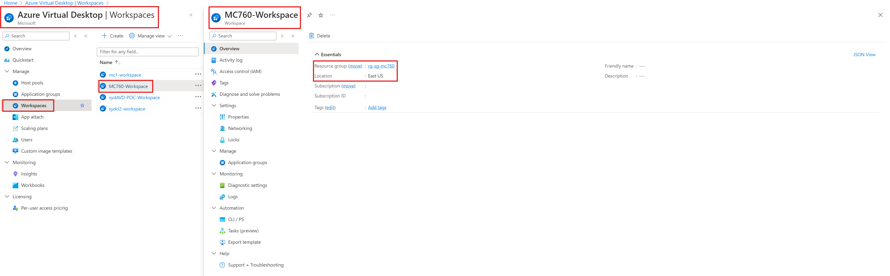

### Task 3 - Create an Application Group

#### Step 1 - Create Application Group
Now let's create application group. Application group must be added to the Host Pool and Workspace. We will create first Application Group for a Host Pool.
```powershell
$DesktopAppGroup="MC760-DesktopAppGroup"
$hostPoolArmPath = (Get-AzWvdHostPool -Name $HostPoolPooled -ResourceGroupName $ResourceGroupName).Id

$parameters = @{
     Name = $DesktopAppGroup
     ResourceGroupName = $ResourceGroupName
     ApplicationGroupType = 'Desktop'
     HostPoolArmPath = $hostPoolArmPath
     Location = $Location
}

New-AzWvdApplicationGroup @parameters

# Check Application Group in Azure
Get-AzWvdApplicationGroup -Name $DesktopAppGroup -ResourceGroupName $ResourceGroupName | FL *

```
#### Expected Result

```
PS C:\Windows\system32> New-AzWvdApplicationGroup @parameters

Etag IdentityPrincipalId IdentityTenantId IdentityType Kind    Location ManagedBy Name                  PlanName PlanProduct PlanPromotionCode PlanPublisher PlanVersion SkuCapacity SkuFamily SkuName SkuSize SkuTier
---- ------------------- ---------------- ------------ ----    -------- --------- ----                  -------- ----------- ----------------- ------------- ----------- ----------- --------- ------- ------- -------
                                                       Desktop eastus             MC760-DesktopAppGroup


PS C:\Windows\system32> # Check Application Group in Azure
>> Get-AzWvdApplicationGroup -Name $DesktopAppGroup -ResourceGroupName $ResourceGroupName | FL *


ApplicationGroupType         : Desktop
CloudPcResource              : False
Description                  :
Etag                         :
FriendlyName                 :
HostPoolArmPath              : /subscriptions/368ac09c-01c9-4b47-9142-a7581c6694a3/resourcegroups/rg-sg-mc760/providers/Microsoft.DesktopVirtualization/hostpools/MC760-Pooled-Pool
Id                           : /subscriptions/368ac09c-01c9-4b47-9142-a7581c6694a3/resourcegroups/rg-sg-mc760/providers/Microsoft.DesktopVirtualization/applicationgroups/MC760-DesktopAppGroup
Identity                     : Microsoft.Azure.PowerShell.Cmdlets.DesktopVirtualization.Models.Api10.Identity
IdentityPrincipalId          :
IdentityTenantId             :
IdentityType                 :
Kind                         : Desktop
Location                     : eastus
ManagedBy                    :
Name                         : MC760-DesktopAppGroup
ObjectId                     : c0182955-3b42-43aa-aa4c-71b6f90c8692
Plan                         : Microsoft.Azure.PowerShell.Cmdlets.DesktopVirtualization.Models.Api10.Plan
PlanName                     :
PlanProduct                  :
PlanPromotionCode            :
PlanPublisher                :
PlanVersion                  :
ShowInFeed                   :
Sku                          : Microsoft.Azure.PowerShell.Cmdlets.DesktopVirtualization.Models.Api10.Sku
SkuCapacity                  :
SkuFamily                    :
SkuName                      :
SkuSize                      :
SkuTier                      :
SystemDataCreatedAt          : 3/9/2024 1:09:14 AM
SystemDataCreatedBy          : d329535d-0cf4-473a-8646-8c612949142a
SystemDataCreatedByType      : Application
SystemDataLastModifiedAt     : 3/9/2024 1:09:14 AM
SystemDataLastModifiedBy     : d329535d-0cf4-473a-8646-8c612949142a
SystemDataLastModifiedByType : Application
Tag                          : Microsoft.Azure.PowerShell.Cmdlets.DesktopVirtualization.Models.Api10.ResourceModelWithAllowedPropertySetTags
Type                         : Microsoft.DesktopVirtualization/applicationgroups
WorkspaceArmPath             :
```
You can also check on Azure Portal:

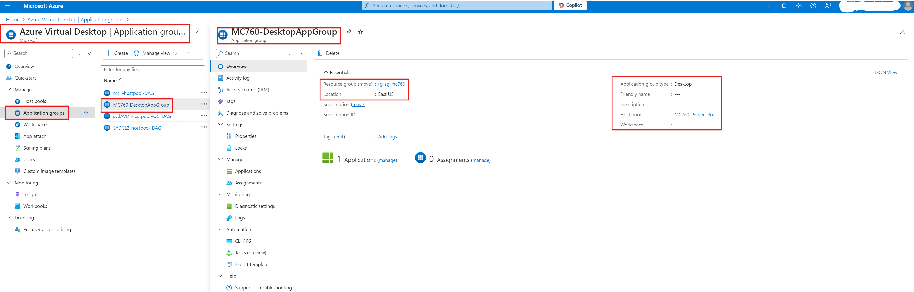

> Note: Application Group type can be **Desktop** or **RemoteApp**

#### Step 2 - Add Application Group to a Workspace

Please note also the Application Group has not been assigned to a Workspace. let's add Application Group to a Workspace

```powershell
# Get the resource ID of the application group that you want to add to the workspace
$appGroupPath = (Get-AzWvdApplicationGroup -Name $DesktopAppGroup -ResourceGroupName $ResourceGroupName).Id

# Add the application group to the workspace
Update-AzWvdWorkspace -Name $WorkspaceName -ResourceGroupName $resourceGroupName -ApplicationGroupReference $appGroupPath

# Check Workspace updated Azure
Get-AzWvdWorkspace -Name $WorkspaceName -ResourceGroupName $ResourceGroupName | FL *
```

#### Expected Result
```
PS C:\Windows\system32> # Get the resource ID of the application group that you want to add to the workspace
>> $appGroupPath = (Get-AzWvdApplicationGroup -Name $DesktopAppGroup -ResourceGroupName $ResourceGroupName).Id
>>
>> # Add the application group to the workspace
>> Update-AzWvdWorkspace -Name $WorkspaceName -ResourceGroupName $resourceGroupName -ApplicationGroupReference $appGroupPath

Etag IdentityPrincipalId IdentityTenantId IdentityType Kind Location ManagedBy Name            PlanName PlanProduct PlanPromotionCode PlanPublisher PlanVersion SkuCapacity SkuFamily SkuName SkuSize SkuTier
---- ------------------- ---------------- ------------ ---- -------- --------- ----            -------- ----------- ----------------- ------------- ----------- ----------- --------- ------- ------- -------
                                                            eastus             MC760-Workspace


PS C:\Windows\system32> # Check Workspace updated Azure
>> Get-AzWvdWorkspace -Name $WorkspaceName -ResourceGroupName $ResourceGroupName | FL *


ApplicationGroupReference    : {/subscriptions/368ac09c-01c9-4b47-9142-a7581c6694a3/resourcegroups/rg-sg-mc760/providers/Microsoft.DesktopVirtualization/applicationgroups/MC760-DesktopAppGroup}
CloudPcResource              : False
Description                  :
Etag                         :
FriendlyName                 :
Id                           : /subscriptions/368ac09c-01c9-4b47-9142-a7581c6694a3/resourcegroups/rg-sg-mc760/providers/Microsoft.DesktopVirtualization/workspaces/MC760-Workspace
Identity                     : Microsoft.Azure.PowerShell.Cmdlets.DesktopVirtualization.Models.Api10.Identity
IdentityPrincipalId          :
IdentityTenantId             :
IdentityType                 :
Kind                         :
Location                     : eastus
ManagedBy                    :
Name                         : MC760-Workspace
ObjectId                     : 36b22e8c-7594-4287-8240-c3c7eae1c49f
Plan                         : Microsoft.Azure.PowerShell.Cmdlets.DesktopVirtualization.Models.Api10.Plan
PlanName                     :
PlanProduct                  :
PlanPromotionCode            :
PlanPublisher                :
PlanVersion                  :
PrivateEndpointConnection    : {}
PublicNetworkAccess          : Enabled
Sku                          : Microsoft.Azure.PowerShell.Cmdlets.DesktopVirtualization.Models.Api10.Sku
SkuCapacity                  :
SkuFamily                    :
SkuName                      :
SkuSize                      :
SkuTier                      :
SystemDataCreatedAt          : 3/9/2024 12:53:39 AM
SystemDataCreatedBy          : d329535d-0cf4-473a-8646-8c612949142a
SystemDataCreatedByType      : Application
SystemDataLastModifiedAt     : 3/9/2024 1:19:42 AM
SystemDataLastModifiedBy     : d329535d-0cf4-473a-8646-8c612949142a
SystemDataLastModifiedByType : Application
Tag                          : Microsoft.Azure.PowerShell.Cmdlets.DesktopVirtualization.Models.Api10.ResourceModelWithAllowedPropertySetTags
Type                         : Microsoft.DesktopVirtualization/workspaces
```

You can also check on Azure Portal:
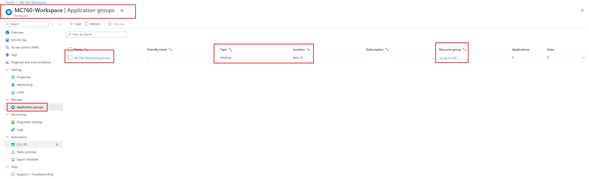

### Task 4 - Assign users or groups to the application group for users to get access

```powershell
# Get the object ID of the user group that you want to assign to the application group
$userGroupId = (Get-AzADGroup -DisplayName "<UserGroupName>").Id

# Assign users to the application group
$parameters = @{
    ObjectId = $userGroupId
    ResourceName = '<ApplicationGroupName>'
    ResourceGroupName = '<ResourceGroupName>'
    RoleDefinitionName = 'Desktop Virtualization User'
    ResourceType = 'Microsoft.DesktopVirtualization/applicationGroups'
}

New-AzRoleAssignment @parameters
```


### Task 5 - Create Session Host Virtual Machines using Azure Portal

In this Task, we will create multiple virtual machines for AVD session hosts using Azure Portal

#### Step 1 - Go to Host Pool and Click Registration key and then Generate new Key

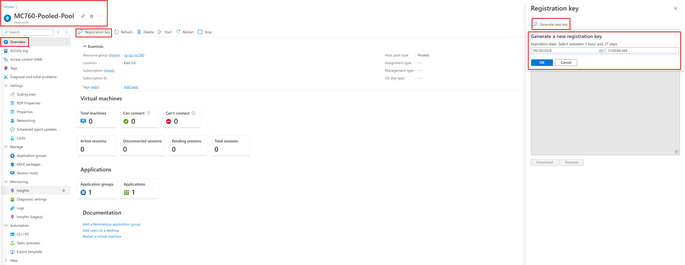

> Choose the expiration date (1 hour - 27 days):

you can also use Powershell to create registration key:

```powershell
$parameters = @{
    HostPoolName = "MC760-Pooled-Pool"
    ResourceGroupName = "rg-sg-mc760"
    ExpirationTime = $((Get-Date).ToUniversalTime().AddHours(24).ToString('yyyy-MM-ddTHH:mm:ss.fffffffZ'))
}

New-AzWvdRegistrationInfo @parameters

# Get the token for use later
(Get-AzWvdHostPoolRegistrationToken @parameters).Token
```


#### Expected Result

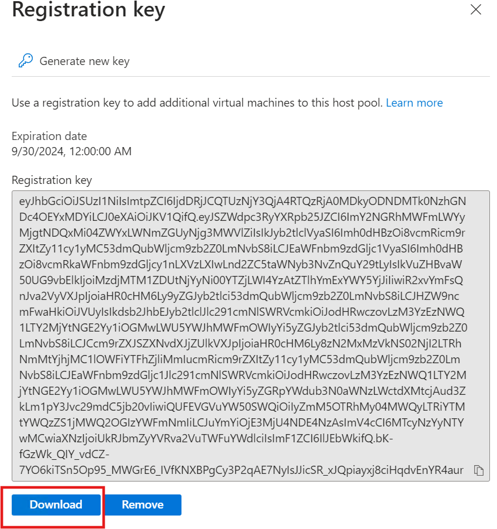

> Download registration key for further use

#### Step 2 - Go to Session Hosts and then Click Add and then fill-out the Basic Section

Use the following Parameter for Basic Section:

```
Basics (has been filled out shown in grey):
    
    Project details

    Subscription:               <use-your-subscription>
    Resource Group:             <use-your-resource-group>
    Host Pool name:             MC760-Pooled-Pool
    Location:                   East US
    Validation Environment      No
    Preferred app group type:   Desktop

    Host Pool details

    Host Pool type:             Pooled
```
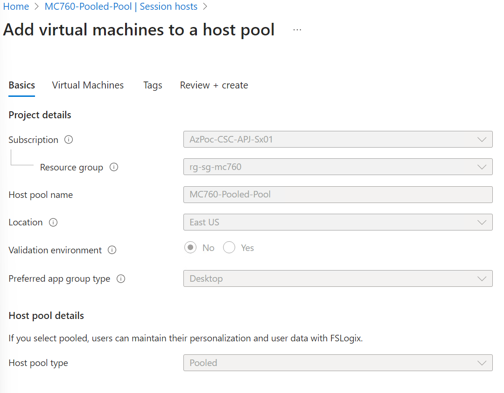


#### Step 3 - Click Next and then fill-out the Virtual Machines section

Use the following Parameter for Virtual Machines Section:

```
    Add Virtual Machines:       Yes <Greyed Out>
    Resource Group:             <use-your-resource-group>
    Name prefix:                mc760avd
    Virtual Machine type:       Azure Stack HCI Virtual Machine
    Custom Location             mc760-clus1-mocarb-cl
    Image:                      win11-23h2-avd-01
    Security Type:              Standard
    Number of VMs               4
    Virtual Processor Count     2
    Memory Type                 Static
    Memory (GB)                 4

    Network and Security

    Network:                    clus1-subnet137-dynamic
    
    Domain to Join

    Select which directory      : Active Directory (Microsoft Entra ID is grayed out for Azure Stack HCI)
    AD domain join UPN          : <your domain admin user upn>
    Password                    : <your domain admin password>
    Confirm password            : <your domain admin password>
    Specify domain or unit      : Yes
    Domain to join              : <your domain name>
    Organizational Unit path    : OU=Desktops,OU=ACPMC760,DC=apex,DC=csc

    Virtual Machine administrator account

    User name                   : <your VM admin user name>
    Password                    : <your VM admin password>
    Confirm password            : <your VM admin password>

```

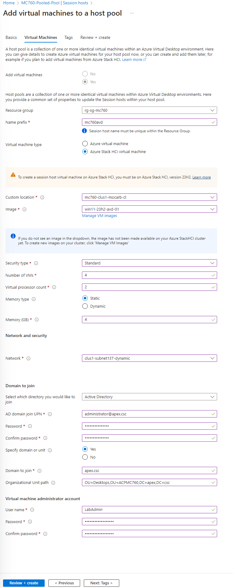

#### Step 4 - Click Next and then fill-out the Tags section and then Click Review+Create

Use the following Parameter for Tags Section:

```
   Tags

    Name                        : apex
    Value                       : mc760
    Resource                    : All resources selected

```

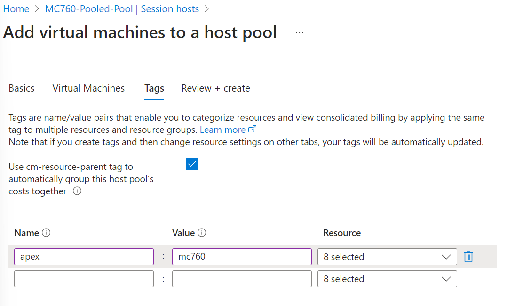

> dont' forget to download the template for automation, since later we will use ARM template

#### Expected Result

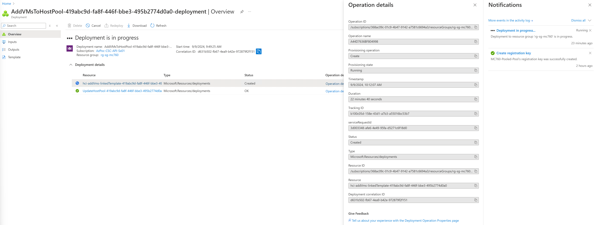

### Task 5a - Register Session Host Virtual Machines using PowerShell

This is if you create VMs outside AVD host pool methode in Task 5

#### Step 1 - Domain Join the VM and restart

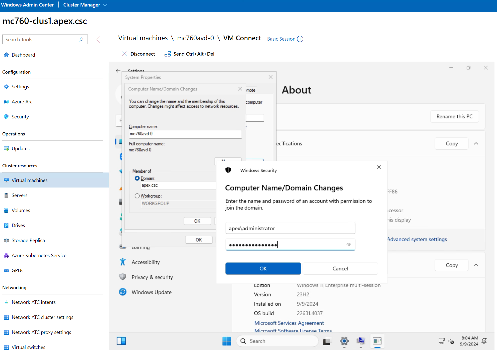


