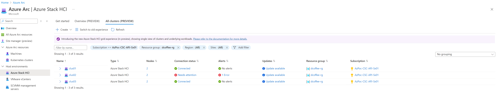
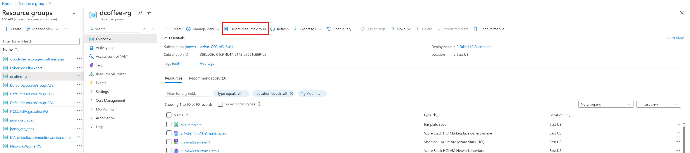
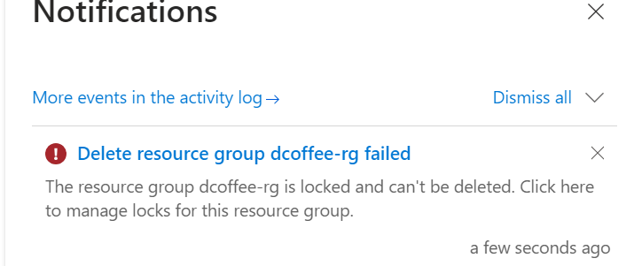
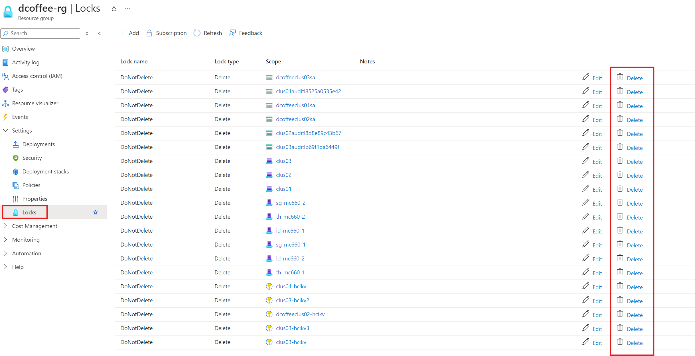
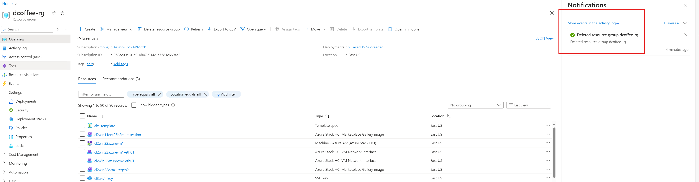
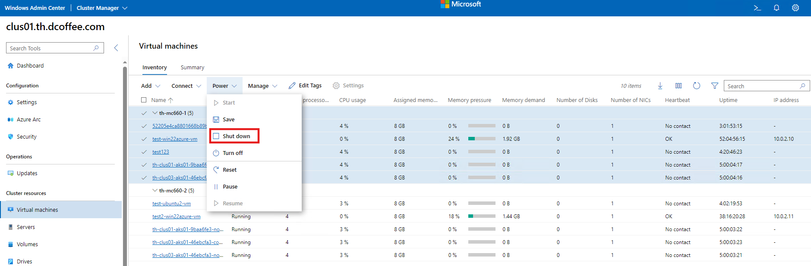
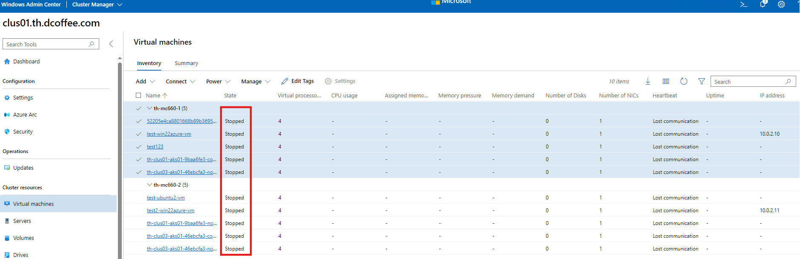

## 13. Cleanup MSLABS

### Task 1 - Unregister the cluster and remove from Portal (resource group)

Go to one of the cluster node and run the following script:

```powershell

# Make sure your management node has the Az.StackHCI module
if (!(Get-InstalledModule -Name az.StackHCI -ErrorAction Ignore)){
	Install-Module -Name Az.StackHCI -Force
}

# Define Variables
$subscriptionID=""
$tenantID=""

Unregister-AzStackHCI  -SubscriptionId $subscriptionID -TenantId $tenantID

```
> NOTE: I get login error when running from Management Node, hence running on Cluster Node would be easier.

The output would be something like this:
```
PS C:\ProgramData\kva\.ssh> Unregister-AzStackHCI -SubscriptionId $subscriptionID -TenantId $tenantID VERBOSE: Importing dependent module Az.Accounts                                                       VERBOSE: Importing dependent module Az.Resources                                                      VERBOSE: Required module Az.Resources (minimum version: 6.2.0) is not imported                        VERBOSE: Unregistering Azure Stack HCI from Azure...                                                  VERBOSE: Cluster DNS suffix resolves to : th.dcoffee.com
VERBOSE: Cluster DNS Name resolves to : clus01
VERBOSE: resource Group resolves to: dcoffee-rg
VERBOSE: resource name resolves to: clus01

Confirm
Are you sure you want to perform this action?
Performing the operation "Unregister-AzStackHCI" on target
"/Subscriptions/368ac09c-01c9-4b47-9142-a7581c6694a3/resourceGroups/dcoffee-rg/providers/Microsoft.Az
ureStackHCI/clusters/clus01".
[Y] Yes  [A] Yes to All  [N] No  [L] No to All  [S] Suspend  [?] Help (default is "Y"): A
VERBOSE: Unregister-AzStackHCI triggered - ResourceName: clus01 Region:
                   SubscriptionId: 368ac09c-01c9-4b47-9142-a7581c6694a3 Tenant:
2fc994a3-81d2-4ba3-ad3e-c1d68b3aaf6b ResourceGroupName: dcoffee-rg
                   AccountId:  EnvironmentName: AzureCloud DisableOnlyAzureArcServer: False
Force:False                                                                                           VERBOSE: Attempting login with TenantID: 2fc994a3-81d2-4ba3-ad3e-c1d68b3aaf6b                         Please select the account you want to login with.                                                                                                                                                           [Login to Azure] To sign in, use a web browser to open the page https://microsoft.com/devicelogin and enter the code QX563W3CX to authenticate.                                                             Retrieving subscriptions for the selection...                                                         WARNING: Unable to acquire token for tenant '2fc994a3-81d2-4ba3-ad3e-c1d68b3aaf6b' with error         'Authentication failed against tenant 2fc994a3-81d2-4ba3-ad3e-c1d68b3aaf6b. User interaction is       required. This may be due to the conditional access policy settings such as multi-factor              authentication (MFA). If you need to access subscriptions in that tenant, please rerun                'Connect-AzAccount' with additional parameter '-TenantId 2fc994a3-81d2-4ba3-ad3e-c1d68b3aaf6b'.'      [Announcements]                                                                                       With the new Azure PowerShell login experience, you can select the subscription you want to use more easily. Learn more about it and its configuration at https://go.microsoft.com/fwlink/?linkid=2271909.

If you encounter any problem, please open an issue at: https://aka.ms/azpsissue

WARNING: You're using Az.Accounts version 3.0.0. The latest version of Az.Accounts is 3.0.2. Upgrade
your Az modules using the following commands:
  Update-Module Az.* -WhatIf    -- Simulate updating your Az modules.
  Update-Module Az.*            -- Update your Az modules.
VERBOSE: cleaning up cluster scheduled task
VERBOSE: Arc already disabled on th-mc660-1.th.dcoffee.com th-mc660-2.th.dcoffee.com
VERBOSE: Successfully completed Remove-AzureStackHCIRegistration on cluster
VERBOSE: invoking Remove-AzureStackHCIRegistrationCertificate on th-mc660-1
VERBOSE: invoking Remove-AzureStackHCIRegistrationCertificate on th-mc660-2
VERBOSE: Unregister ResourceGroupName dcoffee-rg
VERBOSE: Trying to delete resource group: dcoffee-rg
VERBOSE: Resource Group Not Found


Result  : Success
Details : Azure Stack HCI is successfully unregistered. The Azure resource representing Azure Stack
          HCI has been deleted. Azure Stack HCI can't sync with Azure until you register again.

```

Now, let's check on the portal whether the cluster has been deleted.

> Looks like it's not deleted yet.

Check the Cluster status and Arc status with the following command:
```powershell
Get-AzureStackHCI
Azcmagent show
```

Result are the following:
```

PS C:\ProgramData\kva\.ssh> Get-AzureStackHCI


ClusterStatus      : Clustered
RegistrationStatus : OutOfPolicy
RegistrationDate   :
AzureResourceName  :
AzureResourceUri   :
ConnectionStatus   :
LastConnected      :
NextSync           :
IMDSAttestation    :
DiagnosticLevel    : Basic
Region             :

PS C:\ProgramData\kva\.ssh> azcmagent show
Resource Name                           : id-mc660-1
Resource Group Name                     : dcoffee-rg
Resource Namespace                      : Microsoft.HybridCompute
Resource Id                             : /subscriptions/368ac09c-01c9-4b47-9142-a7581c6694a3/resourceGroups/dcoffee-rg/providers/Microsoft.HybridCompute/machines/id-mc660-1
Subscription ID                         : 368ac09c-01c9-4b47-9142-a7581c6694a3
Tenant ID                               : 2fc994a3-81d2-4ba3-ad3e-c1d68b3aaf6b
VM ID                                   : 4c1dc372-19a0-411e-b5b8-d0ecf9c3042a
Correlation ID                          : 50d3e95b-ace8-4324-88b9-4c0e469193de
VM UUID                                 : 432BBF54-8A84-456B-819C-E31655731110
Location                                : eastus
Cloud                                   : AzureCloud
Agent Version                           : 1.40.02664.1629
Agent Logfile                           : C:\ProgramData\AzureConnectedMachineAgent\Log\himds.log
Agent Status                            : Connected
Agent Last Heartbeat                    : 2024-08-05T05:00:17Z
Agent Error Code                        :
Agent Error Details                     :
Agent Error Timestamp                   :
Using HTTPS Proxy                       :
Proxy Bypass List                       :
Upstream Proxy                          :
Upstream Proxy Bypass List              :
Cloud Provider                          : AzSHCI
Cloud Metadata
Manufacturer                            : Microsoft Corporation
Model                                   : Virtual Machine
MSSQL Server Detected                   : false
Dependent Service Status
  Agent Service (himds)                 : running
  Azure Arc Proxy (arcproxy)            : stopped
  Extension Service (extensionservice)  : running
  GC Service (gcarcservice)             : running
Portal Page                             : https://portal.azure.com/#@2fc994a3-81d2-4ba3-ad3e-c1d68b3aaf6b/resource/subscriptions/368ac09c-01c9-4b47-9142-a7581c6694a3/resourceGroups/dcoffee-rg/providers/Microsoft.HybridCompute/machines/id-mc660-1/overview
Disabled Features                       : atsauth

```
let's stop the Arc agent on each of the nodes:

```powershell
PS C:\ProgramData\kva\.ssh> azcmagent disconnect
INFO    Please login using the pop-up browser to authenticate.
To sign in, use a web browser to open the page https://microsoft.com/devicelogin and enter the code J2UBEDE3E to authenticate.
INFO    Deleting resource from Azure...               Correlation ID=9da15c96-31b0-4b1d-9d6c-abdf8be29f57 Resource ID=/subscriptions/368ac09c-01c9-4b47-9142-a7581c6694a3/resourceGroups/dcoffee-rg/providers/Microsoft.HybridCompute/machines/id-mc660-1
INFO    Exit Code:  AZCM0043: Failed to Delete Resource
INFO    For troubleshooting, see https://aka.ms/arc/azcmerror
FATAL   RequestCorrelationId:9da15c96-31b0-4b1d-9d6c-abdf8be29f57 Message: The scope '/subscriptions/368ac09c-01c9-4b47-9142-a7581c6694a3/resourceGroups/dcoffee-rg/providers/Microsoft.HybridCompute/machines/id-mc660-1' cannot perform delete operation because following scope(s) are locked: '/subscriptions/368ac09c-01c9-4b47-9142-a7581c6694a3/resourceGroups/dcoffee-rg/providers/Microsoft.HybridCompute/machines/id-mc660-1'. Please remove the lock and try again. Code: ScopeLocked httpStatusCode:409
```
> looks like it cannot delete from here because it's locked

Remove the Resource Group from Portal


> Looks like Resource Group is locked, let's remove the lock:


Now let's delete the resource group again.

Verifiy that the resource group and all resources are deleted

### Task 2 - Shutdown the Cluster

#### Step 1 - You must gracefully shut down all client VMs before shutting down the cluster.

Go to the Windows Admin Center and Shut Down all VM:



You can also use the following powershell from each of the cluster node:
```powershell
Get-VM
Stop-VM
```


### Task 3 - Hydrate Lab

> t disks. It will take 15-30 minutes to finish. Once Finished, press Enter to close window (it will cleanup unnecessary files and folders).

### Expected Result

in MSLAB folder you should see LAB and ParentDisks folder along with three PowerShell scripts and log files.


### Task 4 - Create Azure Stack HCI parent disk

1.

### Expected Result

Azure Stack HCI 23H2 image will be created in ParentDisks folder. Hydrating is done