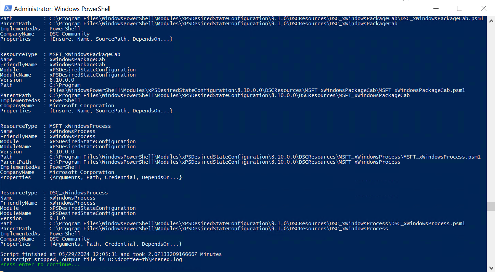
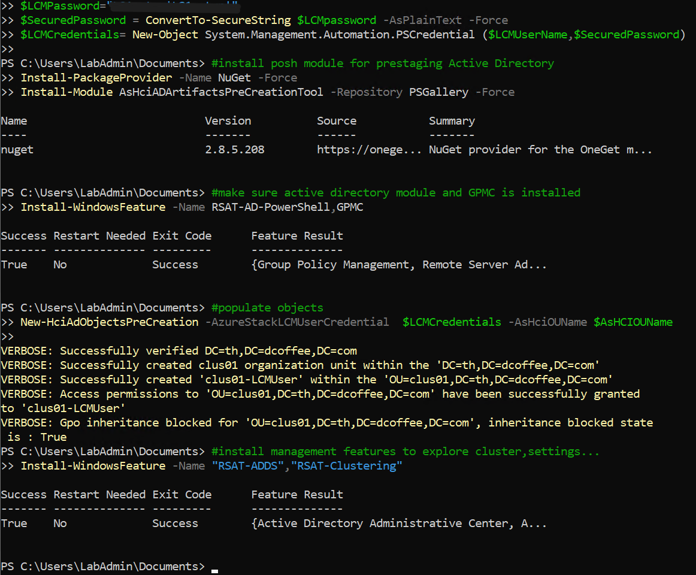
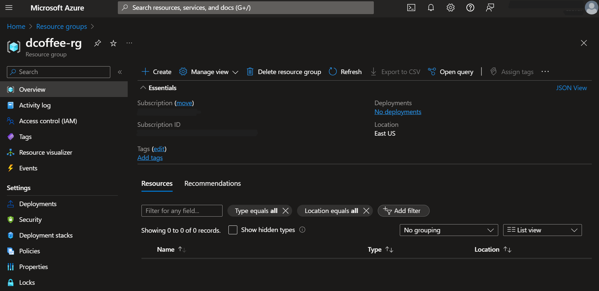
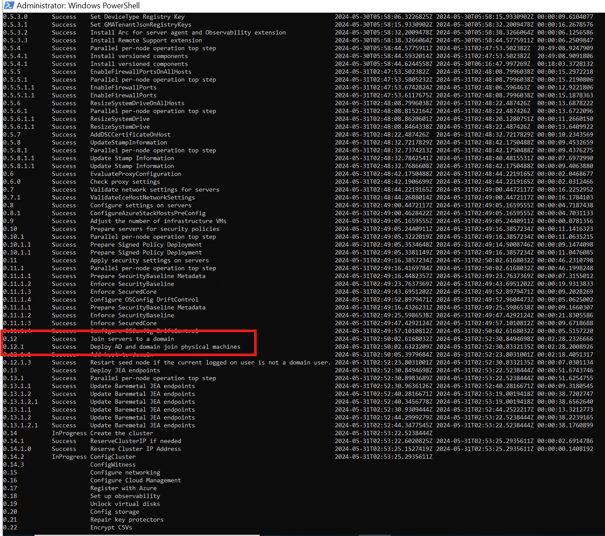

# csc-lab-mslab-azurestackhci23h2
My hands-on Lab on Azure Stack HCI version 23H2 using MSLab
> Note: Password and Secrets are removed from scripts

## 1. Hydrating MSLab Files

I am creating a folder with a dummy domain name I use throughout the Lab. After hydrating MSLab files, this folder will contain Domain Controller - ready to be imported and parent disks: Windows Server 2022 and Azure Stack HCI 23H2. 
Please note that the Domain controller here is unique to this Lab and can not be changed later (I use the specific Domain Name and also DC admin password). If you want to change domain name and password, you must re-hydrate MSLAB files again from fresh.

### Task 1 - Check hardware requirement

* I'm using a large Hyper-V host VM with 48 vCPU and 384 GB of RAM. Just to make sure I can run all services like AKS and Azure Arc Enabled Data/App Services with ease
* I'm also using Windows Server 2022 Datacenter Edition. This Hyper-V hosts will run a nested VM for azure stack HCI cluster nodes
* This Hyper-V host VM also has two VHDX one is for OS (127GB) and another one is for MSLAB (5TB)

### Task 2 - Download all neccessary files

* MSLab scripts : [MSLab](https://aka.ms/mslab)
* latest Windows Server ISO: [MSDN Download](https://my.visualstudio.com/downloads) requires Visual Studio users.
* latest Azure Stack HCI ISO: [23H2](https://azure.microsoft.com/en-us/products/azure-stack/hci/hci-download/) requires login to azure portal.

### Task 3 - Hydrate Lab

1. Unzip files from MSLab zip folder into D:\MSLAB (volume from MSLAB VHDX where you have enough space here ~5TB)

2. Replace content of LabConfig.ps1 with the following:
```powershell
$LabConfig=@{ 
    DomainAdminName=''; 
    AdminPassword=''; 
    Prefix = 'dcoffee-' ; 
    DCEdition='4'; 
    Internet=$true ;
    DomainNetbiosName="th"; 
    DomainName="th.dcoffee.com";
    AdditionalNetworksConfig=@(); 
    VMs=@()
}
```
> This will create custom Domain Controller (AD) built on top of Windows Server Datacenter with GUI. Some explanation of the parameters are the following:

- **DomainAdminName** : used during 2_CreateParentDisks (no affect if changed after this step)
- **AdminPassword** : used 2_CreateParentDisks. If changed after, it will break the functionality of 3_Deploy.ps1
- **Prefix** : All VMs and vSwitch are created with this prefix, so you can identify the lab. If not specified, Lab folder name is use
- **DCEdition** : 4 for DataCenter or 3 for DataCenterCore. We want a full GUI for DC so we choose 4.
- **Internet** : if $true it will use External vSwitch from MSLAB Hyper-V hosts and create vNIC to the DC and configure NAT with some Open DNS servers in DNS forwarder (8.8.8.8 and 1.1.1.1)
> Note: Make sure you enable MAC address spoofing in MSLAB Hyper-V hosts, and you might want to setup static IP address for your DC if you are using static in your environment otherwise DHCP would also work. You also might need to add DNS forwarders using your environment DNS servers.
- **DomainNetbiosName** : custom NetBios will be used instead default "Corp"
- **DomainName** : custom DomainName will be used instead of default "Corp.Contoso.Com"
- **AdditionalNetworksConfig** : empty array for additional network config later (not used in this step)
- **VMs** : empty array for specifying Lab VMs (not used in this step)
3. Right-click 1_Prereq.ps1 and select **Run with PowerShell**, the script will automatically elevate and run as administrator
4. The script will finish. it will download necessary files and create folders. Close PowerShell Window by pressing enter.

5. Save as LabConfig.ps1 as [LabConfig.hydrate.ps1](LabConfig.hydrate.ps1) for documentation as we are going to use another version of LabConfig.ps1 in later step.
6. Right-click 2_CreateParentDisks.ps1 and select **Run with PowerShell**.
7. When asked for ISO image, choose Windows Server 2022 image.
8. When asked for Windows Server Update (msu), click **cancel**
> Script will now create Domain Controller and Windows Server 2022 parent disks. It will take 15-30 minutes to finish. Once Finished, press Enter to close window (it will cleanup unnecessary files and folders).

### Expected Result

in MSLAB folder you should see LAB and ParentDisks folder along with three PowerShell scripts and log files.


### Task 4 - Create Azure Stack HCI parent disk

1. Navigate to MSLAB folder and open ParentDisks folder
2. Right-click on CreateParentDisk.ps1 and select **Run with PowerShell**
3. When asked for ISO image, choose Azure Stack HCI 23H2 image. Hit Cancel when asked for MSU package.
4. When asked for VHD name and size, just hit enter (it will use default AzSHCI23H2_G2.vhdx and 127GB size) 
> Script will finish in few minutes. When done, press enter to close PowerShell window. Azure Stack HCI image will be created.


### Expected Result

Azure Stack HCI 23H2 image will be created in ParentDisks folder. Hydrating is done


## 2. Deploy Azure Stack HCI Cluster 23H2 using Cloud Based Deployment (Azure Portal)

Now, after MSLAB is hydrated we are ready to build 2 node of Azure Stack HCI clusters 23H2 (in nested VM) using cloud based deployment (Azure Portal). Read the microsoft document [here](https://learn.microsoft.com/en-us/azure-stack/hci/deploy/deploy-via-portal) for more detail.
> Note: Cloud Deployment is not yet supported from any OEM. Here we can get away to work nested VM with disabling bitlocker for OS and disabling WDAC (WDAC policy is distributed as part of Solution Builder Extensions)

### Task 1 - Customize deployment LabConfig and Deploy

1. Below LabConfig will deploy a large 2 virtual nodes (with 24 vCPU and 96GB RAM each) and also DC VM, Windows Admin Center Gateway (WAC GW) VM and Management VM. We will use range of VLAN for different subnets later on (for Storage traffic, Network ATC will use 711-712, for VM and AKS logical networks we can use Vlan 1-10),these VLANs are all internal, if require connection to Azure it will be routed and NATed from DC VM as the gateway.
```powershell
$LabConfig=@{
    AllowedVLANs="1-10,711-723"; 
    ManagementSubnetIDs=0..4; 
    DomainAdminName=''; 
    AdminPassword=''; 
    Prefix = 'dcoffee-' ; 
    DCEdition='4'; 
    Internet=$true ;
    UseHostDnsAsForwarder=$true; 
    #MGMTNICsInDC=4;
    AdditionalNetworksInDC=$true; 
    AdditionalNetworksConfig=@(); 
    VMs=@(); 
    DomainNetbiosName="th";
    DomainName="th.dcoffee.com";
    TelemetryLevel='Full' ; 
    TelemetryNickname='csc'
}

#pre-domain joined
1..2 | ForEach-Object {
    $VMNames="th-mc660-" ; 
    $LABConfig.VMs += @{ 
        VMName = "$VMNames$_" ; 
        Configuration = 'S2D' ; 
        ParentVHD = 'azshci23h2_g2.vhdx' ; 
        HDDNumber = 4; 
        HDDSize= 2TB ; 
        MemoryStartupBytes= 96GB; 
        VMProcessorCount="24"; 
        MGMTNICs=5 ; 
        NestedVirt=$true; 
        vTPM=$true;
        Unattend="NoDjoin"
    }
}

#add subnet 1-3

$LABConfig.AdditionalNetworksConfig += @{ 
        NetName = 'subnet1';                        # Network Name
        NetAddress='10.0.1.';                      # Network Addresses prefix. (starts with 1), therefore first VM with Additional network config will have IP 172.16.1.1
        NetVLAN='721';                                 # VLAN tagging
        Subnet='255.255.255.0'                       # Subnet Mask
    }
    $LABConfig.AdditionalNetworksConfig += @{ NetName = 'subnet2'; NetAddress='10.0.2.'; NetVLAN='722'; Subnet='255.255.255.0'}
    $LABConfig.AdditionalNetworksConfig += @{ NetName = 'subnet3'; NetAddress='10.0.3.'; NetVLAN='723'; Subnet='255.255.255.0'}

#Windows Admin Center gateway
$LabConfig.VMs += @{ VMName = 'WACGW' ; ParentVHD = 'Win2022Core_G2.vhdx' ; MGMTNICs=1 }

#Management machine
$LabConfig.VMs += @{ VMName = 'Management' ; ParentVHD = 'Win2022_G2.vhdx'; MGMTNICs=1 ; AddToolsVHD=$True }
```
2. Right-click on Deploy.ps1 and select **Run with PowerShell**

### Expected Result

Here are screenshot of successfull powershell script and view on Hyper-V Manager


> Make sure to start all VMs before going to the next task.

### Task 2 - Prepare Active Directory

These steps are inspired from Microsoft Documentation [here](https://learn.microsoft.com/en-us/azure-stack/hci/deploy/deployment-prep-active-directory). Please run the following PowerShell Script [PrepareAd.ps1](PrepareAD.ps1) from Management VM's PowerShell in elevated mode (Run As Administrator).
Adjust the script if necessary:
```powershell
$AsHCIOUName="OU=clus01,DC=th,DC=dcoffee,DC=com"
$LCMUserName=""
$LCMPassword=""
$SecuredPassword = ConvertTo-SecureString $LCMpassword -AsPlainText -Force
$LCMCredentials= New-Object System.Management.Automation.PSCredential ($LCMUserName,$SecuredPassword)

#install posh module for prestaging Active Directory
Install-PackageProvider -Name NuGet -Force
Install-Module AsHciADArtifactsPreCreationTool -Repository PSGallery -Force

#make sure active directory module and GPMC is installed
Install-WindowsFeature -Name RSAT-AD-PowerShell,GPMC

#populate objects
New-HciAdObjectsPreCreation -AzureStackLCMUserCredential  $LCMCredentials -AsHciOUName $AsHCIOUName

#install management features to explore cluster,settings...
Install-WindowsFeature -Name "RSAT-ADDS","RSAT-Clustering"
```
### Expected Result




### Task 3 - Prepare Azure

At this step make sure you have Azure Subscription and you have user that are a user access administrator and a contributor role, since we are going to create some resources like resource group.
Here I'm using ServicePrincipal because it's convinient to code and from security perspective you can use time limited secrets or certificates. If you use regular user, you need to interactively login with browser and finish the MFA (MultiFactorAuthentication) step.
Basically we are going to create a Resource Group to hold all the resources. Please run the following PowerShell Script [PrepareAzure.ps1](PrepareAzure.ps1) from Management VM's PowerShell in elevated mode (Run As Administrator).
Adjust the script if necessary:
```powershell
# Setup some variables
$ResourceGroupName="dcoffee-rg"
$Location="eastus" #make sure location is lowercase

# Make sure User or SPN is contributor and user access administrator in Azure Subscriptions
# We are using SPN here:
# fill out the following variable to your environment
$tenantID = ""
$AdminSPNAppID=""
$AdminPlainSecret=""
$AdminSecuredSecret = ConvertTo-SecureString $AdminPlainSecret -AsPlainText -Force
$AdminSPNCred = New-Object -TypeName System.Management.Automation.PSCredential -ArgumentList $AdminSPNAppID, $AdminSecuredSecret

#login to azure
#download and install Azure module

#Set PSGallery as a trusted repo
Set-PSRepository -Name "PSGallery" -InstallationPolicy Trusted

if (!(Get-InstalledModule -Name az.accounts -ErrorAction Ignore)){
	Install-Module -Name Az.Accounts -Force
}
if (-not (Get-AzContext)){
	Connect-AzAccount -ServicePrincipal -TenantId $tenantID -Credential $AdminSPNCred
}

#install az resources module
if (!(Get-InstalledModule -Name "az.resources" -ErrorAction Ignore)){
	Install-Module -Name "az.resources" -Force
}

#create resource group
if (-not(Get-AzResourceGroup -Name $ResourceGroupName -ErrorAction Ignore)){
	New-AzResourceGroup -Name $ResourceGroupName -Location $location
}
```

### Expected Result



### Task 4 - Prepare Azure Stack HCI Nodes for Cloud Deployment

Now, we are going to prepare the nodes for Cloud Deployment.

#### Step 1 - Test Connectivity

* Test name Resolution using simple ping from Management machine to the azure stack HCI nodes
> Time out is OK since Windows Firewall does not allow ping by default, most important is the name resolution works. Please also ignore the IPv6 we will fix this later.
* Test WINRM works from Management machine to the azure stack HCI nodes
```powershell
Test-NetConnection -ComputerName tch-mc660-1 -CommonTCPPort WINRM
Test-NetConnection -ComputerName tch-mc660-2 -CommonTCPPort WINRM
```

#### Expected Result


#### Step 2 - Deploy Arc Agent

* In this step we will install Arc agent, Arc extensions and will set RBAC roles to Arc objects. It will also install Environmental Checker, so cloud deployment will be able to kick validations
* Please run the following PowerShell Script [PrepareNodes.ps1](PrepareNodes.ps1) from Management VM's PowerShell in elevated mode (Run As Administrator).

**The script will do the following:**
* Since all the nodes are not domain joined yet, we will need to enable trusted hosts
* Install required features and cumulative updates
* Set the timezone to UTC (known issue using baseline builds 10.2310.0.30 (25398.469))
* Restart the servers to finalize features/updates
* Install required PowerShell modules on all nodes
* Deploy arc agent and extensions

#### Expected Result


> Check if all arc extensions were installed. If one failed (sometimes LCM fails), it needs to be uninstalled (in azure portal) and rerun code above to attempt to redeploy extension.
Wait for extensions to be installed before continuing with lab! If you will connect to remote session, it might interrupt installing LCM extension and it will fail.

The following are the script for installing individual extensions:
```powershell
# Check if Extension is installed
Get-AzConnectedMachineExtension -Name "AzureEdgeTelemetryAndDiagnostics" -ResourceGroupName $ResourceGroupName -MachineName $Server
Get-AzConnectedMachineExtension -Name "AzureEdgeDeviceManagement" -ResourceGroupName $ResourceGroupName -MachineName $Server
Get-AzConnectedMachineExtension -Name "AzureEdgeLifecycleManager" -ResourceGroupName $ResourceGroupName -MachineName $Server
Get-AzConnectedMachineExtension -Name "AzureEdgeRemoteSupport" -ResourceGroupName $ResourceGroupName -MachineName $Server

# install the extensions manually here:
New-AzConnectedMachineExtension -Name "AzureEdgeTelemetryAndDiagnostics" -ResourceGroupName $ResourceGroupName -MachineName $Server -Location $Location -Publisher "Microsoft.AzureStack.Observability" -Settings $Settings -ExtensionType "TelemetryAndDiagnostics" -NoWait
New-AzConnectedMachineExtension -Name "AzureEdgeDeviceManagement" -ResourceGroupName $ResourceGroupName -MachineName $Server -Location $Location -Publisher "Microsoft.Edge" -ExtensionType "DeviceManagementExtension" -NoWait
New-AzConnectedMachineExtension -Name "AzureEdgeLifecycleManager" -ResourceGroupName $ResourceGroupName -MachineName $Server -Location $Location -Publisher "Microsoft.AzureStack.Orchestration" -ExtensionType "LcmController" -NoWait
New-AzConnectedMachineExtension -Name "AzureEdgeRemoteSupport" -ResourceGroupName $ResourceGroupName -MachineName $Server -Location $Location -Publisher "Microsoft.AzureStack.Observability" -ExtensionType "EdgeRemoteSupport" -NoWait
```

#### Step 3 - Add final touches

* Make sure there is only one NIC with gateway configured:
```powershell
#make sure there is only one management NIC with IP address (setup is complaining about multiple gateways)
    Invoke-Command -ComputerName $servers -ScriptBlock {
        Get-NetIPConfiguration | Where-Object IPV4defaultGateway | Get-NetAdapter | Sort-Object Name | Select-Object -Skip 1 | Set-NetIPInterface -Dhcp Disabled
    } -Credential $Credentials
```
* Configure NTP Servers
First you need to disable Timesync from Hyper-V. Run following command on Hyper-V Host! (applies to nested environment only)
```powershell
Get-VM *ASNode* | Disable-VMIntegrationService -Name "Time Synchronization"
```
And after that you can run following command from management machine to configure NTP Server
```powershell
$NTPServer="th.dcoffee.com"
Invoke-Command -ComputerName $servers -ScriptBlock {
    w32tm /config /manualpeerlist:$using:NTPServer /syncfromflags:manual /update
    Restart-Service w32time
} -Credential $Credentials

Start-Sleep 20

#check if source is NTP Server
Invoke-Command -ComputerName $servers -ScriptBlock {
    w32tm /query /source
} -Credential $Credentials
```
* Configure current user to be Key Vault Administrator on dcoffee-rg resource group
```powershell
#add key vault admin of current user to Resource Group (It can be also done in Deploy Azure Stack HCI wizard)
#$objectId = (Get-AzADUser -SignedIn).Id
# Since we are using SPN
$objectId =(Get-AzADServicePrincipal -DisplayName "cscapj-adm-spn").id
New-AzRoleAssignment -ObjectId $ObjectId -ResourceGroupName $ResourceGroupName -RoleDefinitionName "Key Vault Administrator"
```
* Configure new admin password on nodes (as Cloud Deployment requires at least 12chars)
```powershell
#change password of local admin to be at least 12 chars
Invoke-Command -ComputerName $servers -ScriptBlock {
    Set-LocalUser -Name Administrator -AccountNeverExpires -Password (ConvertTo-SecureString "LS1setup!LS1setup!" -AsPlainText -Force)
} -Credential $Credentials
```

### Task 5 - Perform Azure Stack HCI deployment from Azure Portal

#### Step 1 - Navigate to Azure Portal and in Azure Stack HCI clusters, click on Create button


#### Step 2 - Continue with setup with following values:
> In Security settings I removed Bitlocker for data volumes as it would expand VHDs when encrypting volumes.
```
Basics:
    Resource Group: dcoffee-rg
    ClusterName:    clus01
    Keyvaultname:   <Just generate new>

Configuration:
    New Configuration

Networking
    Network Switch for storage
    Group All traffic

    Network adapter 1:          Ethernet
    Network adapter 1 VLAN ID:  711 (default)
    Network adapter 2:          Ethernet 2
    Network adapter 2 VLAN ID:  712 (default)

    Starting IP:                10.0.0.111
    ENding IP:                  10.0.0.116
    Subnet mask:                255.255.255.0
    Default Gateway:            10.0.0.1
    DNS Server:                 10.0.0.1

Management
    Custom location name:       dcoffee-clus01-cl
    Azure storage account name: <just generate new> dcoffeeclus01sa

    Domain:                     th.dcoffee.com
    Computer name prefix:       clus01
    OU:                         OU=clus01,DC=th,DC=dcoffee,DC=com

    Deployment account:
        Username:               clus01-LCMUser
        Password:               LS1setup!LS1setup!

    Local Administrator
        Username:               Administrator
    Password:                   LS1setup!LS1setup!

Security:
    Customized security settings
        Unselect Bitlocker for data volumes (would consume too much space)

Advanced:
    Create workload volumes (Default)

Tags:
    <keep default>
```


#### Step 3 - Validation process will take some time. And if all goes OK, it will succesfully validate cluster


### Task 6 - Monitor Deployment Progress

#### Step 1 - Monitor from Management Machine

Paste following PowerShell to update credentials and pull information about the deployment progress
> Run this before domain join step
```powershell
    #Create new password credentials
    $UserName="Administrator"
    $Password="LS1setup!LS1setup!"
    $SecuredPassword = ConvertTo-SecureString $password -AsPlainText -Force
    $Credentials= New-Object System.Management.Automation.PSCredential ($UserName,$SecuredPassword)

    #before domain join
    Invoke-Command -ComputerName $Servers[0] -ScriptBlock {
        ([xml](Get-Content C:\ecestore\efb61d70-47ed-8f44-5d63-bed6adc0fb0f\086a22e3-ef1a-7b3a-dc9d-f407953b0f84)) | Select-Xml -XPath "//Action/Steps/Step" | ForEach-Object { $_.Node } | Select-Object FullStepIndex, Status, Name, StartTimeUtc, EndTimeUtc, @{Name="Duration";Expression={new-timespan -Start $_.StartTimeUtc -End $_.EndTimeUtc } } | Format-Table -AutoSize
    } -Credential $Credentials
```


> Run this after domain join
```powershell
    #after domain join
    Invoke-Command -ComputerName $Servers[0] -ScriptBlock {
        ([xml](Get-Content C:\ecestore\efb61d70-47ed-8f44-5d63-bed6adc0fb0f\086a22e3-ef1a-7b3a-dc9d-f407953b0f84)) | Select-Xml -XPath "//Action/Steps/Step" | ForEach-Object { $_.Node } | Select-Object FullStepIndex, Status, Name, StartTimeUtc, EndTimeUtc, @{Name="Duration";Expression={new-timespan -Start $_.StartTimeUtc -End $_.EndTimeUtc } } | Format-Table -AutoSize
    }
```


#### Step 2 - Monitor from Azure Portal

In Azure Portal, navigate to your Azure Stack Cluster and you should see deployment progress there:


#### Step 3 - Troubleshoot using Deployment logs

To troubleshoot deployment you can explore deployment logs by navigating into first cluster node to c:\CloudDeployment\Logs

